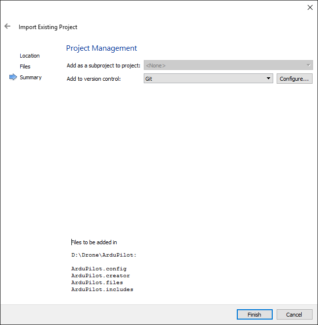

.. _building-px4-with-make:

============================================================
Building ArduPilot for Pixhawk/PX4 on Windows with QtCreator
============================================================

This article shows how you can set up Qt Creator for editing ArduPilot code
and building for Pixhawk/PX4 targets on Windows and Linux.

Preconditions for Windows
=========================

Follow the instructions in :ref:`Building for Pixhawk/PX4 on Windows with Make <building-px4-with-make>` 
to download the required source code (*ardupilot*, *PX4Firmware* and *PX4NuttX*) and toolchain.

Make sure you have no Cygwin installed, as this can get in the way of the PX4 toolchain.

Preconditions for Linux
=======================

Follow the instructions in :ref:`Building for Pixhawk/PX4 on Linux with Make 
<building-px4-for-linux-with-make>` to download the required source code 
(*ardupilot*, *PX4Firmware* and *PX4NuttX*) and toolchain.

Install Qt Creator
==================

#. Download Qt and the Qt Creator IDE from the `Qt Creator website <https://www.qt.io/ide/>`__
#. Follow the instructions to install the IDE on your platform.

Run Qt Creator on Windows
=========================

We try to make sure that Qt Creator is running with all the necessary environment variables 
that are needed to build an ArduPilot project.

#. Go to your local PX4 toolchain directory and create a file called **qtcreator.sh**

   .. code-block:: bash

		cd /path-to-your-qt-creator-dir/bin
		qtcreator.exe
 
#. Go to the *toolchain\msys\1.0* subdirectory of the PX4 toolchain directory and
   make a copy of the file **px4_console.bat** , called **px4_qt_creator.bat**.
   Change this file in *:startsh* section, so that it becomes:

   .. code-block:: bash

		:startsh                             
		if NOT EXIST %WD%sh.exe goto notfound
		start %WD%sh --login -i -c creator.sh
		exit   
		
#. Optional: create a Windows shortcut to the **px4_qt_creator.bat** for easy access.

#. Start up Qt Creator by starting up **px4_qt_creator.bat**

Run Qt Creator on Linux
=======================

If you installed the gcc-arm cross-compiler and made sure that the cross-compiler is in your
path, then it suffices to simply start up Qt Creator.

Create a project
================

#. Select File -> New File or Project

#. Choose the "Import Project" template and from these templates "Import Existing Project". Then press "Next"

#. Enter a project name and choose the location of the ArduPilot Git repository. Then press "Next".

	
#. Qt Creator shows you the files that will be imported into the project. Just press "next" (we will worry about this a bit later)

#. The summary of the project settings is shown in the next screen.	It is interesting to see which files are generated:

   #. the ".files" file contains all the files that need to be edited
   
   #. the ".includes" file contains all directories containing header files that might be useful to consult during development   

Update the project with Git hooks
=================================
A fixed project is not useful, because files can get renamed or be added or removed by commits from other contributors.

Therefore, it is useful to let the Qt Creator project be updated each time a new incoming change from a remote repository 
updates your own repository.

The tactic is that we first create a "project generation script" that will update the project's 
".files" and ".includes" folder and then let Git hooks call this script each time when it assumed to be appropriate.   

Windows script
--------------
Create a file called **generate_ardupilot_project.bat**

	.. code-block:: bash
   
		@echo off
		cd ArduCopter
		dir *.cpp *.hpp *.ipp *.c *.h /b /s > ..\ArduPilot.files
		cd ..
		cd AntennaTracker
		dir *.cpp *.hpp *.ipp *.c *.h /b /s >> ..\ArduPilot.files
		cd ..
		cd ArduPlane
		dir *.cpp *.hpp *.ipp *.c *.h /b /s >> ..\ArduPilot.files
		cd ..
		cd APMRover2
		dir *.cpp *.hpp *.ipp *.c *.h /b /s >> ..\ArduPilot.files
		cd ..
		dir *include* /A:D /s /b > ArduPilot.includes
		dir *libraries /A:D /s /b >> ArduPilot.includes
		
Linux script
------------
Create a file called **generate_ardupilot_project.sh**

	.. code-block:: bash
		
		cd ArduCopter
		find . \( -name "*.cpp" -o -name "*.hpp" -o -name "*.ipp" -o -name "*.c" -o -name "*.h" \) > ../ArduPilot.files
		cd ..
		cd AntennaTracker
		find . \( -name "*.cpp" -o -name "*.hpp" -o -name "*.ipp" -o -name "*.c" -o -name "*.h" \) >> ../ArduPilot.files
		cd ..
		cd ArduPlane
		find . \( -name "*.cpp" -o -name "*.hpp" -o -name "*.ipp" -o -name "*.c" -o -name "*.h" \) >> ../ArduPilot.files
		cd ..
		cd APMRover2
		find . \( -name "*.cpp" -o -name "*.hpp" -o -name "*.ipp" -o -name "*.c" -o -name "*.h" \) >> ../ArduPilot.files
		cd ..
		find . -type d -name 'include' > ArduPilot.includes
		find . -type d -name 'libraries' >> ArduPilot.includes
		
Git hooks
---------
Open a command line interface and browse to the .git/hooks subfolder in the project folder.

Change the "post-merge" and "post-checkout" files so that they become:

	.. code-block:: bash
	
		#!/bin/sh
		./generate_qt_creator_files.bat
		exit 0
	
Another option is to make symbolic links in between the Git hook files and the generation script. 
In Linux for example, that is achieved by:

	.. code-block:: bash

		ln -s ./generate_ardupilot_project.sh ./.git/hooks/post-merge
		ln -s ./generate_ardupilot_project.sh ./.git/hooks/post-checkout 	

Build the project
=================
This section discusses how to build the code in Qt Creator.

#. Qt Creator has a ``Projects`` tab at the left, click it
    Remove all existing Build Steps and Clean Steps
    Click Add build step, select Custom process step
        Command: /home/<user>/Projects/ampli_pp/amplibuild.sh
        Arguments: debug test-debug
    Click Add clean step, select Custom process step
        Command: /home/<user>/Projects/ampli_pp/amplibuild.sh
        Arguments: -c all
    At the top, at Edit build configuration, select Add, and Clone Selected
        you can now for example add a build configuration to only build ampli_s3
        At the build step, modify the Arguments: mod-ampli_s3-test-debug
        At the top, at Desktop, select Run, and at Run:
            Executable: test/debug/bin/ampli_s3_unittest
        You can add multiple run configurations by clicking Add -> Custom executable

Qt Creator editor settings
==========================		

    Tools -> Options -> Text Editor, Behavior tab:
        Tab policy: Spaces Only
        Tab size: 8
        Indent size: 4
        Align continuation lines: With Spaces
    If you do not want tooltip balloons on mouseover, you can change the settings in Tools -> Options -> Text Editor, Mouse and Keyboard -> Show help tooltips