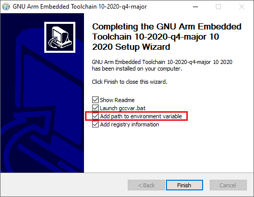

.. _building-setup-windows-cygwin:

============================================================
Setting up the waf Build Environment on Windows using Cygwin
============================================================

These setup instructions describe how to setup `Cygwin <http://www.cygwin.com/>`__ on so that waf (the build system) can run natively on windows and build for all supported boards.

.. note::

      There is a pre-built script at `/ardupilot/Tools/environment_install/install-prereqs-windows.ps1 <https://github.com/ArduPilot/ardupilot/tree/master/Tools/environment_install/install-prereqs-windows.ps1>`__ that will automatically perform all of the below steps.

Install Cygwin
--------------

#. Open a web browser to `www.cygwin.com/install.html <https://www.cygwin.com/install.html>`__ and download  "setup-x86_64.exe"

#. Paste the  following command at a DOS prompt (press window and R key then enter cmd) in the directory where you downloaded "Run setup-x86_64.exe"

::

    setup-x86_64.exe -P autoconf,automake,ccache,gcc-g++,git,libtool,make,gawk,libexpat-devel,libxml2-devel,python36,python36-future,python36-lxml,python36-pip,libxslt-devel,python36-devel,procps-ng,zip,gdb,ddd
    
Or, for a stepped install:

#. open a web browser to `www.cygwin.com/install.html <https://www.cygwin.com/install.html>`__ and run setup-x86_64.exe"

#. accept the all the prompts (including default file locations) until
   you reach the *Select Packages* dialog.
   
#. Select the required packages from the thousands of available packages.
   Refer to the list below and enter each package "Name" into the Search field as shown below.
   When you have found the package click on the **Skip** button to change it to a version number and then move onto the next package:

   .. figure:: ../images/Cygwin-select-install-gpp.png
      :target: ../_images/Cygwin-select-install-gpp.png

      Cygwin Installer: Select Package Dialog

   +-----------------+----------------------------------------------------------------------------------+
   | Package Name    | Category / Name / Description                                                    |
   +=================+==================================================================================+
   | autoconf        | Devel \| autoconf: Wrapper scripts for autoconf commands                         |
   +-----------------+----------------------------------------------------------------------------------+
   | automake        | Devel \| automake: Wrapper scripts for automake and aclocal                      |
   +-----------------+----------------------------------------------------------------------------------+
   | ccache          | Devel \| ccache: A C compiler cache for improving recompilation                  |
   +-----------------+----------------------------------------------------------------------------------+
   | gcc-g++         | Devel \| gcc-g++ GNU Compiler Collection (C++)                                   |
   +-----------------+----------------------------------------------------------------------------------+
   | git             | Devel \| git: Distributed version control system                                 |
   +-----------------+----------------------------------------------------------------------------------+
   | libtool         | Devel \| libtool: Generic library support script                                 |
   +-----------------+----------------------------------------------------------------------------------+
   | make            | Devel \| make: The GNU version of the 'make' utility                             |
   +-----------------+----------------------------------------------------------------------------------+
   | gawk            | Interpreters \| gawk: GNU awk, a pattern scanning and processing language        |
   +-----------------+----------------------------------------------------------------------------------+
   | libexpat-devel  | Libs \| libexpat-devel: Expat XML parser library (development files)             |
   +-----------------+----------------------------------------------------------------------------------+
   | libxml2-devel   | Libs \| libxml2-devel: Gnome XML library (development)                           |
   +-----------------+----------------------------------------------------------------------------------+
   | libxslt-devel   | Libs \| libxslt-devel: XML template library (development files)                  |
   +-----------------+----------------------------------------------------------------------------------+
   | python36        | Python \| python36: Python2 language interpreter                                 |
   +-----------------+----------------------------------------------------------------------------------+
   | python36-devel  | Python \| python36-devel: Python3 language interpreter                           |
   +-----------------+----------------------------------------------------------------------------------+
   | python36-future | Python \| python36-future: Clean single-source support for Python 3 and 2        |
   +-----------------+----------------------------------------------------------------------------------+
   | python36-libxml2| Python \| python36-lxml: Gnome XML Library (Python bindings)                     |
   +-----------------+----------------------------------------------------------------------------------+
   | python36-pip    | Python \| python36-pip: Python package installation tool                         |
   +-----------------+----------------------------------------------------------------------------------+
   | procps-ng       | System \| procps-ng: System and process monitoring utilities (required for pkill)|
   +-----------------+----------------------------------------------------------------------------------+
   | gdb             | Devel \| gdb: The GNU Debugger                                                   |
   +-----------------+----------------------------------------------------------------------------------+
   | ddd             | Devel \| ddd: DDD, the data display debugger                                     |
   +-----------------+----------------------------------------------------------------------------------+
   | zip             | Archive \| zip: Info-ZIP compression utility                                     |
   +-----------------+----------------------------------------------------------------------------------+   
   | xterm           | Shells, X11 \|  X11 terminal emulator                                            |
   +-----------------+----------------------------------------------------------------------------------+   
   

#. When all the packages are selected, click through the rest of the
   prompts and accept all other default options (including
   the additional dependencies).
#. Select **Finish** to start downloading and installing the packages.

   .. warning::

      Sometimes the installation can stall because of anti-virus protection software is running.
      If this occurs, shutdown all other programs on your PC including the anti-virus protection and try again.

Install the GCC compiler
-------------------------

.. note::

      This step is only required if you intend to compile for ARM-based boards.

- download and install the gcc-arm-non-eabi compiler from `firmware.ardupilot.org/Tools/STM32-tools <https://firmware.ardupilot.org/Tools/STM32-tools>`__ (`quick link is here <https://firmware.ardupilot.org/Tools/STM32-tools/gcc-arm-none-eabi-6-2017-q2-update-win32-sha2.exe>`__)
    - accept the license
    - install to the default location
    - accept the ssl certificate
    - check option to "Add path to environment variable"

Install MAVProxy
-----------------------------------------------------

The MAVProxy GCS is required when running SITL. If you're not planning to run SITL, you can skip this step.

#. To install MAVProxy on Windows follow the :ref:`MAVProxy documentation <mavproxy:mavproxy-downloadinstallwindows>`.

Set up directories/paths and extra packages in Cygwin
-----------------------------------------------------

#. open and then close the "Cygwin64 Terminal" application from the desktop or start menu icon.  This creates initialisation files for the user in the Cygwin home directory.

#. open the "Cygwin64 Terminal" application from the desktop or start menu icon.  Enter the following command to set Python 3.6 to be the default Python and then install additional Python packages:

::

    ln -s /usr/bin/python3.6 /usr/bin/python
    ln -s /usr/bin/pip3.6 /usr/bin/pip
    pip install empy pyserial pymavlink

Download ArduPilot Source
=========================

The ArduPilot source files then need to be downloaded to your local Cygwin filesystem by cloning the git repository and updating the submodules. Enter the following commands into the Cygwin terminal to download the source files:

::

    git clone https://github.com/ardupilot/ardupilot.git
    cd ardupilot
    git submodule update --init --recursive

Build with Waf
==============

You should now be able to start the "Cygwin64 Terminal" application from your Windows Start menu and build with waf as described in `BUILD.md <https://github.com/ArduPilot/ardupilot/blob/master/BUILD.md>`__.

   .. warning::

      The build may fail if the file path to some files is too long.  If the build fails, please try :ref:`cloning <git-clone>` ArduPilot into a directory very high in the directory structure (i.e. ~/ardupilot).
      
      If during build process you get error of missing packet xyz, re-check that you have installed all cygwin packages listed above
      
Running SITL
============

You can run SITL just as you can with any other build environment. In order to see the terminal you should install VcXsrv or other X server application. You must then tell Cygwin where to look for the display by setting the DISPLAY variable. 

::

      export DISPLAY=:0.0 
