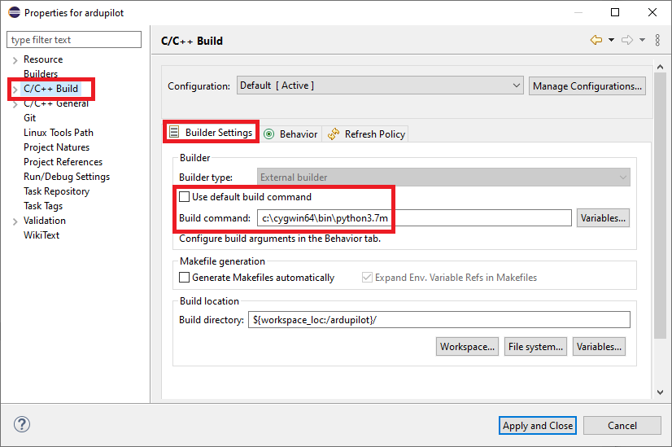

.. _building-setup-windows-eclipse:

========================
Setup Eclipse on Windows
========================

This page shows how to setup Eclipse on Windows to build using waf which allows building for all supported boards.  These instructions replace the :ref:`older method which relied on Make <editing-the-code-with-eclipse>`.

.. note::

    These instructions assume you have already :ref:`Setup the Build Environment on Windows using Cygwin <building-setup-windows-cygwin>`

Remove Pixhawk Toolchain (if present)
-------------------------------------

If you have been using the :ref:`older method which relied on Make <building-px4-with-make>` first remove the old tool chain by renaming the ``C:\pixhawk_toolchain`` directory to ``C:\pixhawk_toolchain.bak``

Install and Run Eclipse
-----------------------

- Download `Eclipse 64 bit from here <https://www.eclipse.org/downloads/>`__
- Run the downloaded eclipse installer and select "Eclipse IDE for C/C++ Developers"
- Accept the Eclipse Foundation certificate when asked
- Launch Eclipse and click on the "Workbench" button on the top right

Import ArduPilot
----------------

Once Eclipse has been started import ArduPilot by doing the following:

- Select File, New, Makefile Project with Existing Code

- When the "New Project" window appears select the folder into which ardupilot was :ref:`cloned <git-clone>` and select the Toolchain to be "Cygwin GCC"

- In the Project Explorer tab on the top right, right-mouse-button-click on the "ardupilot" folder and select "Properties"
- When the "Properties for ardupilot" window appears, under "C/C++ Build", uncheck "Use default build command" and enter ``c:\cygwin64\bin\python2.7 waf`` into the "Build command" field as shown below

Setup Build Target
------------------

- Within the "Build Targets" tab on the right select "ardupilot" and push the green "New Build Target" button.
- In the "Target name" field enter ``configure --board fmuv3 --no-submodule-update`` and press OK to create a build target to configure the waf build for Pixhawk/Cube flight controllers using ChibiOS
- Create another build target called ``copter``
- Run these two targets in order to create an ArduPilot Copter binary for Pixhawk/Cube flight controllers
- If the build fails with a "Missing configuration file" check the ardupilot directory for a directory called "build" and delete it and try again
- Other useful build targets include, ``clean``, ``plane``, ``rover`` and  ``--help``

The arducopter.apj firmware will be created in the **ardupilot\\build\\fmuv3\\bin** directory and can be uploaded from the Mission Planner or other ground station.

.. note::

    The ``configure`` build target described above requires the ``--no-submodule-update`` be prepended because the submodule update step of the build does not yet work with the setup described here.  We expect this to be resolved in the future but until then, please open a **git bash** terminal and run ``git submodule update --recursive`` if you believe the submodules have been updated recently.

Use spaces instead of tabs
--------------------------

By default Copter, Plane and Rover use spaces in place of tabs. This can be set to the default in Eclipse by changing two settings

-  Select **Window \| Preferences \| General \| Editors \| Text Editors
   \| Insert spaces for tabs**.

   .. image:: ../images/EditingTheCode_Eclipse_spaces1.png
       :target: ../_images/EditingTheCode_Eclipse_spaces1.png
    
-  Select **Windows \| Preferences \| C/C++ \| Code Style \| Formatter**
   and creating a new Profile (i.e. "K&R Tab") which has the
   "Indentation" set to "Spaces only"

   .. image:: ../images/EditingTheCode_Eclipse_spaces2.png
       :target: ../_images/EditingTheCode_Eclipse_spaces2.png