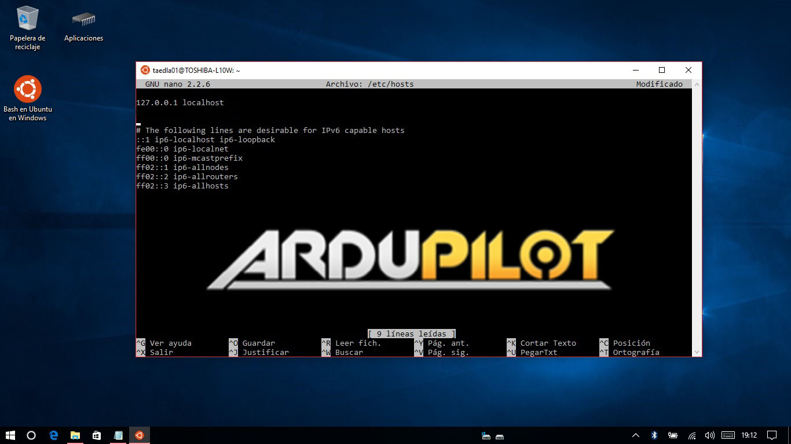

.. _building-setup-windows10:

================================================================
Setting up the Build Environment on Windows10 using WSL1 or WSL2
================================================================

These setup instructions describe how to setup "Bash on Ubuntu on Windows" (aka "Windows Subsystem for Linux") which allows building with waf.

It involves enabling the built-in Windows Linux environment (WSL) in Windows10, installing a compatible Linux OS image, and finally installing the build environment as if it were a normal Linux system.

Upon completion, you will be able to build ArduPilot binaries and run the native ArduPilot SITL simulator, including the MAVProxy developer Ground Control Station. 

WSL1 vs WSL2
------------

WSL2 is the latest version of the Windows10 Subsystem for Linux. It is many times faster than WSL1 and is therefore much preferred  for building the code in terms of speed. It can also run MAVProxy and native SITL. However, it does not support USB yet, so uploading code or connecting to the autopilot is not possible. Also, it does not support running Realflight on the same or a remote PC.

Once installed, you can switch between WSL1 or WSL2 versions as you prefer.

WSL Setup steps
---------------
#. First, follow the instructions `here <https://docs.microsoft.com/en-us/windows/wsl/install-win10>`_. Usually, installing the latest version of Ubuntu is preferred.

#. Congratulations, you now have a working Ubuntu subsystem under Windows, you can now use our :ref:`Ubuntu instructions to install ArduPilot development environment <building-setup-linux>`

.. tip::

  You can run XWindows applications (including SITL) by installing `VcXsrv <https://sourceforge.net/projects/vcxsrv/>`_  on Windows. You will need to set the DISPLAY variable to point to your display: in WSL it is 127.0.0.1:0, in WSL2 it will be the ip address of the PC's network port and can be set by using the code below. Also in WSL2 you may have to disable the firewall for public networks, or create an exception in order for VcXsrv to communicate with WSL2:

::

  export DISPLAY=$(cat /etc/resolv.conf | grep nameserver | awk '{print $2}'):0

.. tip:: For code editing you can install VSCode inside WSL.
   
.. tip::

    Windows 10 includes "Windows Defender" virus scanner. It will slow down WSL quite a bit. Disabling it greatly improves disk performance but increases your risk to viruses so disable at your own risk. Here is one of many resources/videos that show you how to disable it: https://www.youtube.com/watch?v=FmjblGay3AM

File System Access between WSL and Windows10
--------------------------------------------

From within WSL, the Windows drives are referenced in the /mnt directory. For example, in order to list documents within your (<username>) documents folder:

::

    ls /mnt/c/'Documents and Settings'/<username>/Documents
    or
    ls /mnt/c/Users/<username>/Documents

From within Windows, the WSL distribution's files are located at (type in windows Explorer address bar):

::

   \\wsl$\<distribution name>
   e.g.
   \\wsl$\Ubuntu-20.04

