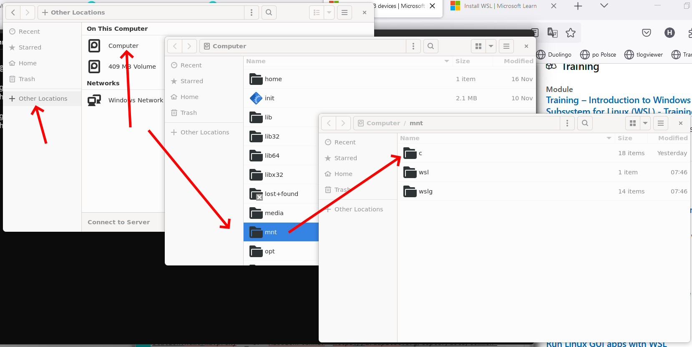

.. _building-setup-windows11:

========================================================
Setting up the Build Environment on Windows 11 using WSL
========================================================

These setup instructions describe how to set up "Windows Subsystem for Linux" for Windows 11  which allows building with waf.

It involves enabling the built-in Windows Linux environment (WSL) in Windows, installing a compatible Linux distribution, and finally installing the ArduPilot build environment as if it were a normal Linux system.

Upon completion, you will be able to build ArduPilot binaries and run the native ArduPilot SITL simulator, including the MAVProxy developer Ground Control Station. You will also be able to use the majority of Linux development features such as debugging.

WSL Setup Steps
===============

#. The official instructions are `here <https://docs.microsoft.com/en-us/windows/wsl/install>`__.

#. From the Start menu, start the "Ubuntu" application and then follow the :ref:`Ubuntu instructions to install ArduPilot development environment <building-setup-linux>`

    .. note:: Compilation speeds will be much faster if the ArduPilot repository is downloaded inside of WSL's file system and not externally in the normal Windows file structure.

    * To reload the path variables in WSL either close the terminal and reopen it or use: ``logout``

#. Windows 11 WSL2 includes a graphical interface for Linux programs. Programs such as ``gedit`` and ``retext`` editors, ``nautilus`` file manager, etc do not need anything additional installed to display graphical interfaces.

#. If USB connectivity from within WSL2 is desired, `install USBIPD <https://learn.microsoft.com/en-us/windows/wsl/connect-usb>`__

File System Access between WSL and Windows
==========================================

In Windows 11, Windows Explorer will show the file base directory for the Linux system (normally Ubuntu) in its left pane for easy access.

Windows files can be from within WSL2 using a file explorer such as ``nautilus`` as shown below:

Uploading to a board using WSL2
===============================

Uploading to boards (e.g. ``./waf plane --upload``) in WSL2 is possible; however, an installation of Python must exist on the Windows side. Install these packages in Windows Python.

::

    pip.exe install empy pyserial

As of July 2022, Microsoft's solution of providing USB access to WSL2 via usbipd does not work for accessing the bootloader on the device due to slow mounting times.

.. note:: WSL1 can upload to boards by default with no additional changes. This is due to differences in how USB devices are handled.

Code Editing in WSL Using VSCode (Optional)
===========================================

VSCode can be installed on the Windows machine to edit and compile files inside of WSL. VSCode automatically integrates upon installation with WSL. More details are available :ref:`here<editing-the-code-with-vscode>`.

    * Do not install VSCode inside of WSL using, for example, apt-get.
    * Be sure that the folder you are working on is opened within the WSL remote. This can be achieved by clicking the green button in the bottom left corner.

Windows Terminal (Optional)
===========================

Windows Terminal enables multiple tabs that can switch between many Linux terminals, PowerShell, and more.

    * You can change the default terminal when opening Windows Terminal by going to "Settings" and moving the Ubuntu section to be first in the ``list`` section of the ``settings.json`` file.
    * The default starting directory can be changed by adding the ``startingDirectory`` line below to your preferred location by following the example below.
    * Note a similar code block to the one shown below will be automatically generated based upon the version and distribution of Linux installed.

::

    {
        "guid": "{07b52e3e-de2c-5db4-bd2d-ba144ed6c273}",
        "hidden": false,
        "name": "Ubuntu-20.04",
        "source": "Windows.Terminal.Wsl",
        "startingDirectory" : "//wsl$/Ubuntu-20.04/home/<yourUserName>/ardupilot"
    },

Git Integration with Windows Credential Manager (Optional)
==========================================================

Git's Credential Manager can be connected to Window's Credential Manager tokens. This connection prevents re-authentication requests when accessing remote repositories such as GitHub after closing WSL or restarting Windows. The first time a Git operation requires credentials a dialog box will appear automatically to enter your credentials.
See this `guide <https://docs.microsoft.com/en-us/windows/wsl/tutorials/wsl-git#git-credential-manager-setup>`_ for more information regarding GIT and WSL. 

.. code-block:: bash

    git config --global credential.helper "/mnt/c/Program\ Files/Git/mingw64/libexec/git-core/git-credential-manager.exe"
