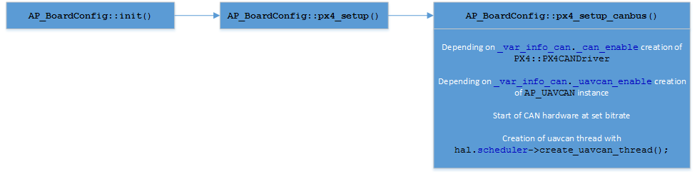

.. _can-bus:

===========================
CAN bus and UAVCAN protocol
===========================

Support for CAN bus messaging in Ardupilot relies on two parts:

- Hardware CAN bus support that is done with HAL drivers
- UAVCAN protocol which is responsible for handling all high level work

CAN bus support in Ardupilot
============================

The base for hardware CAN bus support is located in AP_HAL library and
consist of two classes:

- CAN class that is responsible for representation of one physical interface on board.
  This class manages opening, setup and operation of the interface and is a main connection
  point between software and hardware
  
- CANManager class is wrapping all physical interfaces.
  It does enumeration of interfaces, provides access to them and also holds connection
  point for accessing UAVCAN managing class.
  
As a guide for implementing CAN bus support for new hardware, following :ref:`roadmap <can-bus-driver-roadmap>` can be used.

UAVCAN protocol
===============

The support for UAVCAN protocl is based on AP_UAVCAN class that is wrapping interaction
with Libuavcan and provides access points for other libraries present in Ardupilot. It is
responsible for sending the messages over CAN bus with UAVCAN protocol, receiving the messages,
translation of messages to form that is acceptable to other libraries and provide cyclic
update of Libuavcan.

The AP_UAVCAN class supports following messages:

- Transmission of 1010.ArrayCommand to servos

- Receiving of 1001.MagneticFieldStrength

- Receiving of 1028.StaticPressure

- Receiving of 1029.StaticTemperature

- Transmission of 1030.RawCommand to ESCs

- Receiving of 1060.Fix from GNSS

- Receiving of 1061.Auxiliary from GNSS

Processing of all incoming messages is made in the AP_UAVCAN class and the messages
are translated into the form that is best suited for other libraries. The libraries that
consume or transmit data should not include the UAVCAN header files from UAVCAN module,
but instead should send all data to AP_UAVCAN class in their own preferable way.

Initialization description
==========================

The following initialization is based on px4 hardware and is provided as example

Depending on type of board and underlaying hardware, other actions may need to be taken
for creation of CAN driver and UAVCAN interface class.

.. toctree::
    :maxdepth: 1

    CAN bus driver implementation roadmap <can-bus-driver-roadmap>
    
