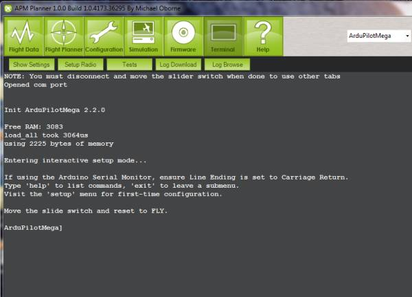
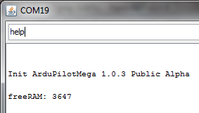
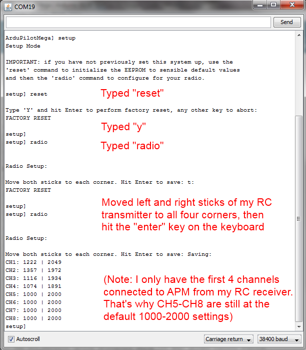
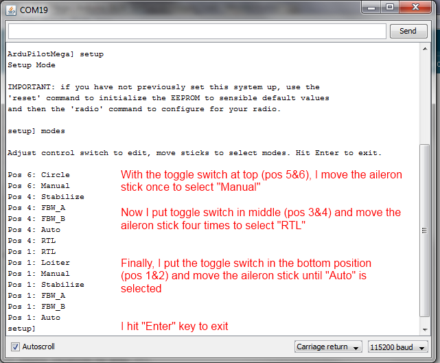

.. _cli-setup-test-modes:

====================================
Mission Planner CLI Setup Test modes
====================================

Command Line Interpreter
========================

The Mission Planner Command Line interpreter is a serial terminal line
editor that works similarly to the way the old DOS prompt operating
systems used to work. If you want, you can set up and test APM is via a
Command Line Interpreter (CLI). It is only available via the USB cable
and it cannot be used via an Xbee or 3DR wireless telemetry connection.
Open up the Terminal in the Mission Planner by selecting the Terminal
tab (ensure that the serial baud rate is set for 115200). This will
bring up the Terminal window, and it should automatically take you to
the APM CLI menu (if not, click in the window and hit "Enter" three
times): 

    
You can now enter commands by typing them at the
command prompt. You can always type "exit" to leave any mode. In the
following examples, I'll be using another serial terminal (in this case
the Arduino Serial Monitor). You can use any terminal you want, but the
Mission Planner terminal is the most straightforward. Here I'm typing
"help" to see a list of available commands:

Initial commands are:

-  **logs**: Log readback/setup mode. Used after flying)
-  **setup**: Initial setup mode)
-  **test**: Test mode)

Setup
=====

The Setup process configures APM for your particular RC radio settings
and desired flight modes. Type "setup" and hit return to enter this
mode. **You MUST setup both radio and modes before you can fly. You
should also test that you're getting GPS lock (using the gps command in
the test mode), which usually means testing outside where the GPS module
has a clear view of the sky.** Allowed setup commands are:

-  **reset**: Resets APM to default settings
-  **radio**: Sets up RC settings (see below)
-  **modes**: Sets up flight control modes for each RC toggle switch position (see below)
-  **compass**: Enables compass. Commands are "compass on" or "compass
   off"
-  **declination**: Sets local magnetic declination for compass. You
   can find your local declination at `this web page <http://www.ngdc.noaa.gov/geomag-web/>`__. Although it is given
   in minutes and seconds, enter it as a decimal.
   So ``14° 10' E`` would be entered as 14.10.
-  **"battery"**: Enables battery monitoring. Enter options 0-4 (repeat
   to enter additional options):

::

         0 = Batt monitoring disabled
         1 = Monitoring 3 cell battery
         2 = Monitoring 4 cell battery
         3 = Monitoring batt volts 
         4 = Monitoring both volts and current

-  **"show"**: Shows all current settings in EEPROM
-  **"erase"**: Erases EEPROM

Radio setup
===========

*Note: APM does not power the RC receiver or servos (although the RC
equipment can power APM). If you have APM powered by USB, you must also
connect an ESC/Lipo or receiver battery to the RC APM pins (typically,
the ESC would be plugged into Out 3, while a receiver battery would
typically be plugged into your receiver, which would send power to APM
via the RC cables). If you do not separately power the RC system, APM
will be unable to read any signals on its RC inputs.* In this mode you
must move both sticks to all of their extremes, as follows: Move the
right stick to the top right, then bottom right, then top left, then
bottom left. Then repeat for the left stick. The order doesn't matter,
but what's important is that you hit all four corners for each stick.
Hold the stick in each corner for a second. Here's a screenshot of a
typical Radio setup process:

**Note**: As shown above, the RC readings for the channels you have
hooked up should be around 1,000-1,300 at the low end and around
1,900-2,000 at the high end. (Readings of exactly 1,000 and 2,000 mean
that channel's not connected at all). If you are getting readings that
are all around 1,500, there are three likely causes:

#. You didn't move both sticks to all four corners of their range during
   the test, or did it too quickly.
#. Your RC connections are plugged in wrong, either upside down, on the
   wrong pins, or otherwise not making a connection
#. You have one of the early APM boards that may need to have its PPM
   firmware updated (this should not be a problem for any board shipped
   after mid-2010). Instructions for doing that
   are :ref:`here <copter:common-ppm-encoder-8-channel-standalone-encoder>`.

Flight Control Modes
====================

Here's how to set your flight control modes: In the CLI, enter setup
mode. Type "modes" and press return. You can now see the flight modes
displayed as you move your control switch to each position. If you want
to change your mode, use the rudder/aileron control stick on your radio.
Just move the stick to the right or left and the mode will increment.
Hitting Enter will exit the mode and save your changes. See this
example:

**Here's a video tutorial:**

.. youtube:: E7RE1B0lhk4
    :width: 100%

Checking for reversed servos
============================

Now is a good time to go back and see if any of the DIP switches need to
be flip to reverse a servo. Instructions
are :ref:`here <plane:reversing-servos-and-setting-normalelevon-mode>`.
And remember that if you're flying an elevon plane (flying wing or
delta), you should set the mixing with the DIP switch, too. And if
you're flying a regular plane and find that channel 1 and 2 are
accidentally combined, that means you've accidentally got it in the
elevon mode. Push the last DIP switch down to return to normal.

Logs
====

This mode allows you to read and manage flight log files in the onboard
16MB dataflash memory. NOTE: You must use erase before trying to use the
logging function. Failure to do an erase first will cause problems and
show false results.

-  **"dump (n)"**: Dump log "n"
-  **"erase"**: Erase all logs
-  **"enable (name) or all"**: Enable logging "name" or everything
-  **"disable (name) or all"**: Disable logging "name" or everything

CLI APM Test Suite
==================

APM comes with a number of onboard tests. To use them, type "test" in
the CLI, and "help" to see all the different tests:

-  **baro**: Shows the data from the barometer
-  **compass**: Shows the data from the magnetometer, if one is
   connected and enabled
-  **ins**: tests the accelerometers and gyros
-  **optflow**: Tests optical flow sensor
-  **relay**: Tests the onboard relay (turns it on and off every five
   seconds; you should hear it faintly click)
-  **shell**: Provides access to the NSH shell (Pixhawk only)
-  **rangefinder**: Tests the rangefinder sensor

