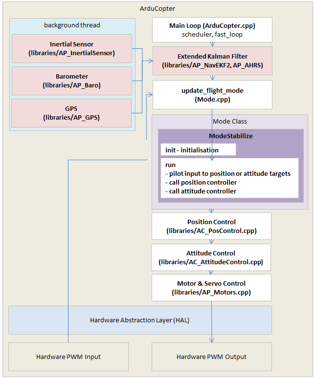
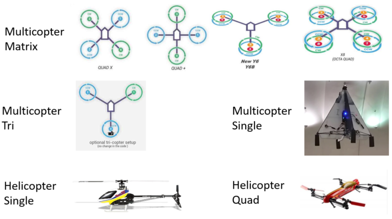
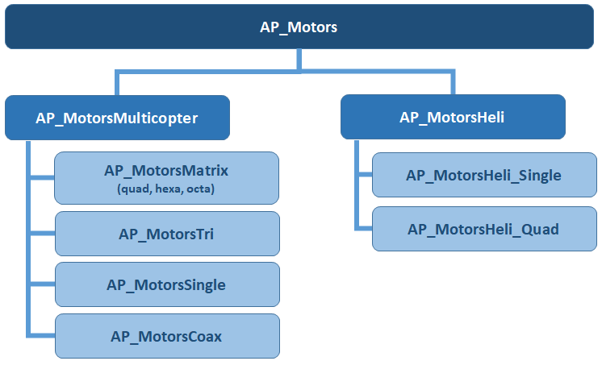

.. _code-overview-copter-motors-library:

=====================
Copter Motors Library
=====================

This page covers the basics of the `Copter motors library <https://github.com/ArduPilot/ardupilot/tree/master/libraries/AP_Motors>`__

As a reference the diagram below provides a high level view of Copter's architecture.  The motors library can be seen near the bottom right just above the "Hardware Abstraction Layer"

ArduPilot supports over 22 different multicopter frames.  The Motors library is designed to consolidate the majority of the differences in these frame types from the higher level code including the attitude controllers and vehicle specific code.  In other words the library provides a common interface so that all vehicles can be controlled in the same way without special handling being required in higher level code.

The image below shows a categorisation of these frames which is consistent with the class structure

- Multicopter Matrix : vehicles with mostly downward facing propellers and no servos.  These are the most commonly used frames and the code can be found in the `AP_MotorsMatrix <https://github.com/ArduPilot/ardupilot/blob/master/libraries/AP_Motors/AP_MotorsMatrix.h>`__ class
- Multicopter Tri and Single: vehicles with a combination of motors and servos.  These are peers of each other and Multicopter Matrix and can be found in the `AP_MotorsTri <https://github.com/ArduPilot/ardupilot/blob/master/libraries/AP_Motors/AP_MotorsTri.h>`__ and `AP_MotorsSingle <https://github.com/ArduPilot/ardupilot/blob/master/libraries/AP_Motors/AP_MotorsSingle.h>`__ classes
- Helicopter Single, Quad: vehicles with swashplates that can provide reverse thrust.  These are peers of each other and children of the `AP_MotorsHeli <https://github.com/ArduPilot/ardupilot/blob/master/libraries/AP_Motors/AP_MotorsHeli.h>`__ class.

Below is a diagram of the Motors library's class hierarchy

Inputs to the Motors Library
----------------------------

The Attitude Controller provides high level roll, pitch, yaw and throttle commands to the Motors library in the range of -1 to +1 (for roll, pitch and yaw) or 0 to +1 (for throttle).  The exact point where the attitude controller issues these commands can be found in AC_AttitudeControl_Multi's `rate_controller_run() <https://github.com/ArduPilot/ardupilot/blob/master/libraries/AC_AttitudeControl/AC_AttitudeControl_Multi.cpp#L253>`__ method

   ::

        void AC_AttitudeControl_Multi::rate_controller_run()
        {
            Vector3f gyro_latest = _ahrs.get_gyro_latest();
            _motors.set_roll(rate_target_to_motor_roll(gyro_latest.x, _rate_target_ang_vel.x));
            _motors.set_pitch(rate_target_to_motor_pitch(gyro_latest.y, _rate_target_ang_vel.y));
            _motors.set_yaw(rate_target_to_motor_yaw(gyro_latest.z, _rate_target_ang_vel.z));

and the definitions of the methods used can be seen in `AP_Motors_Class.h <https://github.com/ArduPilot/ardupilot/blob/master/libraries/AP_Motors/AP_Motors_Class.h#L78>`__

   ::

            // set_roll, set_pitch, set_yaw, set_throttle
            void set_roll(float roll_in) { _roll_in = roll_in; };        // range -1 ~ +1
            void set_pitch(float pitch_in) { _pitch_in = pitch_in; };    // range -1 ~ +1
            void set_yaw(float yaw_in) { _yaw_in = yaw_in; };            // range -1 ~ +1
            void set_throttle(float throttle_in) { _throttle_in = throttle_in; }; // range 0 ~ 1

Outputs and Responsibilities
----------------------------

All motors libraries must do two things:

1. Convert the high level inputs from the attitude controller to individual motor and servo outputs

  - Roll input of +1.0 should cause motor and servo outputs that provide maximum roll rotation to the right
  - Pitch input of +1.0 should result in maximum pitch back
  - Yaw input of +1.0 should result in maximu yaw in the clockwise direction
  - Throttle input of +1.0 should result in maximum acceleration upwards (in the vehicle's body frame).  Throttle of zero should result in minimum acceleration upwards (or maximum acceleration downwards in the case of helicopters)

2. Set the limit flags to avoid "I-term build-up" in the attitude and throttle controllers.  Although a vehicle will be flyable without setting these flags, they are important for protecting against overshoot in lean angle control and also for automatic landing detection.  The limits are held in the `AP_Motors_Class::limit <https://github.com/ArduPilot/ardupilot/blob/master/libraries/AP_Motors/AP_Motors_Class.h#L118>`__ variable.

   ::

            // structure for holding motor limit flags
            struct AP_Motors_limit {
                uint8_t roll_pitch      : 1; // we have reached roll or pitch limit
                uint8_t yaw             : 1; // we have reached yaw limit
                uint8_t throttle_lower  : 1; // we have reached throttle's lower limit
                uint8_t throttle_upper  : 1; // we have reached throttle's upper limit
            } limit;

Adding support for a new "Multicopter Matrix" frame
---------------------------------------------------

To add support for a new Multicopter Matrix frame type (i.e. a frame with downward facing propellers and no servos):

- Decide on a name for the frame and add a new entry into either the motor_frame_class and/or motor_frame_type enums found in `AP_Motors/AP_Motors_Class.h <https://github.com/ArduPilot/ardupilot/blob/master/libraries/AP_Motors/AP_Motors_Class.h#L32>`__
- Add the same number(s) from the above step to the `FRAME_CLASS <https://github.com/ArduPilot/ardupilot/blob/master/ArduCopter/Parameters.cpp#L848>`__ and/or `FRAME_TYPE <https://github.com/ArduPilot/ardupilot/blob/master/ArduCopter/Parameters.cpp#L361>`__ parameters descriptions
- Add a new case to the `AP_MotorsMatrix::setup_motors() <https://github.com/ArduPilot/ardupilot/blob/master/libraries/AP_Motors/AP_MotorsMatrix.cpp#L466>`__ for the new frame class and/or frame type

  - Use AP_MotorsMatrix::add_motor() or `AP_MotorsMatrix::add_motor_raw() <https://github.com/ArduPilot/ardupilot/blob/master/libraries/AP_Motors/AP_MotorsMatrix.h#L62>`__ functions to set the roll, pitch and yaw factors for each motor on the vehicle.  These factors are multiplied by the high level roll, pitch and yaw input from the attitude controllers and the result is then output to the motors.
  - The above add_motor function's testing_order argument specifies the order in which the motors should spin when the user initiates a motor test.  Normally each motor's testing order should be relative to its position on the frame in a clockwise direction.
  - set success = true at the bottom of the case to alert the AP_Motors initialisation code that the frame has been setup

Detailed instructions are not yet available for adding more complex frame types (sorry!)

..  youtube:: c6aCwSHr_is
    :width: 100%
