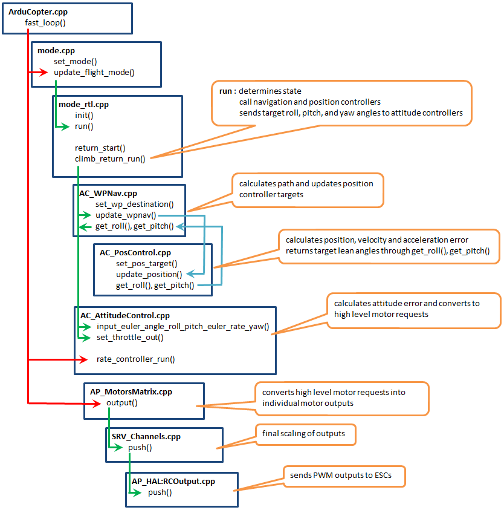
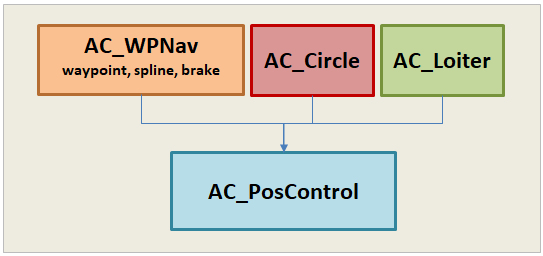

.. _code-overview-copter-poscontrol-and-navigation:

======================================
Copter Position Control and Navigation
======================================

This page covers the basics of Copter's `Position Control  <https://github.com/ArduPilot/ardupilot/tree/master/libraries/AC_AttitudeControl/AC_PosControl.h>`__ and `Waypoint Navigation <https://github.com/ArduPilot/ardupilot/tree/master/libraries/AC_WPNav>`__ libraries

As a reference the diagram below provides a high level code flow view of Copter's RTL mode

Class Hierarchy and Description
-------------------------------

At the highest level, AC_WPNav, AC_Circle and AC_Loiter libraries are peers and all make use of the AC_PosControl library

- AC_WPNav is made up of three independent controllers (these may be separated into individual libraries in the future):

  - Waypoint attempts to fly the vehicle in a straight line to a target waypoints.  This interface accepts a 3D target destination specified as a latitude, longitude and altitude or as an offset from the EKF origin
  - Spline flies the vehile in a smooth curved path to a 3D target waypoint with a final velocity that will allow it to continue smoothly towards a subsequent waypoint.  Its interface is very similar to the Waypoint controller above
  - Brake tries to slow the vehicle to a stop as quickly as possible
  - Waypoint, Spline and Brake controllers do not use PIDs directly.  Instead they update target positions or velocities which are then passed to the Position Controller

  .. image:: ../images/copter-navigation-wpnav-path.png
      :target: ../_images/copter-navigation-wpnav-path.png
      :width: 450px

- AC_PosControl:

  - Separate interfaces for horizontal (X and Y axis) control and vertical (Z-axis) control.  These interfaces are separated because some flight modes (like AltHold mode) only require the Z-axis controller
  - Layered PID controllers are used

    - XY axis uses a Position P to convert position error to a target velocity.  A velocity PID converts velocity error into a desired acceleration which is then converted to a desired lean angle which is then sent into the attitude control library.

    .. image:: ../images/copter-poscontrol-pid.png
        :target: ../_images/copter-poscontrol-pid.png
        :width: 600px

    - The Z axis uses a Position P controller to convert position error to a target vertical velocity (aka climb rate).  A Velocity P controller converts velocity error to a desired acceleration.  An Acceleration PID converts acceleration error into a desired throttle which is then sent into the attitude control library (which mostly just passes it through to the low level motors library)

  - AC_PosControl also includes a 3D velocity controller and a 3D Position+Velocity controller

Should I use PosControl or WPNav?
---------------------------------

Because both AC_PosControl and AC_WPNav allow the caller to move a vehicle to a 3D target point it may not be clear which should be used.

In general the vehicle code (i.e. flight mode code) should use the AC_WPNav library because it will ensure the vehicle flies a straight path to the target.  AC_PosControl should normally only be used by other higher level navigation libraries.  The exception to this rule is simpler flight modes that simply want Z-axis control - these make direct use of AC_PosControl.
