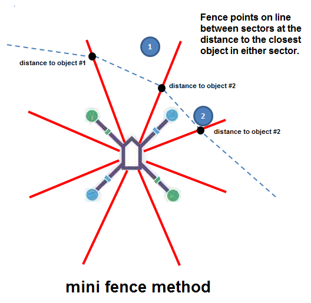

.. _code-overview-object-avoidance:

=======================
Copter Object Avoidance
=======================

ArduCopter, from release 3.5, supports object avoidance using a :ref:`Lightware SF40C <copter:common-lightware-sf40c-objectavoidance>`, :ref:`TeraRanger Tower <copter:common-teraranger-tower-objectavoidance>`  or with any sensor capable of providing distances using the MAVLink `DISTANCE_SENSOR <https://mavlink.io/en/messages/common.html#DISTANCE_SENSOR>`__ message.
This page describes how the object avoidance feature works and how "proximity sensors" should provide data into ArduPilot.

Avoidance in Loiter
===================

..  youtube:: BDBSpR1Dw_8
    :width: 100%

The video above shows a test of an EnRoute EX700 copter fitted with a :ref:`Lightware SF40C 360degree lidar<common-lightware-sf40c-objectavoidance>`.
The vehicle stops 2m from the fence regardless of the speed of the vehicle towards the fence.
This is possible because ArduPilot knows the speed of the vehicle (using the GPS and accelerometers), the distance to the barrier and the maximum acceleration/deceleration of the vehicle.

The `AP_Proximity library <https://github.com/ArduPilot/ardupilot/tree/master/libraries/AP_Proximity>`__ collects the raw distance measurements from the sensor.
These raw distance measurements are consolidated so that only the closest distance and angle within 8 sectors is stored and used.

Each sector is 45 degrees wide with sector 0 pointing forward of the vehicle, sector 1 is forward-right, etc.
From these distances and angles a fence (an array of 2D Vectors) is built up around the vehicle.  The fence points fall on the lines between sectors at a conservative distance.

.. note::

   The default is to divide the area around the vehicle into 8 sectors but each proximity sensor driver can override this and use a different number of sectors.

The `AC_Avoidance library <https://github.com/ArduPilot/ardupilot/tree/master/libraries/AC_Avoidance>`__ consumes the above fence and uses it to adjust (mostly shortens) desired velocity vectors sent to it by
the `Loiter controller <https://github.com/ArduPilot/ardupilot/blob/master/libraries/AC_WPNav/AC_Loiter.cpp#L310>`__ (search for "avoid->adjust_velocity").  Loiter's desired velocity vectors come from the pilot's inputs.

.. note::

   Object avoidance also works for Guided mode's velocity controller

Avoidance in AltHold
====================

The `AP_Proximity <https://github.com/ArduPilot/ardupilot/tree/master/libraries/AP_Proximity>`__ and `AC_Avoidance libraries <https://github.com/ArduPilot/ardupilot/tree/master/libraries/AC_Avoidance>`__ are also used
for object avoidance in AltHold.  Because AltHold does not rely upon the GPS, the vehicle's velocity towards the barriers is not known and a much simpler version of object avoidance is used in which
the distance to the barrier is converted into a lean angle.

The image below shows the method by which the distances to various objects are combined together to result in a final roll/pitch lean angle.
Each sensed object's distance and angle from the vehicle is turned into a roll/pitch angle.  The largest positive and negative roll and pitch angles are found and combined together resulting in a final roll/pitch angle.

This final roll/pitch angle is combined with the pilot's input meaning the vehicle tends to fly away from objects but the pilot always maintains the ability to override the object avoidance.
This is quite different from Loiter mode in which the pilot cannot force the vehicle to fly into an object.

.. note::

   The vehicle will also stop before hitting barriers above it if there is an upward facing range finder.
   Currently this range finder's distance must be sent to ardupilot using the `DISTANCE_SENSOR <https://mavlink.io/en/messages/common.html#DISTANCE_SENSOR>`__ message with the orientation field set to 24 (upwards).

Reporting to the Ground Station
===============================

MissionPlanner, from v1.3.48 onwards (and hopefully other ground stations in the future), shows the distance to nearby objects in a RADAR type window. 

This window can be opened by going to the Flight Data screen, press Ctrl-F and push the Proximity button.  Values will will appear if the `PRX_TYPE <https://ardupilot.org/copter/docs/parameters.html#prx-type>`__ parameter is set to enable a sensor, and messages are being received.

.. image:: ../images/code-overview-object-avoidance-show-radar-view.png
    :target: ../_images/code-overview-object-avoidance-show-radar-view.png
    :width: 300px

This is accomplished by the vehicle sending DISTANCE_SENSOR messages to the ground station at regular intervals.
The method that does this can be seen in the `GCS_Common.cpp file <https://github.com/ArduPilot/ardupilot/blob/master/libraries/GCS_MAVLink/GCS_Common.cpp#L408>`__ (search for "send_proximity").
Note that this means that it is possible that DISTANCE_SENSOR messages can be used both to send distances into the vehicle code, and then similar DISTANCE_SENSOR messages might be sent out from the vehicle to the ground station.
These are separate messages though and are likely transferred at a different rate.

Providing Distance Sensor messages to ArduPilot
===============================================

For developers of new "proximity" sensors (i.e. sensors that can somehow provide the distance to nearby objects) the easiest method to get your distance measurements into ardupilot is to send `DISTANCE_SENSOR <https://mavlink.io/en/messages/common.html#DISTANCE_SENSOR>`__ message for each direction the sensor is capable of.
The system id of the message should match the system id of the vehicle (default is "1" but can be changed using the SYSID_THISMAV parameter).
The component id can be anything but MAV_COMP_ID_PATHPLANNER (195) or MAV_COMP_ID_PERIPHERAL (158) are probably good choices.

These messages should be sent at between 10hz and 50hz (the faster the better).  The fields should be filled in as shown below:

- time_boost_ms : 0 (ignored)
- min_distance : the minimum distance that the sensor can measure in centimeters (i.e. 100 = 1m).  This number should generally not change and should be the same regardless of the orientation field.
- max_distance : the maximum distance that the sensor can measure in centimeters (i.e. 1500 = 15m).  This number should generally not change and should be the same regardless of the orientation field.
- current_distance : the shortest distance in cm to the object
- type : 0 (ignored)
- id : 0 (ignored)
- orientation : 0 to 7 (0=forward, each increment is 45degrees more in clockwise direction), 24 (upwards) or 25 (downwards).  search for MAV_SENSOR_ORIENTATION on the `mavlink/common page <https://mavlink.io/en/messages/common.html>`__.
- covariance : 0 (ignored)

When DISTANCE_SENSOR messages are not received for all 8 sectors, empty sectors are filled in with the distance from an adjacent sector (if available).  This conveniently leads to a "cup" shaped fence which is more likely to protect the vehicle from hitting the object.
It is likely this will be changed in future releases especially if the "stop" behaviour (instead of "slide" behaviour) is configured.

These two videos shows a `ZED 3D camera <https://www.stereolabs.com/>`__ connected to an :ref:`NVidia TX1 <companion-computer-nvidia-tx1>` running `OpenKai <https://github.com/yankailab/OpenKAI>`__ and providing forward facing distance measurements to ArduPilot using the method described above.

..  youtube:: qk_hEtRASqg
    :width: 100%

..  youtube:: MOFullt5k3g
    :width: 100%

Future Steps
============

- add avoidance to other modes including RTL, AUTO (`issue here <https://github.com/ArduPilot/ardupilot/issues/5607>`__)
- improve integration with ROS (`issue here <https://github.com/ArduPilot/ardupilot/issues/5608>`__)
- implement a simple occupancy grid for cases where we cannot (or do not want to) implement ROS on the vehicle (`issue here <https://github.com/ArduPilot/ardupilot/issues/5609>`__)

If you would like to get involved with the development of this area, please consider posting in the issues listed above or chatting with the developers on `ArduPilot Discord <https://ardupilot.org/discord>`__.
