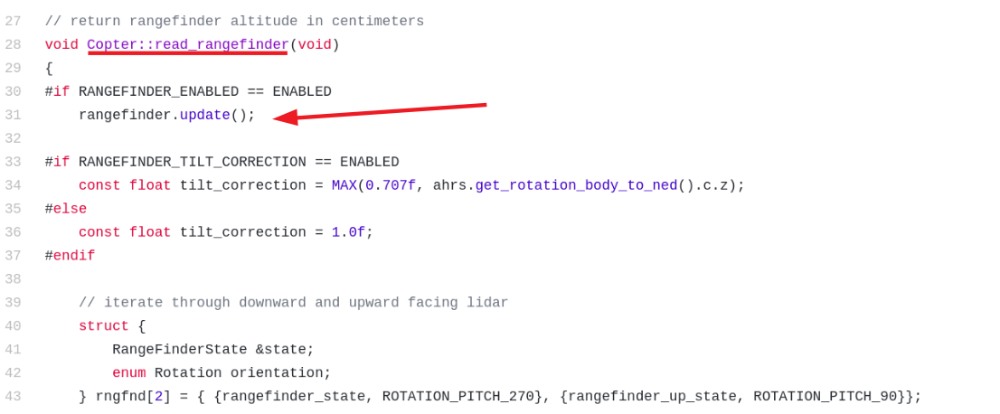
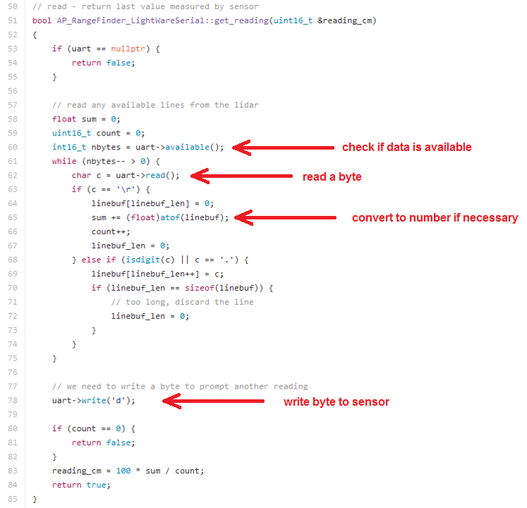

.. _code-overview-sensor-drivers:

==============
Sensor Drivers
==============

ArduPilot supports a wide variety of sensors from many different manufacturers.  One clear example of this can be seen in the :ref:`list of range finders <copter:common-rangefinder-landingpage>` (aka sonars, lidars).
This page attempts to explain how sensor drivers are written and integrated into the vehicle code.

Supported Protocols
===================

`I2C <https://en.wikipedia.org/wiki/I%C2%B2C>`__, `SPI <https://en.wikipedia.org/wiki/Serial_Peripheral_Interface_Bus>`__,
`UART (aka Serial) <https://en.wikipedia.org/wiki/Universal_asynchronous_receiver/transmitter>`__ and `CANBUS <https://en.wikipedia.org/wiki/CAN_bus>`__ (in particular UAVCAN) protocols are supported.
If you plan to write a new driver, you will likely need to refer to the sensor's datasheet in order to determine which protocol it uses.

I2C
---

- one master, many slaves possible
- a relatively simple protocol which is good for communicating over short-distances (i.e. less than 1m).
- bus runs at 100kHz or 400kHz but the data rate is relatively low compared to other protocols.
- only 4 pins are required (VCC, GND, SDA, SCL)

SPI
---

- one master, one slave
- 20Mhz+ speed meaning it is very fast especially compared to I2C
- only works over short distances (10cm)
- requires at least 5 pins (VCC, GND, SCLK, Master-Out-Slave-In, Master-In-Slave-Out) + 1 slave select pin per slave

Serial / UART
-------------

- one master, one slave
- character based protocol good for communicating over longer distances compared to I2C and SPI (i.e. 1m)
- relatively fast at 57Kbps ~ 1.5Mbps
- at least 4 pins required (VCC, GND, TX, RX), plus 2 optional pins (Clear-To-Send, Clear-To-Receive)

CAN bus with UAVCAN
-------------------

- multimaster bus, any node can initiate transmittion of data when they need to
- packet based protocol for very long distances
- high speed, typically 1 Mb (however only 50% of the bus bitrate can really be used without major collisions)
- at least 3 pins required (GND, CAN HI, CAN LO). Optionally VCC can be used to power nodes
- point-to-point topology. Star or stubs topolgy is not advised
- termination is required at each end of the bus

FrontEnd / BackEnd Split
========================

An important concept within the sensor driver architecture is the front-end / back-end split.

The vehicle code only ever calls into the Library's (aka sensor driver's) front-end.

On start-up the front-end creates one or more back-ends based either on automatic detection of the sensor (i.e. probing for a response on a known I2C address)
or by using the user defined _TYPE params (i.e. RNGFND_TYPE, RNGFND_TYPE2).  The front-end maintains pointers to each back-end which are normally held within an array named _drivers[].

User settable parameters are always held within the front-end.

How and When the driver code is run
===================================

The image above shows a zoomed in view of the ardupilot architecture.  The top-left blue box illustrates how the sensor driver's back-ends are run in a background thread.
Raw data from the sensors is collected, converted into standard units and then held within buffers within the driver.

The vehicle code's main thread runs regularly (i.e. 400hz for copter) and accesses the latest data available through methods in the driver's front-end.
For example in order to calculate the latest attitude estimate, the AHRS/EKF would pull the latest accelerometer, gyro and compass information from the sensor drivers' front-ends.

The image is a slight generalization, for drivers using I2C or SPI, they must run in the background thread so that the highrate communication with the sensor does not affect
the main loop's performance but for driver's using a serial (aka UART) interface, it is safe to run in the main thread because the underlying serial driver itself collects data
in the background and includes a buffer.

Vehicle Code and Front-End Example
==================================

The example below shows how the Copter vehicle code pulls data from range finder (aka sonar, lidar) drivers.
The Copter code's `scheduler <https://github.com/ArduPilot/ardupilot/blob/master/ArduCopter/Copter.cpp#L107>`__ calls the vehicle's read_rangefinder() method at 20Hz.
Below is a picture of this method, the latest version can be seen in the `sensors.cpp <https://github.com/ArduPilot/ardupilot/blob/master/ArduCopter/sensors.cpp>`__ file.
The rangefinder.update() method is a call into the driver's front-end.

Below is the range finder driver's front-end `update method <https://github.com/ArduPilot/ardupilot/blob/master/libraries/AP_RangeFinder/AP_RangeFinder.cpp#L289>`__.
This gives the driver a chance to do any general processing it might want to within the main thread.
Each back-end's update method is called in turn.

UART/Serial Back-End Example
============================

Next is the update method of the `LightWare back-end <https://github.com/ArduPilot/ardupilot/blob/master/libraries/AP_RangeFinder/AP_RangeFinder_LightWareSerial.cpp>`__ using the serial protocol.
As described on the `user wiki <https://ardupilot.org/copter/docs/common-lightware-sf10-lidar.html#serial-connection>`__ the serial range finder can be connected to any of the flight controller's serial ports but the user must specify which serial port, and what baud rate is used by setting the SERIALX_BAUD and SERIALX_PROTOCOL parameters.

Within the serial driver's `backend code <https://github.com/ArduPilot/ardupilot/blob/master/libraries/AP_RangeFinder/AP_RangeFinder_Backend_Serial.cpp>`__, it first finds which UART the user would like to use via the serial_manager class which looks for the parameters settings described above.

Each time the driver's back-end update() method is called it calls the get_reading method which checks if new characters have arrived from the sensor and then decodes them.

As mentioned above, because the serial protocol implements it's own buffering, the processing of any data (see get_reading method) from the sensor is run here in the main thread.
I.e. there is no "register_periodic_callback" like you will see in I2C and SPI drivers.

I2C Back-End Example
====================

This example shows the back-end for the Lightware I2C driver.
In this case, the front-end gets the I2C bus and passes it to the back-end during initialisation.

The back-end's init method then registers it's "timer" method to be called at 20hz.  Within the timer method (not shown) the get_reading() method is called which reads bytes from the sensor and converts the distance to centimeters.

SPI Back-End Example
====================

This example shows the back-end for the MPU9250 IMU which includes a gyro, accelerometer and compass.
The front-end gets the SPI bus and passes it to the back-end during initialisation.

the start() method is called during initialisation and configures the sensor.
It uses semaphores to ensure no interference with other SPI devices on the same bus.

The _read_sample method is registered so that it is called at 1000hz.  Note there is no need to take/give semaphores within the _read_sample method because that is done as part of the periodic callback code.

the _block_read method shows how data can be read from the sensor's registers.

Additional Advice
=================

When writing a sensor driver, never include any wait or sleep code because this will either delay the main thread or the background thread associated with the bus being used.

If a new library is written, it must be added to the wscript file in the vehicle directory (i.e. /ardupilot/ArduCopter/wscript) in order for it to be linked into the final binary
