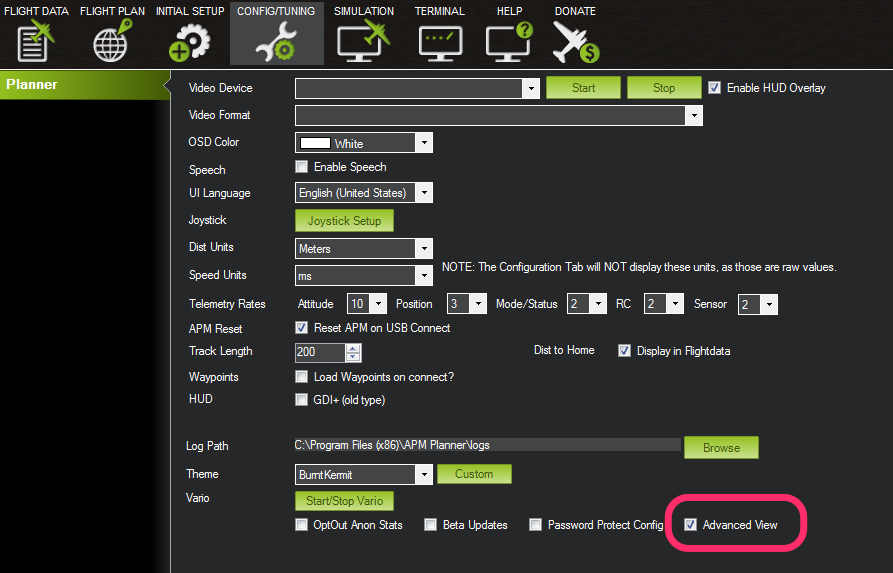
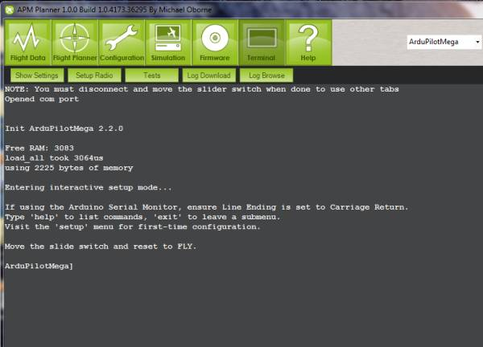

.. _commonmission-planner-command-line-interface-cli:

============================================
Mission Planner Command Line Interface (CLI)
============================================

.. warning::

   The CLI is being phased out on all platforms. The features were
   massively cut down with AC3.1.5 and then it was removed for the APM2
   completely anyway with AC3.2. All CLI functions are now available via
   regular MAVLink commands in the GCSs. This article has been moved to the
   dev wiki and may be considered deprecated.

Using the Mission Planner serial terminal
=========================================

The Terminal tab is visible on the top icon row when “Advanced View” is
checked in the Config tab.

The Mission Planner serial terminal is the best a way to see text data
coming from APM via its USB port and to type commands into the CLI. You
can can also run tests and download and analyze log files from this
screen.

