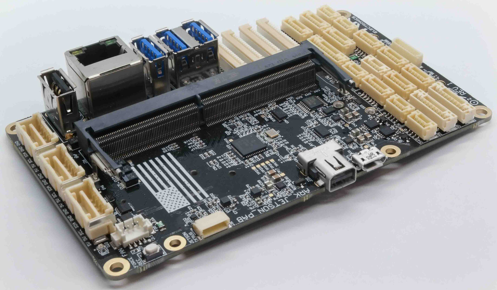
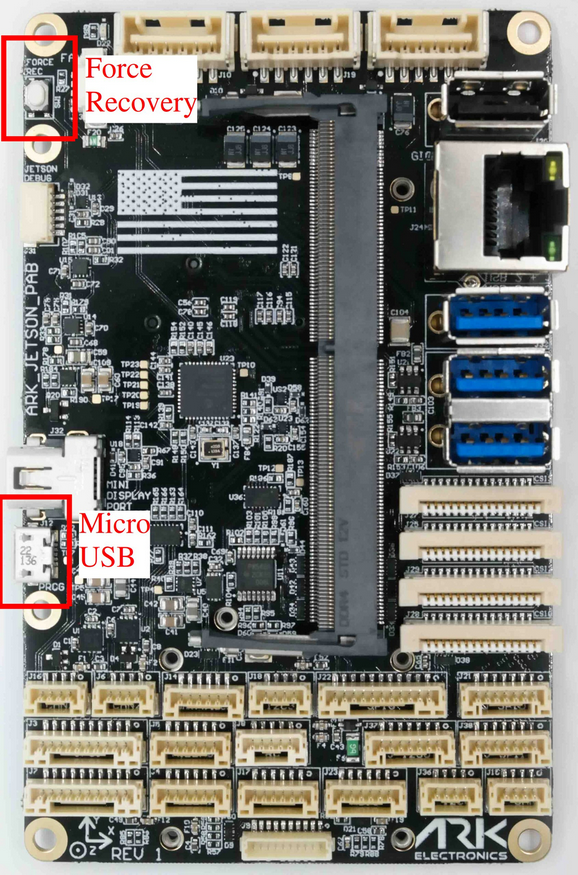

.. _companion-computer-ark-jetson-pab-carrier:

=================================
ARK Jetson PAB Carrier Overview
=================================

The ARK Jetson Pixhawk Autopilot Bus (PAB) Carrier is based on the `Pixhawk Autopilot Bus open source specification <https://github.com/pixhawk/Pixhawk-Standards/blob/master/DS-010%20Pixhawk%20Autopilot%20Bus%20Standard.pdf>`__ and the NVIDIA Jetson Orin NX/Nano Carrier Board. The Pixhawk Autopilot Bus (PAB) form factor enables the ARK PAB Carrier to be used with any PAB flight controller such as the `ARKV6X <https://arkelectron.com/product/arkv6x/>`__.

Specifications
==============

-  **Power Requirements**

   -  5V
   -  4A Minimum
   -  Depends on Usage and Peripherals
 
-  **Other**

   -  `Pixhawk Autopilot Bus (PAB) Form Factor <https://github.com/pixhawk/Pixhawk-Standards/blob/master/DS-010%20Pixhawk%20Autopilot%20Bus%20Standard.pdf>`__
   -  MicroSD Slot
   -  USA Built

    -  NDAA compliant

   -  Designed with a 1W heater. Keeps sensors warm in extreme conditions

-  **Additional Information**

   -  Weight:

    -   Without Jetson and Flight Controller Modules – 80g
    -   With Jetson, no Heatsink or Flight Controller – 108g
    -   With Jetson and Heatsink, no Flight Controller – 160g
    -   With Jetson, Heatsink, and Flight Controller – 166g
    -   With Jetson, Heatsink, Flight Controller, M.2 SSD, M.2 Wifi Module – 174g

   -  Dimensions(Without Jetson and Flight Controller Module): 116 mm x 72 mm x 23 mm

-  **Pinout**

   -  For pinout see the `ARK Jetson PAB Carrier Pinout <https://arkelectron.gitbook.io/ark-documentation/flight-controllers/ark-jetson-pab-carrier/pinout>`__

Autopilot Connections
=====================

There are two primary communication channels between the Jetson and the Flight Controller: Serial and USB. Both interfaces are direct board to board connections and have been tested up to 3Mbps

.. list-table:: Serial Port Mapping
   :widths: 20 25 20
   :header-rows: 1

   * - Type
     - Jetson Device Path
     - Flight Controller
   * - USB
     - /dev/ttyACM0
     - USB
   * - Serial
     - /dev/ttyTHS1
     - Telem2

Flashing Guide
==============

If you purchased a `ARK Jetson Orin NX NDAA Bundle <https://arkelectron.com/product/ark-jetson-orin-nx-ndaa-bundle/>`__ the `Jetpack Ubuntu OS <https://developer.nvidia.com/embedded/jetpack>`__ is already installed along with ARK-OS. Follow this guide if you want to update to the latest Jetpack or need to flash your Jetson for the first time.

**ARK Jetson Kernel GitHub Repository**

    - This `repository <https://github.com/ARK-Electronics/ark_jetson_kernel>`_ contains helper scripts to download and build the kernel. Please follow the README.

To flash the kernel you will need to connect the Jetson to your Host PC using the Micro USB connection. You must boot the Jetson while holding the Force Recovery button.

More Information
================

* `ARK Jetson PAB <https://arkelectron.com/product/ark-jetson-pab-carrier/>`_
* `ARK Jetson Orin NX NDAA Bundle <https://arkelectron.com/product/ark-jetson-orin-nx-ndaa-bundle/>`_
* `ARK Jetson PAB Documentation <https://arkelectron.gitbook.io/ark-documentation/flight-controllers/ark-jetson-pab-carrier>`_
