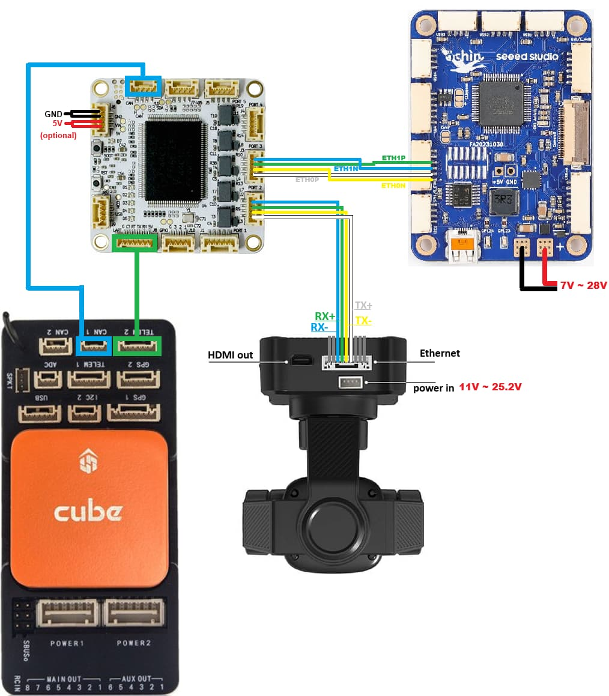
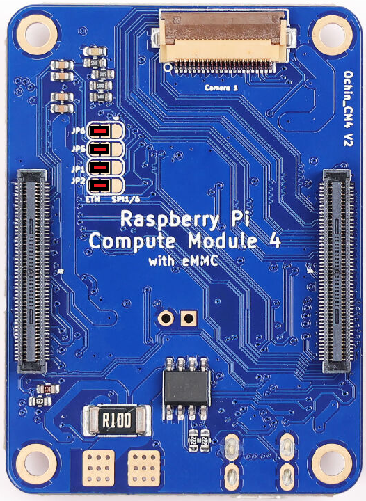

.. _companion-computer-blueos-install:

===================
BlueOS Installation
===================

This page explains how to install BlueOS on an RPI compute module connected to an autopilot via ethernet.  `BlueOS official installation instructions can be found here <https://blueos.cloud/docs/latest/usage/installation/>`__

These instructions were originally posted on `this blog post <https://discuss.ardupilot.org/t/ardupilot-and-blueos-for-companion-computers/134879>`__

Recommended Hardware
--------------------

- :ref:`ArduPilot compatible flight controller <common-autopilots>`
- `RPI4 I/O board <https://www.raspberrypi.com/products/compute-module-4-io-board/>`__ or `RPI5 I/O board <https://www.raspberrypi.com/products/compute-module-5-io-board/>`__
- `RPI CM4 <https://www.raspberrypi.com/products/compute-module-4/>`__ or `CM5 <https://www.raspberrypi.com/products/compute-module-5/>`__
- `Ochin Tiny Carrier Board V2 <https://www.seeedstudio.com/Ochin-Tiny-Carrier-Board-V2-for-Raspberry-Pi-CM4-p-5887.html>`__
- :ref:`BotBlox DroneNet ethernet switch <common-botblox-dronenet>` or :ref:`CubeNodeETH <common-cubepilot-cubenodeeth>` and `CubeLan 8-port ethernet switch <https://docs.cubepilot.org/user-guides/switch/cubelan-8-port-switch>`__ (see :ref:`ethernet adapters <common-ethernet-adapters>`)
- (optionally) Ethernet enabled camera gimbal (e.g. :ref:`Siyi A8 <common-siyi-zr10-gimbal>`)

Ochin Ethernet Solder Bridge
----------------------------

As mentioned `here in the Ochin wiki <https://github.com/ochin-space/ochin-CM4v2/tree/master>`__, four solder bridges as shown in red below are required to enable Ethernet support

Installing BlueOS on RPI4 or RPI5
---------------------------------

- Install rpiboot and rpi-imager on your Ubuntu or Windows PC

  - **Ubuntu** users should run

    - sudo apt install rpiboot
    - sudo apt install rpi-imager

  - **Windows** user instructions are `here <https://www.raspberrypi.com/documentation/computers/compute-module.html#set-up-the-host-device>`__ but in short you should:

    - `download and install rpiboot <https://github.com/raspberrypi/usbboot/raw/master/win32/rpiboot_setup.exe>`__ 
    - `download and install rpi-imager <https://www.raspberrypi.com/software/>`__ 

- On the RPI I/O board

  - Mount the RPI CM4/CM5 on the RPI I/O board
  - Add jumper so the RPI CM starts in bootloader mode, "Fit jumper to disable eMMC Boot"
  - Connect I/O board to PC via USB
  - Power on the I/O board (if using the RPI5 I/O board this step is probably done by the above step)

- On your PC

  - Open a web browser to the `BlueOS release page <https://github.com/bluerobotics/BlueOS/releases>`__, select a recent release of 1.5.0 or higher, open "Assets" and download "BlueOs-raspberry-linux-arm64-v8-bookworm-pi5" (if this image isn't available, pick a different release)
  - run rpiboot:

    - **Ubuntu** users should open a terminal and enter "rpiboot" 
    - **Windows** users should open the start menu and run "rpiboot-CM4-CM5 Mass Storage Gadget"

  - run rpi-imager:

    - **Ubuntu** users should open a terminal and enter "rpi-imager"
    - **Windows** users should open from start menu run "Raspberry Pi Imager"

  - from within RPI Imager:

    - Choose Device: "Raspberry Pi 4" or "Raspberry Pi 5"
    - Operating System: Use custom, select downloaded BlueOS .img file
    - Storage: select RPI drive (should have appeared after rpiboot was run)
    - Select "No" when asked to apply special settings

Configuring BlueOS
------------------

After the above installation is complete, perform the initial setup of BlueOS

Configure RPI/BlueOS to connect to your local WiFi:

- Leave the RPI4/RPI5 on the I/O board initially
- Make sure a WiFi antenna is attached to the RPI4/RPI5 CM
- Remove the Jumper and power-down/power-up the I/O board so the RPI boots normally
- Connect a PC via ethernet to the I/O board's ethernet port
- Set the PC's IP address to manual with IP 192.168.2.100 (the RPI's default IP address is 192.168.2.2 and we want the PC to be within the same ethernet subnet)
- Open a Chrome browser to http://192.168.2.2, BlueOS should appear
- A setup wizard should appear, select "Other vehicle setup"

  - Vehicle Name: MyCopter
  - MDNS Name: "blueos" (default)

- On the top right, select the WiFi icon and connect to your local WiFi

Configure RPI/BlueOS's Ethernet IP to be the same subnet as the autopilot and camera:

  - Push the buddha icon on the top right and change to "Pirate mode"
  - Select the networking icon

    - select "eth0"
    - select "ADD STATIC IP" and enter 192.168.144.20  (this will be the RPI's IP address on the vehicle)
    - select "DISABLE DHCP SERVER"
    - beside "192.168.2.2 Static IP" push the trash can icon.  At this point you will lose contact with BlueOS but you can re-gain contact by changing the PC's manual IP address to 192.168.144.100 and reconnecting with the web browser to http://192.168.144.20
    - restore PC's IP address to automatic

Connect RPI/BlueOS to Autopilot and Camera:

- Follow :ref:`DroneNet <common-botblox-dronenet>` or :ref:`CubeNodeETH <common-cubepilot-cubenodeeth>` setup instructions.  This should result in these IP addresses for other components:

  - DroneNet/CubeNodeETH: 192.168.144.14
  - Autopilot: 192.168.144.15
  - :ref:`Siyi A8 <common-siyi-zr10-gimbal>`: 192.168.144.25

- On the autopilot, create an additional UDP Server connection for BlueOS to connect to:

  - NET_P1_TYPE = 2 (UDP server)
  - NET_P1_PROTOCOL = 2 (MAVLink2)
  - NET_P1_IP0 = 0
  - NET_P1_IP1 = 0
  - NET_P1_IP2 = 0
  - NET_P1_IP3 = 0
  - NET_P1_PORT = 14560

- Install the RPI on the Ochin carrier board
- On the PC open a Chrome browser to http://blueos-avahi.local/ (BlueOS should appear)
- Open BlueOS's Autopilot Firmware screen

  - select "Master Endpoint"

    - Connection Type: UDP Client
    - IP/Device: 192.168.144.15
    - Port/Baudrate: 14560
    - push "Save Changes"

- Check top-right Heartbeat icon has gone white meaning the RPI and autopilot are communicating via MAVLink over ethernet
