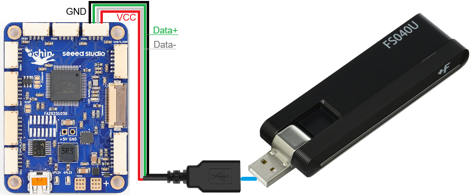

.. _companion-computer-blueos-lte-telem:

=============================
BlueOS 4G/LTE Telemetry Setup
=============================

This page explains how to install and configure a 4G/LTE telemetry module for use with BlueOS assuming :ref:`this setup <companion-computer-blueos-install>` has already been completed.  These instructions were originally posted on `this blog post <https://discuss.ardupilot.org/t/bluerobotics-vehicle-lte-for-japan/112359>`__

`BlueOS's official wiki is here <https://blueos.cloud/docs/latest/usage/overview/>`__

Recommended Hardware
--------------------

1. LTE modem compatible with RPi and capable of IPv4 (but not IPv6).  Known working modems include:

  - `FujiSoft FS040U LTE (Japan) <https://www.amazon.co.jp/gp/product/B08H824QN7?psc=1>`__
  - `Quectel LTE EC25 Mini PCIe <https://www.quectel.com/product/lte-ec25-mini-pcie-series/>`__

2. A compatible SIM card like those from `IIJmio in Japan <https://www.iijmio.jp/>`__ or  `Hologram <https://www.hologram.io/>`__
3. Custom cable to connect the `Ochin Tiny Carrier Board V2 <https://www.seeedstudio.com/Ochin-Tiny-Carrier-Board-V2-for-Raspberry-Pi-CM4-p-5887.html>`__ to the 4G/LTE modem

Check Internet Connectivity
---------------------------

- Power on the vehicle and wait a few minutes for BlueOS to start and for the modem to connect to the 4G/LTE network
- On the PC open a Chrome browser to http://blueos-avahi.local/ (BlueOS should appear)
- From the top right menu select the Networking icon, look for "usb1" and confirm it is using "Dynamic IP"

  .. image:: ../images/blueos-lte-modem-dynamic-ip.png
      :target: ../_images/blueos-lte-modem-dynamic-ip.png
      :width: 400px

- From the top right menu select the globe icon and confirm "usb" shows a green globe meaning internet is available
- Optionally change the priority of 4G/LTE vs wifi by changing the order of "usb" and "wlan" in the list

  .. image:: ../images/blueos-lte-modem-internet.png
      :target: ../_images/blueos-lte-modem-internet.png
      :width: 400px

ZeroTier Setup Part 1
---------------------

- Create a ZeroTier account (see https://www.zerotier.com/)
- Create a new ZeroTier network, record the Network ID
- On the PC:

  - `Install ZeroTier <https://www.zerotier.com/download/>`__

    - Start the ZeroTier App
    - On bottom right tray, select orange ZeroTier icon, Join new network, paste in the Network ID

BlueOS Setup
------------

- On the PC open a Chrome browser to http://blueos-avahi.local/ (BlueOS should appear)
- From left menu select Extensions, find ZeroTier and push the "Get" button (installation will take a few minutes)
- From left menu select ZeroTier Manager, in the “Network ID" field enter the Network ID recorded above and push “Join”
- Enable MAVLink Server:

  - From top right menu click on the Pirate mode icon (smiling Buddha face), Enable Pirate Mode
  - From left menu select “MAVLink Endpoints”
  - Find the “GCS Server Link” section and ensure the blue slider is to the right

ZeroTier Setup Part 2
---------------------

- From a web browser, open `zerotier.com <https://www.zerotier.com/>`__ and "Log In".  The browser should automatically forward to https://my.zerotier.com/
- From the list of Networks, select the Network created in "Part 1" above
- Scroll down to the “Members” area, and look for new entries corresponding to the PC and vehicle
- Check the “Auth?” column for each, then click on the "Edit" column and fill in the "Name" field
- Optionally also change the "IP Assignments" field's last digit to an easy-to-remember value between 1 and 255
- Copy the vehicle's "Managed IP" address (it will be needed below)

Connecting with Mission Planner
-------------------------------

- Ensure PC has internet access
- Start the ZeroTier App, from the bottom right tray, connect to network
- Open a web browser and enter the vehicle's IP address (see above), BlueOS should appear
- Open Mission Planner, it should automatically connect. If it does not, from top-right drop-down select UDPCI, enter the vehicle's IP address, port:14550

Connecting with QGC
-------------------

- Use the same procedure as Mission Planner but if QGC does not automatically connect

  - Select top-left icon, Application Settings, Comm Links
  - Add, Name: vehicle, Type:UDP, Port:14550, Server Address:, Add Server, OK

Connecting with Cockpit
-----------------------

Alternatively the BlueOS's built-in GCS, Cockpit, can be used by opening a Chrome browser, entering the vehicle's IP address into the URL and once BlueOS appears, select Cockpit from the left menu
