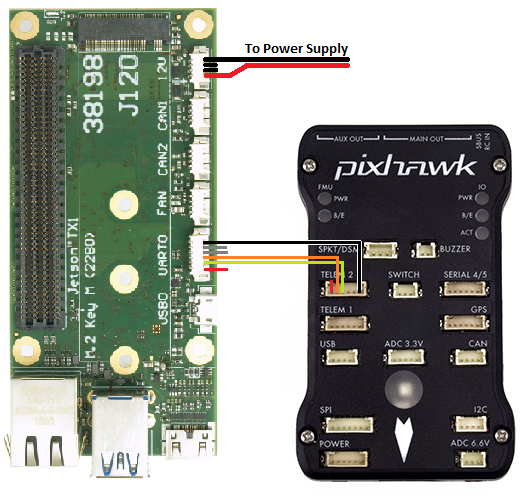
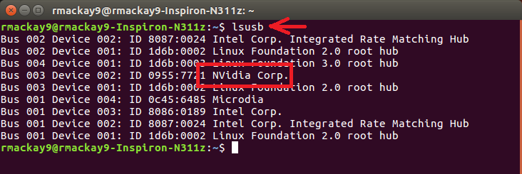
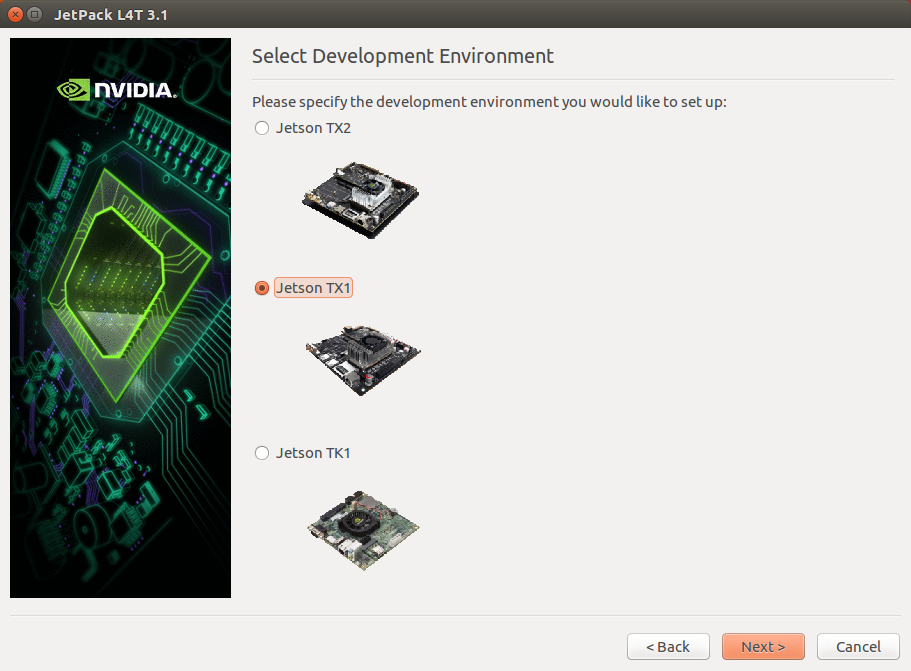
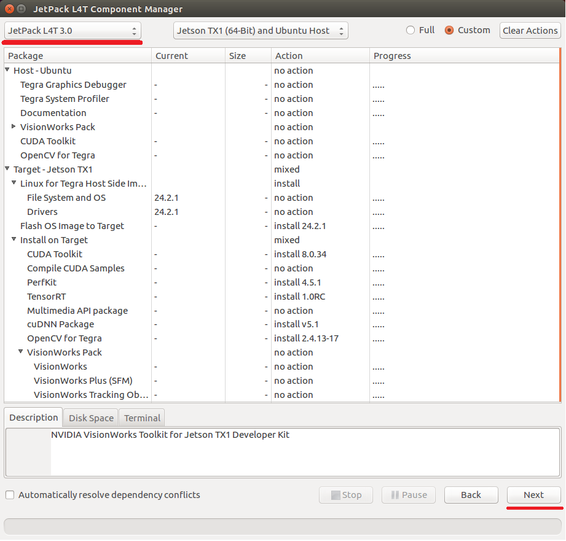
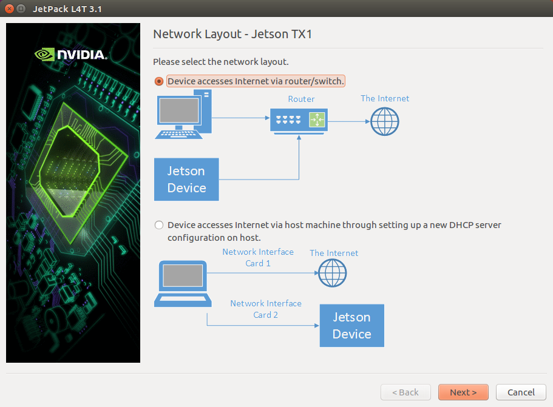
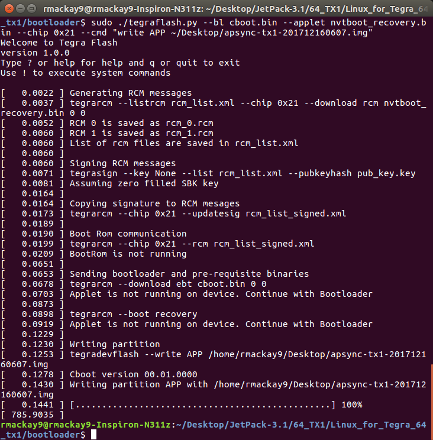

.. _companion-computer-nvidia-tx1:

===========================================
NVidia TX1 as a Companion Computer
===========================================

This page explains how to connect and configure an `NVidia TX1 <http://www.nvidia.com/object/jetson-tx1-dev-kit.html>`__ using `AuVidea.eu's J120 carrier board <http://auvidea.com/j120/>`__ so that it is able to communicate with a Pixhawk flight controller using the MAVLink protocol over a serial connection.

Connecting the Pixhawk and TX1
==============================

Connect the Pixhawk's TELEM2 port to the J120's UART2 port's Ground, TX and RX pins as shown in the image above.

The Pixhawk and TX1 should be powered separately (the J120/TX1 through its 12V power input port, the Pixhawk through its POWER port).  They should be powered on at about the same time or the TX1 powered on first to avoid the Pixhawk interrupting the TX1's bootloader.

Setup the Pixhawk
=================

Connect to the Pixhawk with a ground station (i.e. Mission Planner) and set the following parameters:

-  :ref:`SERIAL2_PROTOCOL <copter:SERIAL2_PROTOCOL>` = 1 (the default) to enable MAVLink on the serial port.
-  :ref:`SERIAL2_BAUD <copter:SERIAL2_BAUD>` = 921 so the Pixhawk can communicate with the TX1 at 921600 baud.
-  :ref:`LOG_BACKEND_TYPE <copter:LOG_BACKEND_TYPE>` = 3 if you are using APSync to stream the dataflash log files to the TX1

You may need to manually disable flow control on Telem2 although this is not normally required:

-  :ref:`BRD_SER2_RTSCTS <copter:BRD_SER2_RTSCTS>` = 0

As a side note the J120's UART2 appears on the TX1 as /dev/ttyTHS1.

Setup the TX1
=============

There are two steps required to setting up the TX1:

- install JetPack-3.0 to an Ubuntu 16 desktop and flash the TX1 operating system
- flash the APSync image to the TX1

Installing JetPack-3.0 and flashing the OS
------------------------------------------

First put the TX1 into bootloader mode

- connect the TX1 to an Ubuntu 16.04 machine using a USB cable
- put the TX1 into bootloader mode by holding the "Force Recovery" button (aka "REC"), then press the "Reset" button (aka "RST") and then release the "Force Recovery" button
- check the TX1 is in bootloader mode by typing "lsusb" on the Ubuntu machine and look for "NVidia Corp"

Next install JetPack and flash the OS

- connect an Ubuntu 16.04 machine to the internet and download `JetPack-3.1 <https://developer.nvidia.com/embedded/dlc/jetpack-l4t-3_1>`__ (nvidia login required)
- move the downloaded file to the directory you want JetPack installed into (i.e. "~/Desktop/JetPack-3.1")
- make sure the file is executable by typing, "chmod a+x JetPack-L4T-3.1-linux-x64.run"
- start the installation by running the downloaded file, "./JetPack-L4T-3.1-linux-x64.run"
- a "JetPack L4T 3.1 Installer" window should appear, press "Next"
- a "Installation Configuration" page should appear confirming where JetPack will be installed, press "Next"
- a "Select Development Environment" page should appear allowing you to select the board type, select "Jetson TX1"

- an "Installing" page will appear asking for your password in order to begin the local installation
- a "JetPack L4T Component Manager" screen should appear

   - from the top left, select "JetPack L4T 3.0" (this may need to be selected twice to work)
   - for "Host - Ubuntu" set the "Action" column to "no action" for everything (select "Keep & Apply" if a question pops up)
   - Target - Jetson TX1: mixed
   - Linux for Tegra Host Side Image Setup: install
   - Flash OS Image to Target: install 24.2.1
   - Install on Target: mixed
   - CUDA Toolkit: install
   - Compile CUDA Samples: no action
   - PerfKit: install
   - TensorRT: install
   - Multimedia API package: no action
   - cuDNN Package: install
   - OpenCV for Tegra: install
   - VisionWorks on TX1 Target: no action

- an "Terms & Conditions" window may appear, select "Accept All" and push the "Accept" button
- a "Host installation is complete" window should appear, press "Next"
- a "Network Layout - Jetson TX1" window should appear, select "Device accesses Internet via router/switch" after first ensuring the TX1 and Ubuntu machine are connected to the internet with an ethernet cable
- if a "Network Interface Selection" window pops up, select the Ubuntu machine's network connection that corresponds to the ethernet cable

- a "Post Installation Jetson TX1" window may appear, press "Next"
- a black console window titled, "Post Installation" should appear asking that the TX1 be put in bootloader mode (this should already have been done), Press "Enter"
- installation should continue for about 15min and finally a message should appear asking you to close the black console window.
- an "Installation Complete" window should appear, leave "Remove downloaded files" unchecked and press "Finish"

These instructions can also be found in `"Step1 : install NVidia image onto the TX1" from here <https://github.com/ArduPilot/companion/blob/master/Nvidia_JTX1/Ubuntu/1_create_base_image.txt>`__.

Flashing the APSync image to the TX1
------------------------------------

- connect a USB cable from the Ubuntu 16 machine to the TX1 development board, power on the TX1 and put the TX1 into bootloader mode (see instructions above)
- On the Ubuntu 16 machine, download the latest `APSync image for the tx1 <https://firmware.ardupilot.org/Companion/apsync/apsync-tx1-latest-img.xz>`__ from `firmware.ardupilot.org <https://firmware.ardupilot.org/Companion/apsync/>`__ (look for images starting with "tx1").
- uncompress the downloaded image (i.e. open a file explorer, right-mouse-button click on the file and select "Extract Here")
- on the Ubuntu machine, from the directory where you installed JetPack (i.e. ~/Desktop/JetPack-3.1)
- cd 64_TX1/Linux_for_Tegra_64_tx1/bootloader
- run this command but replace IMAGE.img with the name of the image downloaded, sudo ./tegraflash.py --bl cboot.bin --applet nvtboot_recovery.bin --chip 0x21 --cmd "write APP IMAGE.img"

Official instructions from NVidia on flashing images can be found `here <https://devtalk.nvidia.com/default/topic/898999/jetson-tx1/tx1-r23-1-new-flash-structure-how-to-clone-/post/4784149/#4784149>`__.

Notes if using ZED camera
-------------------------

If you are using the `StereoLabs <https://www.stereolabs.com/>`__ :ref:`ZED camera <copter:common-zed>` then the TX1 will need to be powered up once with the ethernet cable plugged in so that it has access to the internet in order to download the camera's factory calibration.

If using the AUVidea J120 board, the ZED camera may need to be plugged into the lower USB port to work correctly.
