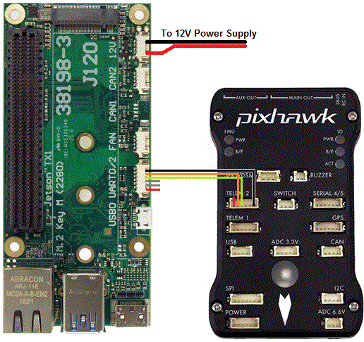
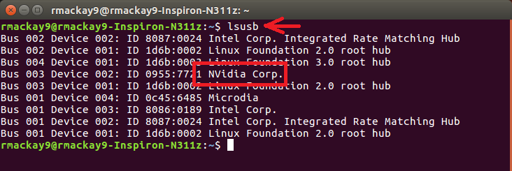
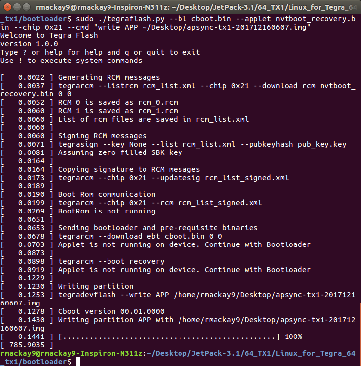

.. _companion-computer-nvidia-tx2:

===========================================
NVidia TX2 as a Companion Computer
===========================================

This page explains how to connect and configure an `NVidia TX2 <https://www.nvidia.com/en-us/autonomous-machines/embedded-systems-dev-kits-modules/>`__ using `AuVidea.eu's J120 carrier board <http://auvidea.com/j120/>`__ so that it is able to communicate with a Pixhawk flight controller using the MAVLink protocol over a serial connection.

Connecting the Pixhawk and TX2
==============================

Connect the Pixhawk's TELEM2 port to the J120's UART2 port's Ground, TX and RX pins as shown in the image above.

The Pixhawk and TX2 should be powered separately (the J120/TX2 through it's 12V power input port, the Pixhawk through it's POWER port).

Setup the Pixhawk
=================

Connect to the Pixhawk with a ground station (i.e. Mission Planner) and set the following parameters:

-  :ref:`SERIAL2_PROTOCOL <copter:SERIAL2_PROTOCOL>` = 1 (the default) to enable MAVLink on the serial port.
-  :ref:`SERIAL2_BAUD <copter:SERIAL2_BAUD>` = 1500 so the Pixhawk can communicate with the TX2 at 1,500,000 baud.
-  :ref:`LOG_BACKEND_TYPE <copter:LOG_BACKEND_TYPE>` = 3 if you are using APSync to stream the dataflash log files to the TX2

You may need to manually disable flow control on Telem2 although this is not normally required:

-  :ref:`BRD_SER2_RTSCTS <copter:BRD_SER2_RTSCTS>` = 0

As a side note the J120's UART2 appears on the TX2 as /dev/ttyTHS1.

Setup the TX2
=============

There are two steps required to setting up the TX2:

- install JetPack-3.3 to an Ubuntu 16 desktop and flash the TX2 operating system
- flash the APSync image to the TX2

Installing JetPack-3.3 and flashing the OS
------------------------------------------

First put the TX2 into bootloader mode

- connect the TX2 to an Ubuntu 16.04 machine using a USB cable
- put the TX2 into bootloader mode by holding the "Force Recovery" button (aka "REC"), then press the "Reset" button (aka "RST") and then release the "Force Recovery" button
- check the TX2 is in bootloader mode by typing "lsusb" on the Ubuntu machine and look for "NVidia Corp"

Next install JetPack and flash the OS

- connect an Ubuntu 16.04 machine to the internet and download `JetPack-3.3 <https://developer.nvidia.com/embedded/dlc/jetpack-l4t-3_3>`__ (nvidia login required) from the `Jetson Download Center <https://developer.nvidia.com/embedded/downloads>`__.
- move the downloaded file to the directory you want JetPack installed into (i.e. "~/Desktop/JetPack-3.3")
- make sure the file is executable by typing, "chmod a+x JetPack-L4T-3.3-linux-x64_b39.run"
- start the installation by running the downloaded file, "./JetPack-L4T-3.3-linux-x64_b39.run"
- a "JetPack L4T 3.3 Installer" window should appear, press "Next"
- a "Installation Configuration" page should appear confirming where JetPack will be installed, press "Next"
- a "Select Development Environment" page should appear allowing you to select the board type, select "Jetson TX2"

- an "Installing" page will appear asking for your password in order to begin the local installation
- a "JetPack L4T Component Manager" screen should appear

   - from the top left, select "JetPack L4T 3.3" (this may need to be selected two or three times to work)
   - for "Host - Ubuntu" set the "Action" column to "no action" for everything (select "Keep & Apply" if a question pops up)
   - Target - Jetson TX2: mixed
   - Linux for Tegra Host Side Image Setup: install
   - Flash OS Image to Target: install 24.2.1
   - Install on Target: mixed
   - CUDA Toolkit: install
   - Compile CUDA Samples: no action
   - PerfKit: install
   - TensorRT: install
   - Multimedia API package: no action
   - cuDNN Package: install
   - OpenCV for Tegra: install
   - VisionWorks on TX2 Target: no action

- an "Terms & Conditions" window may appear, select "Accept All" and push the "Accept" button
- a "Host installation is complete" window should appear, check below before pushing "Next"

At this point, users of AUVidea carrier boards (like the J120) should follow `these instructions <https://auvidea.com/firmware/>`__ to download and patch the kernel to allow the USB ports to work:

::

   cd ~/Desktop/JetPack-3.3  (or wherever JetPack was installed)
   wget https://www.auvidea-pcb.com/firmware/tx2/1.6/auvidea-kernel-J90-J120-v1.6.zip –no-check-certificate
   tar -xf auvidea-kernel-J90-J120-v1.6.zip
   cp auvidea-kernel-J90-J120-v1.6/auvidea-TX2-Jetpack/dtb/tegra186-quill-p3310-1000-a00-00-base.dtb 64_TX2/Linux_for_Tegra/kernel/dtb
   cp auvidea-kernel-J90-J120-v1.6/auvidea-TX2-Jetpack/dtb/tegra186-quill-p3310-1000-c03-00-base.dtb 64_TX2/Linux_for_Tegra/kernel/dtb
   cp auvidea-kernel-J90-J120-v1.6/auvidea-TX2-Jetpack/dtb/tegra186-quill-p3310-1000-c03-00-dsi-hdmi-dp.dtb 64_TX2/Linux_for_Tegra/kernel/dtb

- back on the "Host installation is complete" window, press "Next"
- a "Network Layout - Jetson TX2" window should appear, select "Device accesses Internet via router/switch" after first ensuring the TX2 and Ubuntu machine are connected to the internet with an ethernet cable
- if a "Network Interface Selection" window pops up, select the Ubuntu machine's network connection that corresponds to the ethernet cable

.. image:: ../images/companion-computer-tx1-networklayout.png

- a "Post Installation Jetson TX2" window may appear, press "Next"
- a black console window titled, "Post Installation" should appear asking that the TX2 be put in bootloader mode (this should already have been done), Press "Enter"
- installation should continue for about 15min and finally a message should appear asking you to close the black console window.
- an "Installation Complete" window should appear, leave "Remove downloaded files" unchecked and press "Finish"

Flashing the APSync image to the TX2
------------------------------------

- connect a USB cable from the Ubuntu 16 machine to the TX2 development board, power on the TX2 and put the TX2 into bootloader mode (see instructions above)
- On the Ubuntu 16 machine, download the latest APSync image for the TX2 from `firmware.ardupilot.org <https://firmware.ardupilot.org/Companion/apsync/beta>`__ (look for images that contain "tx2" like "apsync-tx2-201804270923.img.xy").
- uncompress the downloaded image (i.e. open a file explorer, right-mouse-button click on the file and select "Extract Here")
- on the Ubuntu machine, from the directory where you installed JetPack (i.e. ~/Desktop/JetPack-3.3)
- cd 64_TX2/Linux_for_Tegra_64_tx2/bootloader
- copy and rename the apsync image downloaded above to "64_TX2/Linux_for_Tegra_64_tx2/bootloader/system.img"
- run this command to upload the image, sudo ./flash.sh -r -k APP jetson-tx2 mmcblk0p1

Some instructions on flashing images can be found `here <https://elinux.org/Jetson/TX2_Cloning>`__.

Notes if using ZED camera or RPLidarA2
--------------------------------------

If you are using the `StereoLabs <https://www.stereolabs.com/>`__ :ref:`ZED camera <copter:common-zed>` then the TX2 will need to be powered up once with the ethernet cable plugged in so that it has access to the internet in order to download the camera's factory calibration.

If using the AUVidea J120 board, the ZED camera or RPLidarA2 may need to be plugged into the lower USB port to work correctly.
