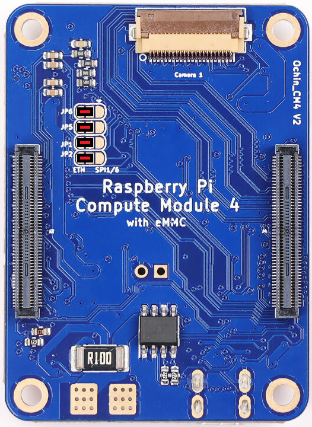

.. _companion-computer-rpanion-install:

===========================
Rpanion Server Installation
===========================

This page explains how to install Rpanion Server on an RPI compute module connected to an autopilot.  `Rpanion Server's official installation instructions can be found here <https://www.docs.rpanion.com/software/rpanion-server>`__

Recommended Hardware
--------------------

.. image:: ../images/rpanion-hardware.jpg
    :target: ../_images/rpanion-hardware.jpg
    :width: 400px

- :ref:`ArduPilot compatible flight controller <common-autopilots>`
- `RPI4 I/O board <https://www.raspberrypi.com/products/compute-module-4-io-board/>`__ or `RPI5 I/O board <https://www.raspberrypi.com/products/compute-module-5-io-board/>`__
- `RPI CM4 <https://www.raspberrypi.com/products/compute-module-4/>`__ or `CM5 <https://www.raspberrypi.com/products/compute-module-5/>`__
- `Ochin Tiny Carrier Board V2 <https://www.seeedstudio.com/Ochin-Tiny-Carrier-Board-V2-for-Raspberry-Pi-CM4-p-5887.html>`__
- (optionally) CSI/MIPI camera

Ochin Ethernet Solder Bridge (Optional)
---------------------------------------

As mentioned `here in the Ochin wiki <https://github.com/ochin-space/ochin-CM4v2/tree/master>`__, four solder bridges as shown in red below are required to enable Ethernet support for the RPI.

Installing Rpanion Server on RPI4 or RPI5
-----------------------------------------

- Install rpiboot and rpi-imager on your Ubuntu or Windows PC

  - **Ubuntu** users should run

    - sudo apt install rpiboot
    - sudo apt install rpi-imager

  - **Windows** user instructions are `here <https://www.raspberrypi.com/documentation/computers/compute-module.html#set-up-the-host-device>`__ but in short you should:

    - `download and install rpiboot <https://github.com/raspberrypi/usbboot/raw/master/win32/rpiboot_setup.exe>`__ 
    - `download and install rpi-imager <https://www.raspberrypi.com/software/>`__ 

- On the RPI I/O board

  - Mount the RPI CM4/CM5 on the RPI I/O board
  - Add jumper so the RPI CM starts in bootloader mode, "Fit jumper to disable eMMC Boot"
  - Connect I/O board to PC via USB
  - Power on the I/O board (if using the RPI5 I/O board this step is probably done by the above step)

- On your PC

  - Open a web browser to the `Rpanion Server release page <https://www.docs.rpanion.com/software/rpanion-server>`__, under "Disk images" find and download the appropriate image for your RPI model
  - run rpiboot:

    - **Ubuntu** users should open a terminal and enter "rpiboot" 
    - **Windows** users should open the start menu and run "rpiboot-CM4-CM5 Mass Storage Gadget"

  - run rpi-imager:

    - **Ubuntu** users should open a terminal and enter "rpi-imager"
    - **Windows** users should open from start menu run "Raspberry Pi Imager"

  - from within RPI Imager:

    - Choose Device: "Raspberry Pi 4" or "Raspberry Pi 5"
    - Operating System: Use custom, select downloaded .img file
    - Storage: select RPI drive (should have appeared after rpiboot was run)
    - Select "No" when asked to apply special settings

Configuring the Connection to the Autopilot
-------------------------------------------

After the above installation is complete, perform the initial setup of Rpanion Server

- Install the RPI on the Ochin Carrier Board connected to one of the autopilot's serial ports as shown in the image at the top of this page
- Make sure a WiFi antenna is attached to the RPI
- Connect to Rpanion Server via Wifi

    - Wait for the "rpanion" wifi access point to appear and connect (password is "rpanion123")

- Disable BlueTooth which may interfere with the RPI's serial ports

  - Use Putty (or any similar terminal program) to connect to the RPI using SSH

    - Host Name: 10.0.2.100
    - Connection Type: SSH
    - Port: 22
    - Username/password: pi/raspberry

  - Open /boot/firmware/config.txt with your favourite linux text editor:

    - sudo nano /boot/firmware/config.txt
    - sudo vi /boot/firmware/config.txt

  - Add "dtoverlay=disable-bt" to the end of the file as shown below

  .. code-block:: text

      [all]
      enable_uart=1
      dtoverlay=disable-bt

  - Save and exit the text editor and reboot the RPI

- Open a browser to http://10.0.2.100:3001/ and enter username: admin, pw: admin
- Select "Flight Controller" from the left menu

  - Input Type: UART
  - Serial Device: /dev/serial0 (or whatever option appears in the drop-down)
  - Baud Rate: 921600
  - MAVLink Version: 2.0
  - Push the "Start Telemetry" button but note that no packets will be received until the autopilot is configured as described below

- Connect the autopilot to your PC with a USB cable and then connect with any GCS (e.g. Mission Planner, QGC) and set the following parameters.  Please note these assume Serial1 (aka Telem1) is physicall connected to the RPI:

  - SERIAL1_BAUD = 921 (921600 bps)
  - SERIAL1_PROTOCOL = 2 (MAVLink2)
  - (Optionally) BRD_SER1_RTSCTS = 0 (Disable clear-to-send/ready-to-send)
  - Reboot the autopilot and check on Rpanion's Flight Controller screen that mavlink packets are being received

- Confirm the ground station can connect to the autopilot through Rpanion's Wifi AP

  - If using Mission Planner

    - From the top-right of the screen select, "UDPCl" and press connect
    - Enter host name/ip: 10.0.2.100
    - Enter remote port: 14550
    - Press Connect
