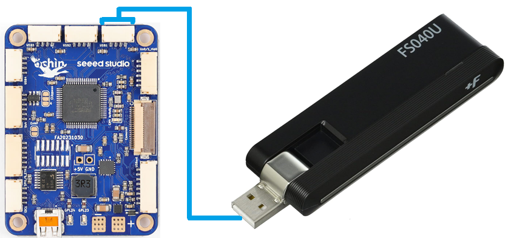

.. _companion-computer-rpanion-lte-telem:

==============================
Rpanion 4G/LTE Telemetry Setup
==============================

This page explains how to install and configure a 4G/LTE telemetry module for use with Rpanion assuming :ref:`this setup <companion-computer-rpanion-install>` has already been completed.

`Rpanion's official VPN setup instructions are here <https://www.docs.rpanion.com/software/rpanion_server_v012#vpn>`__

Recommended Hardware
--------------------

1. LTE modem compatible with RPi.  Known working modems include:

  - `FujiSoft FS040U LTE (Japan) <https://www.amazon.co.jp/gp/product/B08H824QN7?psc=1>`__
  - `Quectel LTE EC25 Mini PCIe <https://www.quectel.com/product/lte-ec25-mini-pcie-series/>`__

2. A compatible SIM card like those from `IIJmio in Japan <https://www.iijmio.jp/>`__ or  `Hologram <https://www.hologram.io/>`__
3. Custom cable to connect the `Ochin Tiny Carrier Board V2 <https://www.seeedstudio.com/Ochin-Tiny-Carrier-Board-V2-for-Raspberry-Pi-CM4-p-5887.html>`__ to the 4G/LTE modem

Install ZeroTier on Rpanion
---------------------------

If using Rpanion Server ver 0.12 (or earlier) ZeroTier must be installed manually

  - Mount the RPI CM4/CM5 on the RPI I/O board
  - Ensure the jumper is removed so the RPI starts normally (e.g. no jumper on "Fit jumper to disable eMMC Boot")
  - Connect an Ethernet cable to the I/O board so that it has internet access
  - Power on the I/O board
  - On your PC, connect to the "rpanion" wifi access point (password is "rpanion123")
  - Use Putty (or any similar terminal program) to connect to the RPI using SSH

    - Host Name: 10.0.2.100
    - Connection Type: SSH
    - Port: 22
    - Username/password: pi/raspberry
    - Install ZeroTier by entering, "curl -s https://install.zerotier.com | sudo bash" (`official instructions are here <https://www.zerotier.com/download/>`__)
    - Type, "sudo poweroff" to power off the RPI
    - Power off the I/O board

  - Mount the RPI CM4/CM5 back on the Ochin carrier board and continue with the steps below

ZeroTier Setup Part 1
---------------------

- Create a ZeroTier account (see https://www.zerotier.com/)
- Create a new ZeroTier network, record the Network ID
- On the PC:

  - `Install ZeroTier <https://www.zerotier.com/download/>`__

    - Start the ZeroTier App
    - On bottom right tray, select orange ZeroTier icon, Join new network, paste in the Network ID

Rpanion Setup
-------------

- Power on the vehicle and wait for the modem to connect to the 4G/LTE network
- Connect to the "rpanion" wifi access point (password is "rpanion123")
- Open a browser to http://10.0.2.100:3001/ and enter username: admin, pw: admin
- From the left menu select "VPN Config"
- In the "Add new network by key" field enter the Network ID recorded above and push "Add"

  .. image:: ../images/rpanion-lte-modem-vpn.png
      :target: ../_images/rpanion-lte-modem-vpn.png
      :width: 400px

ZeroTier Setup Part 2
---------------------

- From a web browser, open `zerotier.com <https://www.zerotier.com/>`__ and "Log In".  The browser should automatically forward to https://my.zerotier.com/
- From the list of Networks, select the Network created in "Part 1" above
- Scroll down to the “Members” area, and look for new entries corresponding to the PC and vehicle
- Check the “Auth?” column for each, then click on the "Edit" column and fill in the "Name" field
- Optionally also change the "IP Assignments" field's last digit to an easy-to-remember value between 1 and 255
- Copy the vehicle's "Managed IP" address (it will be needed below)

Connecting with Mission Planner
-------------------------------

- Ensure PC has internet access
- Start the ZeroTier App, from the bottom right tray, connect to network
- Open a web browser and enter the vehicle's IP address (see above) with ":3001" appended, the Rpanion web interface should appear
- Open Mission Planner, from the top-right drop-down select "UDPCl" and press connect

  - Enter host name/ip: enter IP address from above
  - Enter remote port: 14550

Connecting with QGC
-------------------

- Use the same procedure as Mission Planner but if QGC does not automatically connect

  - Select top-left icon, Application Settings, Comm Links
  - Add, Name: vehicle, Type:UDPCl, Port:14550, Server Address:, Add Server, OK
