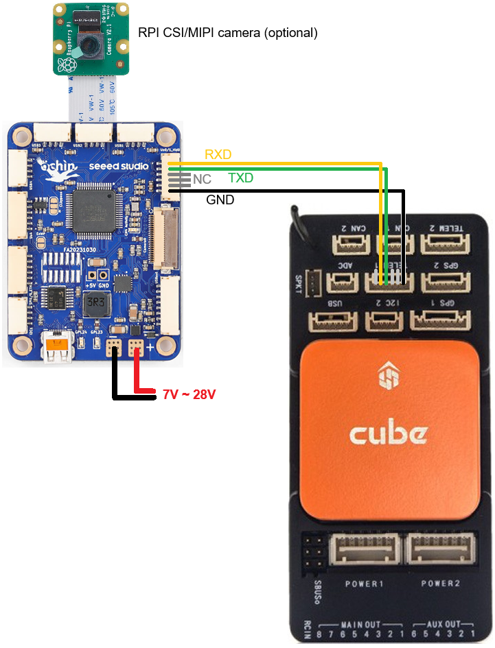

.. _companion-computer-rpanion:

===========================
Rpanion Server Installation
===========================

This section explains how to install Rpanion Server on an RPI compute module connected to an autopilot.  `Rpanion Server's official installation instructions can be found here <https://www.docs.rpanion.com/software/rpanion-server>`__

Recommended Hardware
--------------------

- :ref:`ArduPilot compatible flight controller <common-autopilots>`
- `RPI4 I/O board <https://www.raspberrypi.com/products/compute-module-4-io-board/>`__ or `RPI5 I/O board <https://www.raspberrypi.com/products/compute-module-5-io-board/>`__
- `RPI CM4 <https://www.raspberrypi.com/products/compute-module-4/>`__ or `CM5 <https://www.raspberrypi.com/products/compute-module-5/>`__
- `Ochin Tiny Carrier Board V2 <https://www.seeedstudio.com/Ochin-Tiny-Carrier-Board-V2-for-Raspberry-Pi-CM4-p-5887.html>`__
- (optionally) CSI/MIPI camera
- (optionally) 4G/LTE modem

Setup
-----

Please follow the links below for detailed setup instructions

.. toctree::
    :maxdepth: 1

    Rpanion Server Installation <companion-computer-rpanion-install>
    Rpanion 4G/LTE Telemetry Setup <companion-computer-rpanion-lte-telem>
    Rpanion Live Video Setup <companion-computer-rpanion-live-video>

Videos
------

..  youtube:: xUsFMuyJV_A
    :width: 100%
