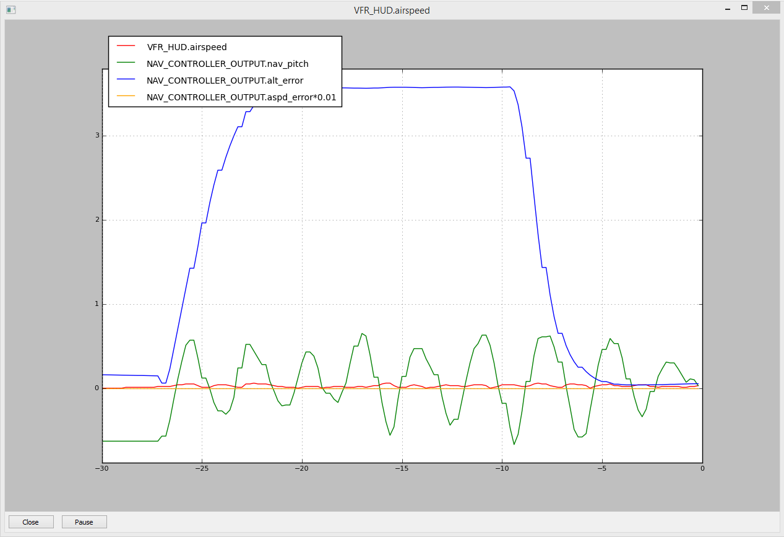

.. _copter-sitl-mavproxy-tutorial:

=============================
Copter SITL/MAVProxy Tutorial
=============================

This tutorial provides a basic walk-through of how to use
:ref:`SITL <sitl-simulator-software-in-the-loop>` and
`MAVProxy <http://ardupilot.github.io/MAVProxy/>`__ for *Copter* testing.

Overview
========

The article is intended primarily for developers who want to test new
Copter builds and bug fixes using SITL and *MAVProxy*. It shows how to
take off, fly in ``GUIDED`` mode, run missions, set a geofence, and
perform a number of other basic testing tasks.

The tutorial is complementary to the topic :ref:`Using SITL for ArduPilot Testing <using-sitl-for-ardupilot-testing>`.

.. note::

   -  We use *MAVProxy* here, but you can :ref:`attach another ground station to SITL <using-sitl-for-ardupilot-testing_connecting_otheradditional_ground_stations>`
      if you prefer (similar instructions can be used in any GCS).
   -  This tutorial is for Copter - see
      :ref:`Plane <plane-sitlmavproxy-tutorial>` and Rover for similar
      tutorials on the other vehicles.

Preconditions
=============

The tutorial assumes you have already set up :ref:`SITL on Windows <sitl-native-on-windows>` or
:ref:`Linux <setting-up-sitl-on-linux>` and that you have started SITL
using the ``--map`` and ``--console`` options:

::

    cd ~/ardupilot/ArduCopter
    sim_vehicle.py --map --console

The *MAVProxy Command Prompt*, *Console* and *Map* should be arranged
conveniently so you can observe the status and send commands at the same
time.

.. image:: ../images/mavproxy_sitl_console_and_map.jpg
    :target: ../_images/mavproxy_sitl_console_and_map.jpg

Taking off
==========

This section explains how to take off in ``GUIDED`` mode. The main steps
are to change to ``GUIDED`` mode, arm the throttle, and then call the
``takeoff`` command. Takeoff must start within 15 seconds of arming, or
the motors will disarm!

.. note::

   At time of writing, Copter only supports takeoff in guided mode;
   if you want to fly a mission you first have to take off and then switch
   to ``AUTO`` mode. From AC3.3 it will be possible to take off in AUTO
   mode too.

Enter the following commands in the *MAVProxy Command Prompt*.

::

    mode guided 
    arm throttle
    takeoff 40

Copter should take off to an altitude of 40 metres and then hover (while
it waits for the next command).

Monitoring
----------

During takeoff you can watch the altitude increase on the console in the
*Alt* field.

Developers may find it useful to **graph** the takeoff by first entering
the ``gtakeoff`` command.

   MAVProxy:Copter Takeoff Graph (gtakeoff)

Troubleshooting
---------------

The most common sources of difficulty taking off are:

#. Starting in any mode other than ``GUIDED``.
#. Attempting to takeoff when the vehicle is not armed. This can happen
   if you call ``takeoff`` too slowly after ``arm throttle``, or if the
   vehicle fails pre-arm checks.

You can list all *enabled* checks using the command ``arm list``:

::

    LAND> arm list
    LAND> all
    params
    voltage
    compass
    battery
    ins
    rc
    baro
    gps

You can enable and disable checks using ``arm check n`` and
``arm uncheck n`` respectively, where n is the name of the check. Use
``n`` value of of ``all`` to enables/disable all checks.

Changing flight mode - circle and land
======================================

The command below shows how to put Copter into
:ref:`CIRCLE <copter:circle-mode>`
mode with a
:ref:`CIRCLE_RADIUS <copter:CIRCLE_RADIUS>`
of 2000cm. This will fly the Copter in a circle at a constant altitude,
with the front pointed towards the centre of the circle.

::

    mode circle
    param set circle_radius 2000

.. note::

   If you set the ``CIRCLE_RADIUS`` to zero the vehicle will rotate
   in place.

Copter supports a :ref:`number of other flight modes <copter:flight-modes>`,
which you can list in MAVProxy using the ``mode`` command:

::

    LAND> mode
    LAND> ('Available modes: ', ['RTL', 'POSHOLD', 'LAND', 'OF_LOITER', 'STABILIZE', 'AUTO', 'GUIDED', 'DRIFT', 'FLIP', 'AUTOTUNE', 'ALT_HOLD', 'LOITER', 'POSITION', 'CIRCLE', 'SPORT', 'ACRO'])

As shown above, you can change the mode by specifying ``mode modename``.
Many of the modes can be set by just entering the mode name, e.g.
``rtl``, ``auto``, ``stabilize`` etc.

For example, to land right where you are you would use the command:
``mode land``. To return to the launch point and then land you would use
the command: ``rtl``.

Guiding the vehicle
===================

Once you've taken off you can move the vehicle around the map in
``GUIDED`` mode. The easiest way to do this is to right-click on the map
where you want to go, select **Fly to**, and then enter the target
altitude.

.. figure:: ../images/MAVProxyCopter_flyto.jpg
   :target: ../_images/MAVProxyCopter_flyto.jpg

   MAVProxy: Fly toLocation

You can also enter the target position manually on the command line
using the two formats below. If only the altitude is specified, the last
specified LAT/LON will be used.

::

    guided ALTITUDE
    guided LAT LON ALTITUDE

In addition to ``takeoff``, you can send the following commands in
``GUIDED`` mode:

::

    yaw ANGLE ANGULAR_SPEED MODE  (MODE is 0 for "absolute" or 1 for "relative")
    speed SPEED_VALUE
    velocity x y z   (m/s)

.. note::

   These commands correspond to
   :ref:`MAV_CMD_NAV_TAKEOFF <copter:mav_cmd_nav_takeoff>`,
   :ref:`MAV_CMD_DO_CHANGE_SPEED <copter:mav_cmd_do_change_speed>`,
   :ref:`MAV_CMD_CONDITION_YAW <copter:mav_cmd_condition_yaw>`,
   `SET_POSITION_TARGET_LOCAL_NED <http://mavlink.org/messages/common#SET_POSITION_TARGET_LOCAL_NED>`__.

   At time of writing, the other :ref:`Copter Commands <copter-commands-in-guided-mode>`
   are not supported (`MAVProxy #150 <https://github.com/ArduPilot/MAVProxy/issues/150>`__)

Flying a mission
================

You can load a mission at any time using the ``wp load`` command. After
you've taken off the current mission will start as soon as you change to
``AUTO`` mode.

The example below shows how to load and start one of the test missions,
skip to the second waypoint, and *loop* the mission:

::

    wp load ..\Tools\autotest\CMAC-circuit.txt
    mode auto
    wp set 2
    wp loop

The `MAVProxy Waypoints documentation <http://ardupilot.github.io/MAVProxy/html/uav_configuration/waypoints.html>`__
lists the full set of available commands (or you can get them using
auto-completion by typing "wp" on the command line).

If you want to create a waypoint mission, this is most easily done on
the map:

#. Right-click on the map and then select **Mission \| Draw**.

   .. figure:: ../images/MAVProxyCopter_Mission_Draw.jpg
      :target: ../_images/MAVProxyCopter_Mission_Draw.jpg

      MAVProxy: Draw Mission Menu

#. Left-click on the map where you want the points to appear.

   .. note::

      Nothing visible will happen when you make the first click.
      After the second click, lines will join your points to show the
      path.
      
#. When you're done, you can loop the mission by right-clicking on the
   map and selecting **Mission \| Loop**.

This approach only allows you to create
:ref:`MAV_CMD_NAV_WAYPOINT <copter:mav_cmd_nav_waypoint>`
commands. You can edit missions and use other commands on Linux using
the *misseditor* module (``module load misseditor``). This is currently
broken on Windows. It is also possible to load other types of commands
from files.

Setting a GeoFence
==================

A GeoFence is is a virtual barrier that Copter uses to constrain the
movement of the vehicle. Copter uses a simple "tin can border" as
described in :ref:`Simple GeoFence <copter:ac2_simple_geofence>`.
When the radius or maximum altitude is breached, Copter returns to the
launch point and/or lands.

The fence is enabled (and its type selected) using the :ref:`Copter Fence Parameters <copter:parameters_FENCE_>`.
You can list the fence parameters with ``param show``:

::

    GUIDED> param show fence*
    GUIDED> FENCE_ACTION     1.000000
    FENCE_ALT_MAX    100.000000
    FENCE_ENABLE     0.000000
    FENCE_MARGIN     2.000000
    FENCE_RADIUS     150.000000
    FENCE_TYPE       3.000000

The fence has an altitude boundary of 100 metres (``FENCE_ALT_MAX``) and
is bound by a circle of radius ``FENCE_RADIUS`` around the home
location. The ``FENCE_TYPE=3`` means that both the radius and altitude
are used (you can change the type to other numbers have an altitude-only
or circle only fence - or none at all).

The fence is initially disabled (``FENCE_ENABLE=0``). To turn it on we
set the value to one:

::

    GUIDED> param set fence_enable 1

When we fly outside the radius the mode changes to RTL (return to land).
If for some reason we travel further out by the value of
``FENCE_MARGIN``, then the vehicle will simply land.

Testing the vehicle
===================

*MAVProxy* allows you to list all the parameters affecting the vehicle
and simulation using ``param show *``, and to set any parameter using:
``param set PARAM_NAME VALUE``. In addition to affecting the vehicle
itself some parameters simulate the performance/failure of specific
hardware components and the environment (for example, the wind). These
can be listed using: `:ref:`param show sim*``. The topic `Using SITL for ArduPilot Testing <using-sitl-for-ardupilot-testing>` explains more about how
you can test using SITL.
