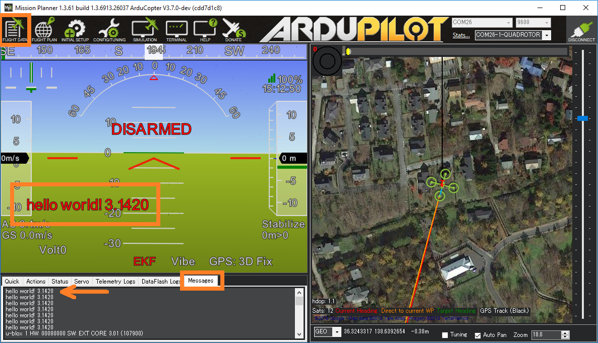

.. _debug-with-send-text:

========================
Debugging with send_text
========================

A simple way to send small short debug messages (50 characters or less) to the ground station is to use `GCS_MAVLink::send_text() <https://github.com/ArduPilot/ardupilot/blob/master/libraries/GCS_MAVLink/GCS.h#L112>`__.  Data sent in this will will appear on the ground station's HUD and messages area.

At the top of the file in which you wish to do the print include GCS_MAVLink.h/GCS.h

   ::

       #include <GCS_MAVLink/GCS.h>

Then at the point in the code where the print should occur add the send_text command

   ::

       gcs().send_text(MAV_SEVERITY_CRITICAL, "hello world! %5.3f", (double)3.142f);

In parts of the code where loops are running very quickly it may be necessary to throttle the output

   ::

       static uint8_t counter = 0;
       counter++;
       if (counter > 50) {
           counter = 0;
           gcs().send_text(MAV_SEVERITY_CRITICAL, "hello world! %5.3f", (double)3.142f);
       }

