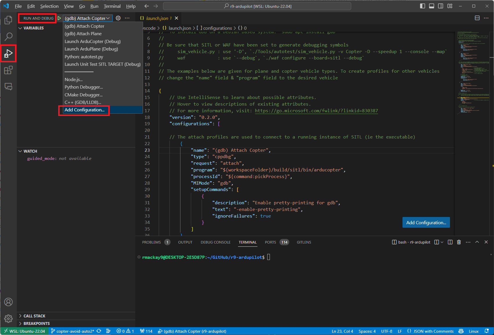
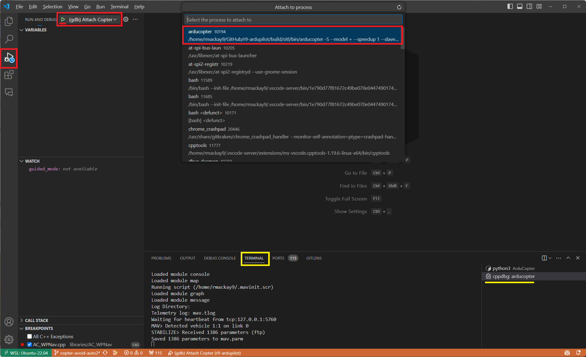
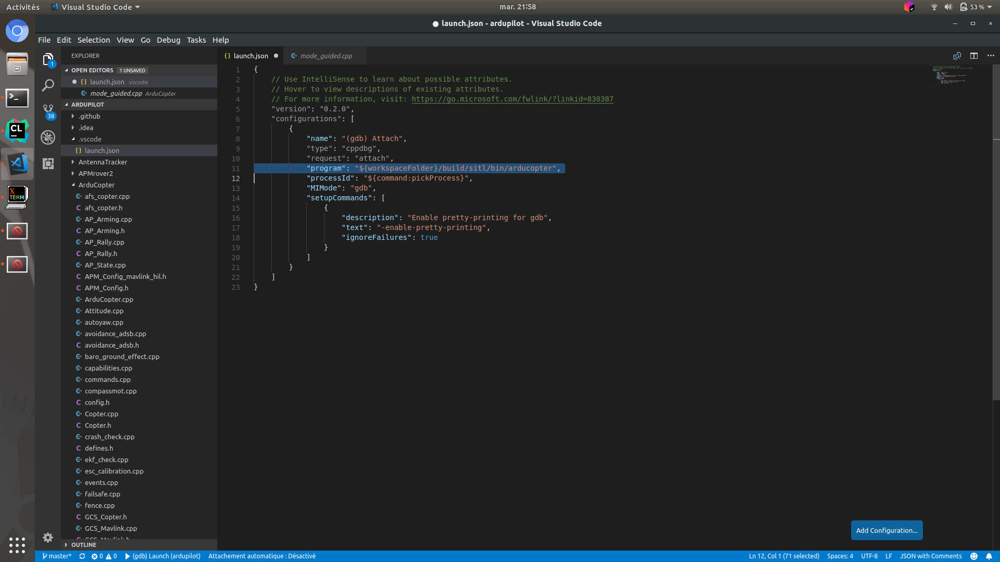
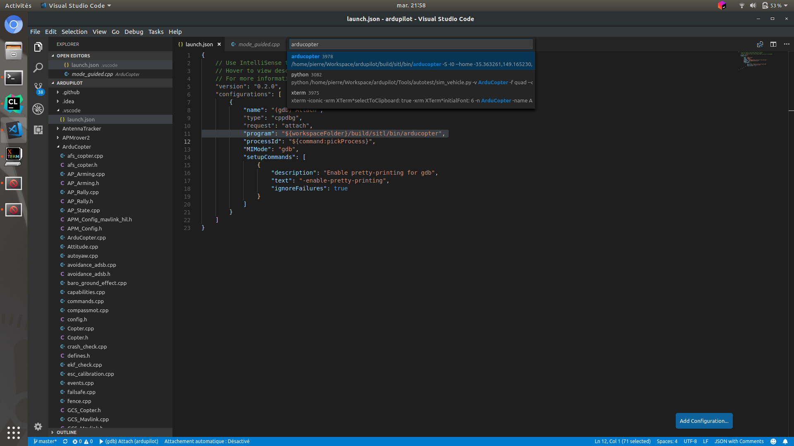
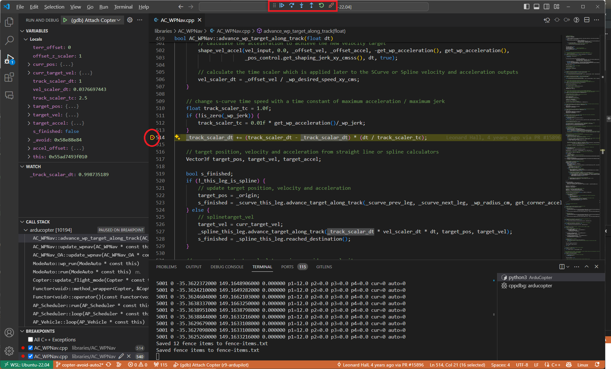
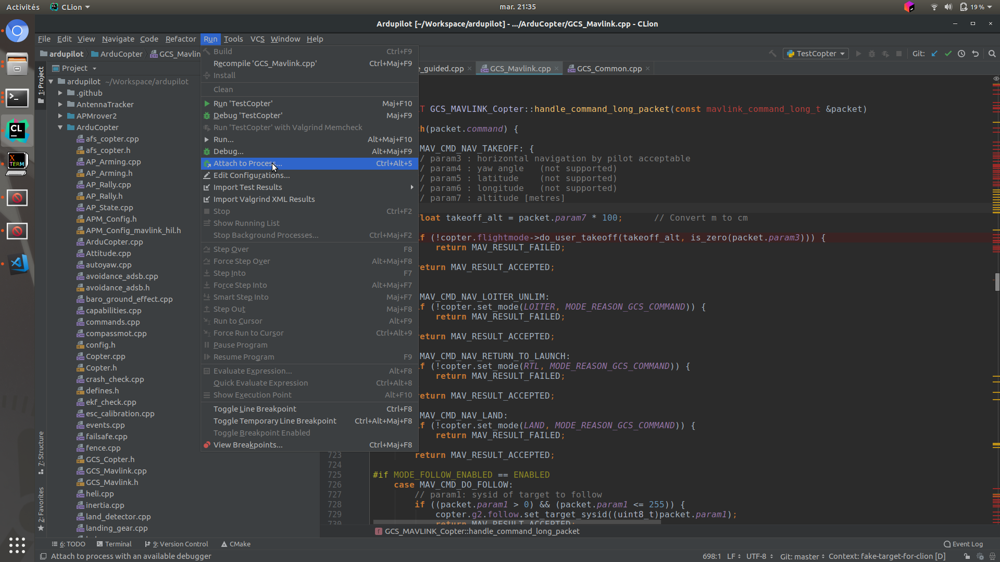
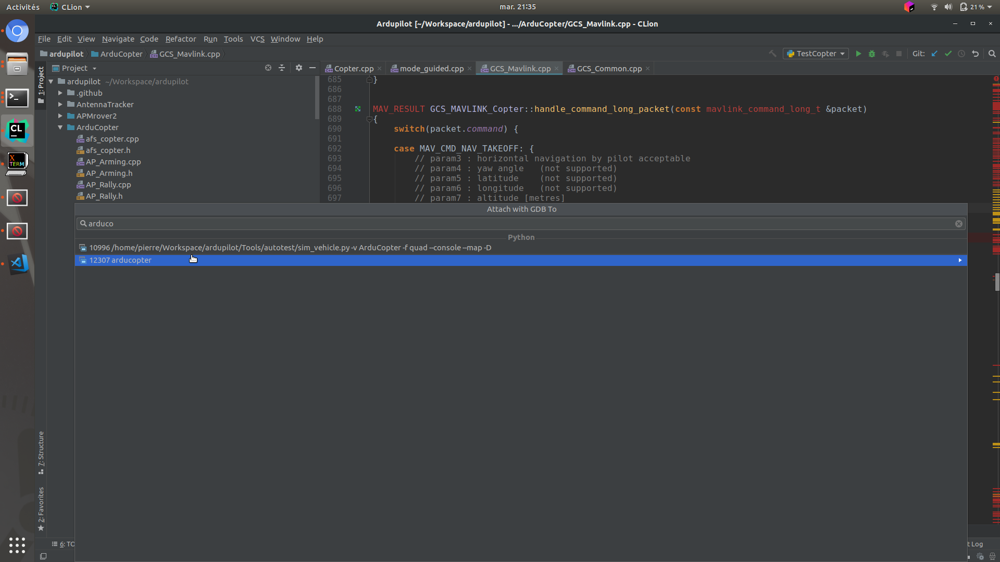
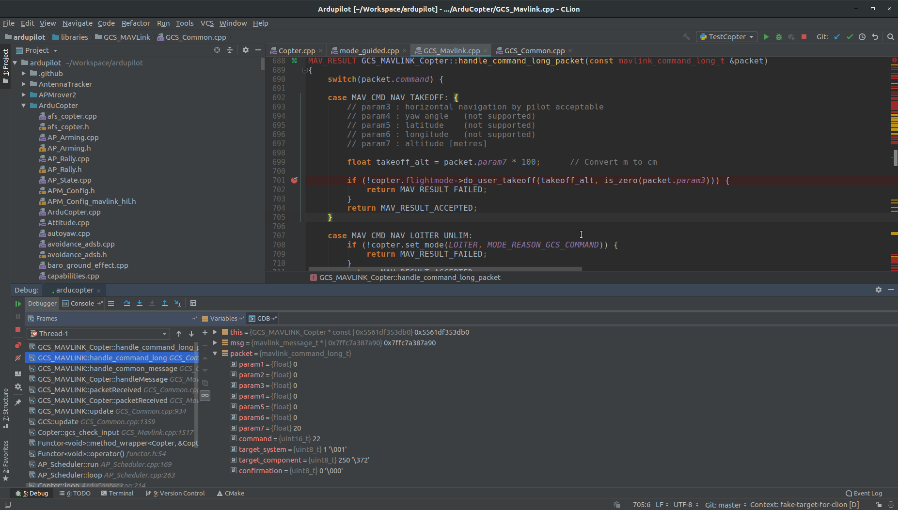

.. _debugging-with-gdb-on-linux:

===========================
Debugging with GDB on linux
===========================

This page describes how to setup GDB on Linux to debug issues with ArduPilot with SITL.

Introduction
============

This guide assumes that you have already successfully use SITL
on your machine following the instructions :ref:`to setup SITL <setting-up-sitl-on-linux>`.

Installing GDB
==============

To install GDB on Linux, please use package installer. If you are on a debian based system (such as Ubuntu or Mint),
simply use the ``apt install`` command :

::

    sudo apt install gdb

Setting up SITL
===============

In order to use GDB, you need to configure your SITL build with debug symbols. Use :

::

    ./waf configure --debug

Raw GDB
=======

This method use the command line gdb for debugging.
There are 3 possible ways:

- run SITL under gdb from the start.

::

    gdb [gdb options] --args path-to-SITL-firmware(generally in build/sitl/bin) [SITL options]

- run gdb with SITL launch script ``sim_vehicle.py`` : simply add ``-D -G`` to build and launch SITL with debug symbols and in gdb directly :

::

    sim_vehicle.py -v ArduCopter -f quad --console --map -D -G

The SITL launch script also get some other feature already provided like launch gdb stopped, put some breakpoints, etc.

- attach to already running SITL process. You can get the SITL process id with ``pidof [vehicle type : arducopter, arduplane, ardurover]``.

::

     gdb path-to-binary(build/sitl/bin/) SITL-process-id

When gdb is launched you should be able to use it to debug ArduPilot like any other program. If you don't know how to
use gdb from commandline, please look on the net for some tutorial, a simple one can be found `here <http://www.unknownroad.com/rtfm/gdbtut/gdbtoc.html>`__.
Don't forget that you can crash you drone on SITL safely !

With IDE
========

For those that are not used to commandline, there are plenty ways to use gdb for debugging with GUI. Here are some.

For Ubuntu user, the default protections will prevent you to attach gdb to SITL from IDE : see `here <https://wiki.ubuntu.com/SecurityTeam/Roadmap/KernelHardening#ptrace%20Protection>`__.
This will lead to an error message ``ptrace: Operation not permitted`` on your first attempt to attach to a local process.

In this case, do one of the following:

- To disable this restriction temporarily, enter the command:

::

    echo 0 | sudo tee /proc/sys/kernel/yama/ptrace_scope

- To disable this restriction permanently, open the ``/etc/sysctl.d/10-ptrace.conf`` file for editing and change the line kernel.yama.ptrace_scope = 1 to kernel.yama.ptrace_scope = 0. To apply the changes immediately, enter the above command. Alternatively, run ``sudo service procps restart`` or simply restart your system.

VS CODE
-------

`VS Code website <https://code.visualstudio.com/>`__

Open ArduPilot directory.
Go in debug menu and then Add a configuration, it should open a launch.json file for debugging configuration.
You should have a big ``Add a configuration`` button.

Click and select ``C/C++ : (gdb) Attach`` option.

Fill the "program" line with

::

    "program": "${workspaceFolder}/build/sitl/bin/arducopter",

Or the other vehicle you want.

Launch SITL with launch script ``sim_vehicle.py`` : simply add ``-D`` to build and launch SITL with debug symbols :

::

    sim_vehicle.py -v ArduCopter -f quad --console --map -D

And now start debugging with VSCode, it will ask you for a process name : type ``arducopter`` or the other vehicle name you want to debug.

Now you can put breakpoint in the code and start debugging !

CLION
-----

`Jetbrains website <https://www.jetbrains.com/clion/>`__
Clion is a paid product, but free for student !

Open ArduPilot directory.
Launch SITL with launch script ``sim_vehicle.py`` : simply add ``-D`` to build and launch SITL with debug symbols :

::

    sim_vehicle.py -v ArduCopter -f quad --console --map -D

In Run menu, select ``Attach to Local Process...``

, and type ``arducopter`` or the other vehicle name you want to debug.

Now you can put breakpoint in the code and start debugging !

