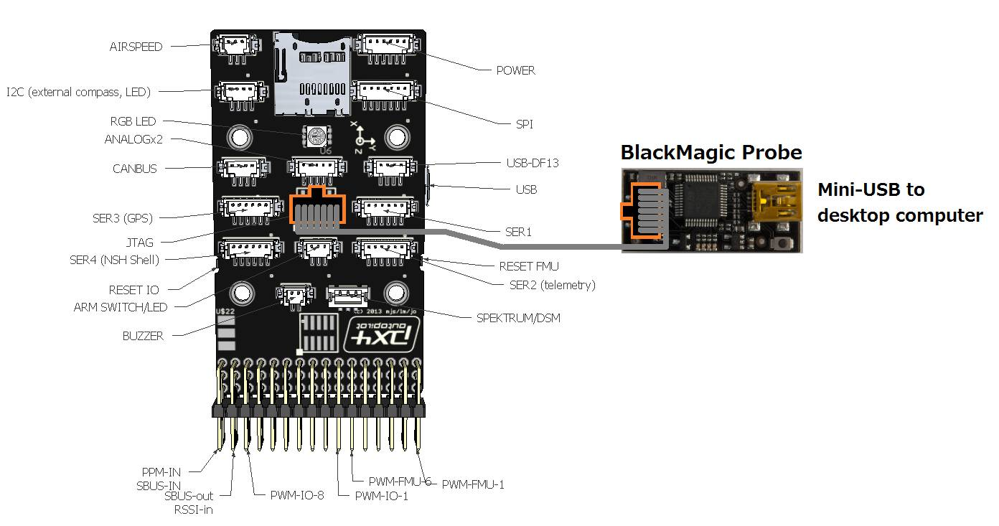
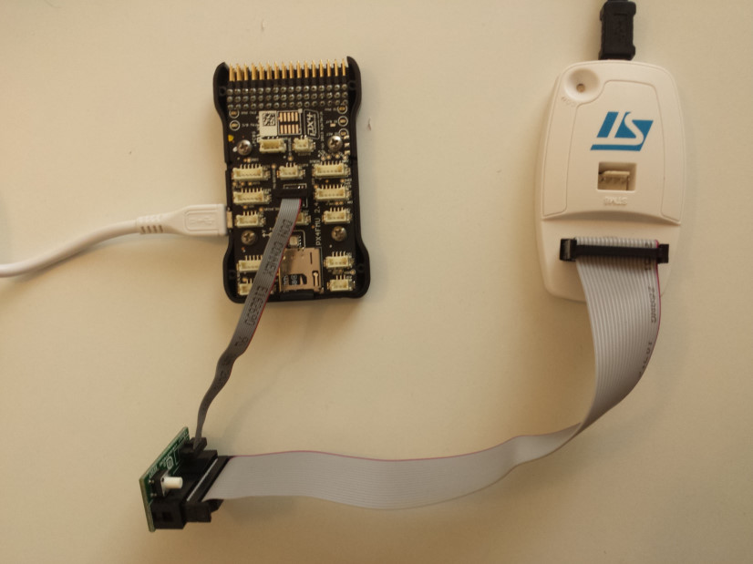
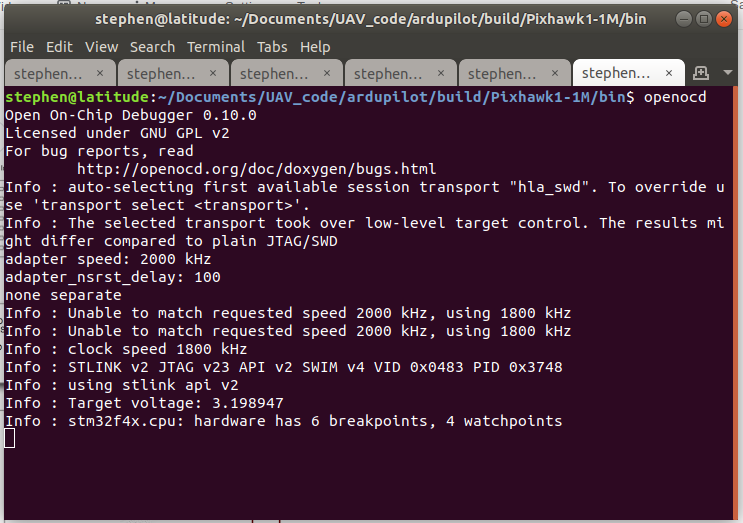
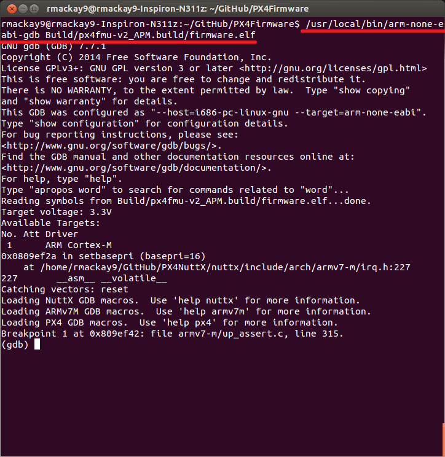
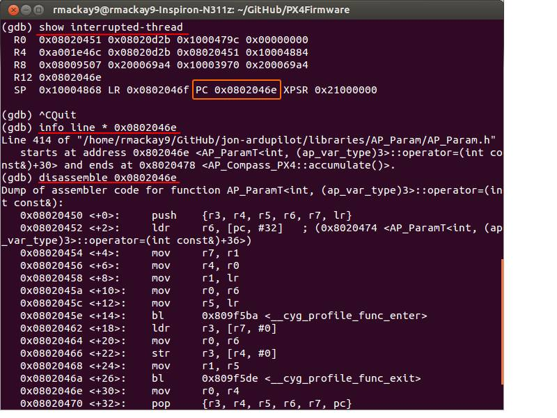

.. _debugging-with-gdb-on-stm32:

===========================
Debugging with GDB on STM32
===========================

This page describes how to setup GDB on Linux to debug issues on STM32. The specific commands were tested on Ubuntu 18.10.

Introduction
============

GDB (the GNU Debugger) "allows you to see what is going on \`inside'
another program while it executes or what another program was doing at
the moment it crashed." which can be useful when investigating very
low-level failures with the STM32 (it cannot be used with the
APM1/APM2)

This guide assumes that you have already successfully built the firmware
on your machine following the instructions for
:ref:`Windows <building-setup-windows>`,
:ref:`Mac <building-setup-mac>` or
:ref:`Linux <building-setup-linux>`.

A `BlackMagic probe <http://www.blacksphere.co.nz/main/index.php/blackmagic>`__ or `ST-Link V2 JST debugger <https://www.ebay.com/itm/ST-Link-V2-Stlink-Emulator-Downloader-Programming-Mini-Unit-STM8-STM32-KK/223056820813>`__ is
also required.  A BlackMagic probe can be purchased in the US from `Transition Robotics <http://transition-robotics.com/products/black-magic-probe-mini>`__,
`1 Bit Squared <http://1bitsquared.com/collections/frontpage/products/black-magic-probe>`__
or in NewZealand from
`Greenstage <http://shop.greenstage.co.nz/product/black-magic-debug-probe>`__.

A small plug (`FTSH-105-04-L-DV <https://au.element14.com/samtec/ftsh-105-04-l-dv/connector-header-1-27mm-smt-10way/dp/2308438?scope=partnumberlookahead&ost=FTSH-105-04-L-DV&searchref=searchlookahead&exaMfpn=true&ddkey=https%3Aen-AU%2FElement14_Australia%2Fw%2Fsearch>`__) may be required to solder on to the JTAG port of the flight controller.


Compiling the Firmware
======================

Build and upload the debug variant of the firmware:

```
./waf configure --board=Pixhawk1-1M --debug --enable-asserts
./waf --target=examples/UART_test --upload
```

Connecting the BlackMagic probe to the Pixhawk
==============================================



The BlackMagic probe should be connected to the Pixhawk's JTAG connector
using the grey 10wire cable that came with the probe. Note that most
Pixhawk come with no headers soldered onto the JTAG connector because it
interferes with the case.

Connecting the ST-Link V2 JTAG debugger to the STM32
====================================================



The ST-Link debugger should be connected to the STM32's JTAG connector
using the JTAG breakout cable. Connect the
SWDIO and SWCLK (see `Debug port pinout <https://ardupilot.org/copter/docs/common-pixracer-overview.html#debug-port-jst-sm06b-connector>`__
for reference) to the corresponding SWDIO and SWCLK pins on the ST-Link debugger.

Ensure :ref:`BRD_OPTIONS<BRD_OPTIONS>` sets the "Enable Debug Pins" bit if bit 3 is present in the vehicle software being used.
It is also advised to disable the watchdog by ensuring bit 0 is not set.


Installing GDB
==============

If using Ubuntu, GDB is likely already installed on your machine and it
will likely work although we recommend using the version available for
download here `https://firmware.ardupilot.org/Tools/STM32-tools <https://firmware.ardupilot.org/Tools/STM32-tools>`__

The gcc-arm-none-eabi*-linux.tar.bz2 file contains both the
recommended compiler and the recommended version of gdb.

If you will be using the ST-Link debugger, please install the gdb version found
in the gcc-arm-none-eabi-6-2017-q2-update-linux.tar.bz2 file.

After installation you should find you have a tool called
arm-none-eabi-gdb.

Installing OpenOCD
==================

You will need to install OpenOCD if you are using the ST-Link debugger:

``sudo apt-get install openocd``.

Before OpenOCD and GDB are run, their configuration files need to be copied to the build folder. Note that the build folder name is the same at the board name.

Go to the ``./Tools/debug`` folder and copy ``openocd.cfg`` to ``./build/<boardname>/bin``, 
if not done so previously

Type ``openocd`` in your terminal in the ``bin`` directory above.



Note: there are 2 versions of the ST-link debugger on eBay, so if
the command does not work, change the first line to ``source [find interface/stlink-v2-1.cfg]``.


Starting GDB and running some commands
======================================

Copy ``.gdbinit`` to ``./build/<boardname>/bin`` and
edit ``~/.gdbinit`` to have the following text: ``set auto-load safe-path /``,
if not done so previously.

In another window, type ``arm-none-eabi-gdb arducopter`` in the 
``./build/<boardname>/bin`` folder. Now you have
connected to the gdb debugging session and can use the commands from
the next section.



Some useful commands:

``r`` -- restarts the process

``b function-name`` -- i.e. b setup -- sets a breakpoint at the start of
the "setup" function. Note a class name can be prepended such as
``b AC_AttitudeControl::init``

``Ctrl-C`` -- stops the code from executing so you can set breakpoints,
etc

``continue`` -- continues the code from wherever it was stopped

``show interrupted-thread`` -- shows address where execution has stopped
(see below)

``info line * <address>`` -- shows c++ line for a given address (i.e.
from show interrupted-thread)

``info threads`` -- show status of all threads

``disassemble <address>`` -- converts given address into assembler code

``exit`` -- exits from the GDB


