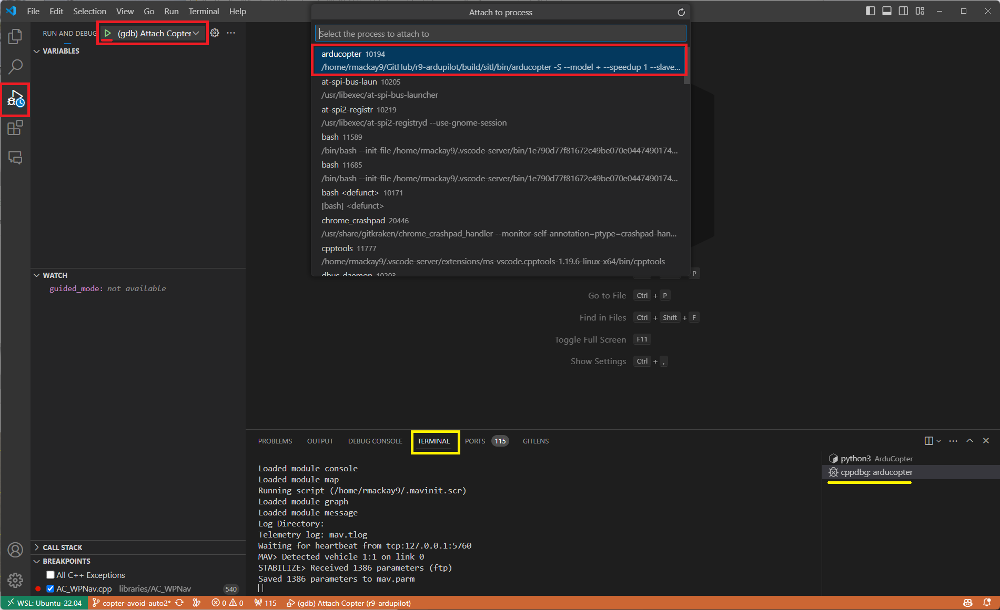
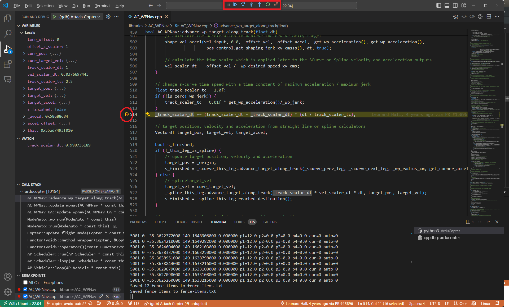

.. _debugging-with-gdb-using-vscode:

===============================
Debugging with GDB using VSCode
===============================

This page describes how to setup and use GDB with the VSCode IDE to debug issues with SITL, autotests, and unit tests.

Introduction
============

This guide assumes that you have already successfully use SITL
on your machine following the instructions :ref:`to setup SITL <setting-up-sitl-on-linux>`.

Installing GDB
==============

To install GDB on Linux, please use package installer. If you are on a debian based system (such as Ubuntu or Mint),
simply use the ``apt install`` command :

::

    sudo apt install gdb

Setting up SITL
===============

In order to use GDB, you need to configure your SITL build with debug symbols. Use :

::

    ./waf configure --debug

Setting up VSCode Debugger
==========================
With VSCode open to the ArduPilot directory. Open the `Run and Debug` menu (Ctrl+Shift+D). Within the `Run and Debug` menu, select `create a launch.json file`. Then select `Add Configuration`, it should open a launch.json file for setting up debugging configurations.  An example launch.json file can be found below.  Copy-paste the example into the newly created launch.json file in VSCode, overwitting anything that has was pre-defined in the file, and save the file.  This example file is a good place to start but can be modified to your liking.  Should you need to access or edit the file in the future, you can find it in the .vscode directory, or you can simply click on the cog icon in the `Run and Debug` menu.

.. image:: ../images/VSCode-config1.png
    :target: ../_images/VSCode-config1.png

Example launch.json File
------------------------

.. code-block:: javascript

    // Common ArduPilot Debugging Profiles for VSCode
    // see https://ardupilot.org/dev/docs/debugging-with-gdb-using-vscode.html
    //
    // GDB must be installed!
    //  To install GDB on a Debian based system: `sudo apt install gdb`
    //
    // Be sure that SITL or WAF have been set to generate debugging symbols
    //     sim_vehicle.py : use '-D', `./Tools/autotest/sim_vehicle.py -v Copter -D --speedup 1 --console --map`
    //     waf            : use `--debug`, `./waf configure --board=sitl --debug`
    //
    // The examples below are given for plane and copter vehicle types. To create profiles for other vehicles 
    // change the "name" field & "program" field to the desired vehicle

    {
        // Use IntelliSense to learn about possible attributes.
        // Hover to view descriptions of existing attributes.
        // For more information, visit: https://go.microsoft.com/fwlink/?linkid=830387
        "version": "0.2.0",
        "configurations": [

        // The attach profiles are used to connect to a running instance of SITL (ie the executable)
            {
                "name": "(gdb) Attach Copter",
                "type": "cppdbg",
                "request": "attach",
                "program": "${workspaceFolder}/build/sitl/bin/arducopter",
                "processId": "${command:pickProcess}",
                "MIMode": "gdb",
                "setupCommands": [
                    {
                        "description": "Enable pretty-printing for gdb",
                        "text": "-enable-pretty-printing",
                        "ignoreFailures": true
                    }
                ]
            },
            {
                "name": "(gdb) Attach Plane",
                "type": "cppdbg",
                "request": "attach",
                "program": "${workspaceFolder}/build/sitl/bin/arduplane",
                "processId": "${command:pickProcess}",
                "MIMode": "gdb",
                "setupCommands": [
                    {
                        "description": "Enable pretty-printing for gdb",
                        "text": "-enable-pretty-printing",
                        "ignoreFailures": true
                    }
                ]
            },

        // The `Launch` profiles allow debugging of the binaries directly for initialization tasks and constructors, etc. without using MAVProxy.
        // Note: The easiest method to debug initialization and constructors is to select the debug points, attach to the executable, and then command "reboot" in MAVProxy.
        // Launch tasks require that the binary to be debugged has already been built. Be sure to run ``./waf copter`` beforehand or the old binary will be debugged instead.
            {
                "name": "Launch ArduCopter (Debug)",
                "type": "cppdbg",
                "request": "launch",
                "cwd": "${workspaceFolder}/ArduCopter",
                "program": "${workspaceFolder}/build/sitl/bin/arducopter",
                "args": [
                    "-S",                                    // set synthetic clock mode
                    "-w",                                    // Wipes simulated eeprom to defaults
                    "--model", "copter",                     // set simulation model
                    "--home", "36.146,-113.89,1429.75,90",   // Grand Canyon Plateau for terrain following
                    "--config", "-G",                        // "-G" option sets debug symbols
                    "--speedup", "8",                        // Set the how much faster relative to real-time the simulation runs
                    // "--serial4=sim:lightwareserial",        // Used to attach simulated serial devices
                    "--defaults",
                    "${workspaceRoot}/ArduCopter/mav.parm",  // set path to defaults file
                    "-I0",
                    // "--help"                              // Lists all commands available
                ],
                // "stopAtEntry": false,
                // "environment": [],
                // "externalConsole": false,
                "miDebuggerPath": "/usr/bin/gdb",
                "MIMode": "gdb",
                "launchCompleteCommand": "exec-run",
                "setupCommands": [
                    {
                        "description": "Enable pretty-printing for gdb",
                        "text": "-enable-pretty-printing",
                        "ignoreFailures": true
                    }
                ]
            },
            {
                "name": "Launch ArduPlane (Debug)",
                "type": "cppdbg",
                "request": "launch",
                "cwd": "${workspaceFolder}/ArduPlane",
                "program": "${workspaceFolder}/build/sitl/bin/arduplane",
                "args": [
                    "-S",
                    "--model", "plane",
                    "--speedup", "8",
                    "--defaults", "${workspaceRoot}/Tools/autotest/default_params/plane.parm",
                    "-I0"
                ],
                "miDebuggerPath": "/usr/bin/gdb",
                "MIMode": "gdb",
                "launchCompleteCommand": "exec-run"
            },

        // Autotest Debugging Profile
        // 
        // Note: This profile does not auto-attach to the correct vehicle binary as the autotest automatically opens & closes new instances of SITL.
        //       In order to debug the C++ code at the same time as the Python autotest code create a debug point in the Python code before the relevant C++ will be called.
        //       Then attach to the vehicle binary using the "Attach" profile. Now that the C++ executable has been attached to GDB you may continue in the Python debugger.

            {
                "name": "Python: autotest.py",
                "type": "python",
                "request": "launch",
                "program": "${workspaceFolder}/Tools/autotest/autotest.py",
                "console": "integratedTerminal",
                "justMyCode": false,                         // This setting allows debugging of dependent Python modules such as pymavlink that get called and used by autotest
                "args": [
                    "--debug",
                    "--no-clean",
                    "build.Copter",
                    "test.Copter.GuidedSubModeChange",
                    // "--help",
                ]
            },

        // Unit Test Debugging Profile
        //
        // Debugging for Unit Testing executed via Google's gtest
            {
                "name": "Launch Unit Test SITL TARGET (Debug)",
                "type": "cppdbg",
                "request": "launch",
                "cwd": "${workspaceFolder}/../testing",
                "program": "${workspaceFolder}/build/sitl/tests/test_sim_ms5611",
                "miDebuggerPath": "/usr/bin/gdb",
                "MIMode": "gdb",
                "launchCompleteCommand": "exec-run"
            },
        ]
    }

Launch SITL with using ``sim_vehicle.py`` : be sure to add ``-D`` to build and launch SITL with debug symbols:

::

    sim_vehicle.py -v ArduCopter -f quad --console --map -D

From the Run and Debug menu select ``(gdb) Attach``, push the green arrow and select the process name for your vehicle's binary (e.g. ``arducopter``)

Note that you can switch between the Debug and SITL terminals by clicking in the areas shown in yellow above.

Before or after attaching you may put breakpoints in the code to start debugging.

Debugging Initialization Tasks and Constructors Using Launch Profiles
---------------------------------------------------------------------
.. note::
    The easiest method to debug initialization and constructors is to select the debug points, attach to the executable, and then command "reboot" in MAVProxy.

The ``Launch`` profiles allow debugging of the binaries directly for initialization tasks and constructors, etc. without using MAVProxy. Launch tasks require that the binary to be debugged has already been built. Be sure to run ``./waf copter`` beforehand or the old binary will be debugged instead.

Autotest Debugging Profile
--------------------------
This profile does not auto-attach to the correct vehicle binary as the autotest automatically opens & closes new instances of SITL. In order to debug the C++ code at the same time as the Python autotest code create a debug point in the Python code before the relevant C++ will be called. Then attach to the vehicle binary using the "Attach" profile. Now that the C++ executable has been attached to GDB you may continue in the Python debugger. 
