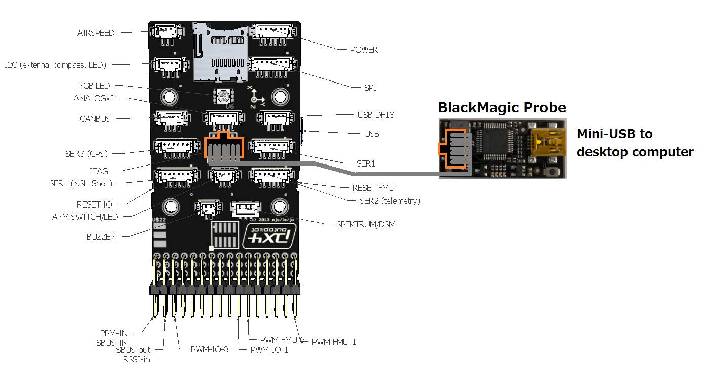

.. _debugging-with-gdb:

==================
Debugging with GDB
==================

This page describes how to setup GDB on Linux to debug issues with a PX4
or Pixhawk. The specific commands were tested on Ubuntu 13.10. GDB can
also be set-up on Windows but `there is an issue passing the Ctrl-C command to GDB <http://stackoverflow.com/questions/711086/in-gdb-on-mingw-how-to-make-ctrl-c-stop-the-program>`__
which makes it difficult to use effectively.

Introduction
============

GDB (the GNU Debugger) "allows you to see what is going on \`inside'
another program while it executes or what another program was doing at
the moment it crashed." which can be useful when investigating very
low-level failures with the Pixhawk (it cannot be used with the
APM1/APM2)

This guide assumes that you have already successfully built the firmware
on your machine following the instructions for
:ref:`Windows <building-px4-with-make>`.

A `BlackMagic probe <http://www.blacksphere.co.nz/main/index.php/blackmagic>`__ is
also required.  They can be purchased in the US from `Transition Robotics <http://transition-robotics.com/products/black-magic-probe-mini>`__,
`Tag-Connect <http://www.tag-connect.com/BLACK-SPHERE-DBG>`__ or `1 Bit Squared <http://1bitsquared.com/collections/frontpage/products/black-magic-probe>`__
or in NewZealand from
`Greenstage <http://shop.greenstage.co.nz/product/black-magic-debug-probe>`__.

Alternative instructions for the set-up can be found on the PX4 wiki
`here <http://pixhawk.org/dev/jtag/start>`__.

Connecting the probe to the Pixhawk
===================================

The BlackMagic probe should be connected to the Pixhawk's JTAG connector
using the grey 10wire cable that came with the probe. Note that most
Pixhawk come with no headers soldered onto the JTAG connector because it
interferes with the case. Please contact `Craig Elder <mailto:craig@3dr.com?Subject=Pixhawk%20with%20JTAG%20connectors>`__
to order a Pixhawk with the JTAG pins soldered.

Installing GDB
==============

If using Ubuntu, GDB is likely already installed on your machine and it
will likely work although we recommend using version 7.7 or higher
because it includes python extensions.  On an Ubuntu machine you can
find where your GDB is installed by typing:

``which gdb``

This will likely return ``/usr/local/bin/arm-none-eabi-gdb``

Next check it's version by calling it with the ``--version`` argument

``/usr/local/bin/arm-none-eabi-gdb --version``

If you wish to upgrade to 7.7 (or higher):

-  download a later version from the `GDB download page <http://ftp.gnu.org/gnu/gdb/>`__.
-  when the download completes extract the compressed file to somewhere
   on your machine (i.e. /home/<username>/Documents)
-  open a terminal and change to the directory that was extracted (i.e.
   /home/<username>/Documents/gdb-7.7.1)
-  run the configuration script by typing
   ``./configure --target arm-none-eabi``
-  make gdb for your system by typing ``make``
-  install the newly built gdb into /usr/local/bin by typing
   ``make install``

Starting GDB and running some commands
======================================

GDB requires both the binary file that's been uploaded to the board
(i.e. Copter-v2.px4) which can normally be found in Copter, Plane or
APMRover2 directory and the firmware.elf file that can be found in
PX4Firmware/Build/px4fmu-v2_APM.build/firmware.elf.

change to your PX4Firmware directory and type the following:

``/usr/local/bin/arm-none-eabi-gdb Build/px4fmu-v2_APM.build/firmware.elf``

.. image:: ../images/DebuggingWithGDB-startGBD.png
    :target: ../_images/DebuggingWithGDB-startGBD.png

Some useful commands:

``r`` -- restarts the process

``b function-name`` -- i.e. b setup -- sets a breakpoint at the start of
the "setup" function. Note a class name can be prepended such as
``b AC_AttitudeControl::init``

``Ctrl-C`` -- stops the code from executing so you can set breakpoints,
etc

``continue`` -- continues the code from wherever it was stopped

``show interrupted-thread`` -- shows address where execution has stopped
(see below)

``info line * <address>`` -- shows c++ line for a given address (i.e.
from show interrupted-thread)

``disassemble <address>`` -- converts given address into assembler code

``exit`` -- exits from the GDB

.. image:: ../images/GDB_commands2.jpg
    :target: ../_images/GDB_commands2.jpg
