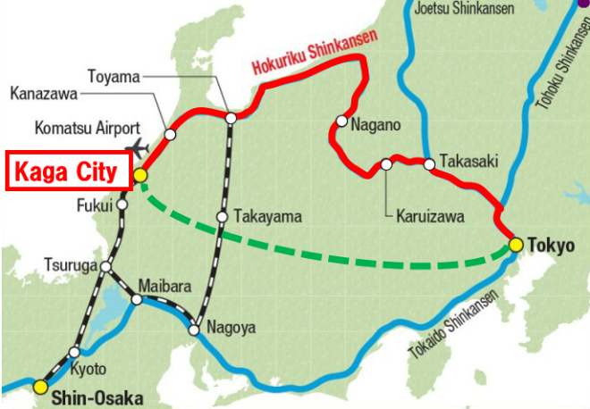
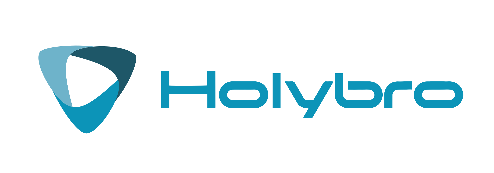

.. _dev-conference:

==========================
Developers Conference 2024
==========================

The 2024 ArduPilot developer conference will be held in `Kaga, Ishikawa Japan <https://visitkaga.jp/>`__ from Oct 25th to 27th. As with previous years the conference will be a mix of presentations, live demonstrations and lots of discussion including what we should do next

To keep the numbers manageable, in-person attendance is limited to ArduPilot "core" developers and :ref:`Partner companies <common-partners>` but we will be live streaming presentations and hopefully even some of the demonstrations

If you plan to come, please add your name to the spreadsheet linked from the top of the AP Discord "conf-2024" chat (if you can't find it, please contact Randy).  The spread sheet also includes many other important links including the HILL-TIP travel agency for booking the hotel, the drone registration spreadsheet and links to the various flight spaces

**Getting there:**

- `Komatsu airport (KMQ) <https://maps.app.goo.gl/psCK7RxNUY6ntXxYA>`__ is about 20km from the main hotel and has direct flights from Seoul, Shanghai, Taipei. Connections through Haneda are also possible
- `Kagaonsen Station <https://maps.app.goo.gl/RxmgFgZqUN5xPqb67>`__ is about 3 hours by bullet train from Tokyo station (use the "hokuriku shinkansen" line)

**Hotels:**

There are basically two hotels and a BnB to choose from.  Bookings can be made through `Hill-Tip travel agency <https://hill-tip.com/>`__ but don't just call them, use the link from the "master spreadsheet" found in the "conf-2024" AP Discord chat.  We plan to provide a shuttle bus between the two hotels in the morning and evenings

- `Kaga Hyakumangoku Hotel <https://www.kaga-hyakumangoku.jp/en/>`__ is the main conference venue and is closer to downtown
- `Arrowle <https://www.arrowle.co.jp/en/>`__ is less expensive but a little more remote
- Magondo BnB

We have a limited number of rooms in an AirBnB for core developers.  Please tell Randy if you would like one of these

Rental cars can also be booked through Hill-Tip travel agency

**Presentations:**

The "master spreadsheet" includes a "Presentations" page with the list of expected presenters.  If you would like to present something please contact Randy who will add you to the list.  Remember this is a developer conference (not a sales or marketing conference) so ideally tailor your presentation to suit a technical audience.  Feel free to share both successes and failures because engineers like to solve problems!

**Demonstrations:**

We very much encourage attendees to bring a vehicle (copter, plane, rover, boat, etc) to demonstrate or just to have fun with. For flying vehicles they will need to be registered though so please make a copy of `this form <https://www.dropbox.com/scl/fi/pfhqs021i5xruew7kl1ky/APDevConf2024-DroneRegistration.xlsx?rlkey=7qajurkmiu0nqojymmfjvfh63&dl=0>`__, fill it in and return to Randy.

Here are the four available demonstration areas

- `Athletics field <https://maps.app.goo.gl/FfWSNrX9B15CByJZ7>`__
- `Kenko green park <https://maps.app.goo.gl/EfhpWKgDPqaLRtgH9>`__
- `Shibayamagata park <https://maps.app.goo.gl/awxqRJNPfXz4wXQa9>`__ (good for boats)
- `Kutani Dam <https://maps.app.goo.gl/FDo7AwWzrkviNCp79>`__

**Japan Visa:**

Many visitors do not require a visa for a short-term stay (`see country list <https://www.mofa.go.jp/j_info/visit/visa/short/novisa.html#section2>`__).  For those requiring an invitation letter please contact Rishabh Singh from the AP core dev team

**Have Questions?**

If you have any questions or comments please feel free to the organisers (see below) and/or ask questions in the ArduPilot Discord "conf-2024" channel

- Randy from AP core dev team
- Katsumata-san from `Drone Japan <https://www.drone-j.com/>`__

Special thanks to the sponsors of this year's conference (in alphabetical order):

.. image:: ../../../images/supporters/supporters_logo_ASW.png
      :width: 250px
      :target: https://aerosystemswest.com

.. image:: ../../../images/supporters/supporters_logo_EAMS.png
      :width: 250px
      :target:  https://eams-robo.co.jp

---------------------

For recording of previous developer conference please see `ArduPilot's YouTube Playlists <https://www.youtube.com/@ardupilot19/playlists>`__