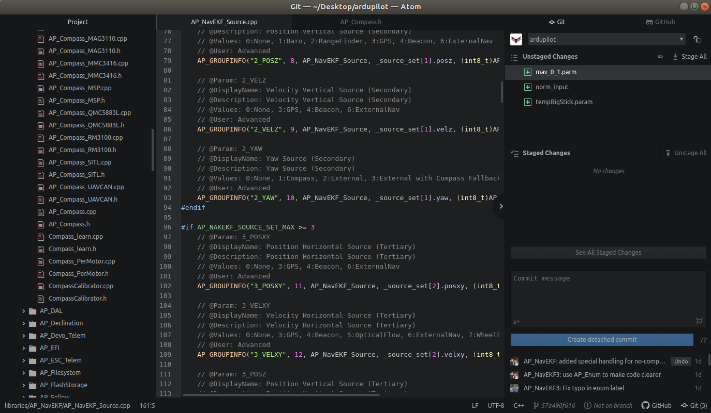
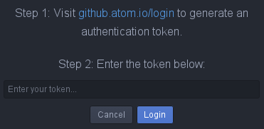
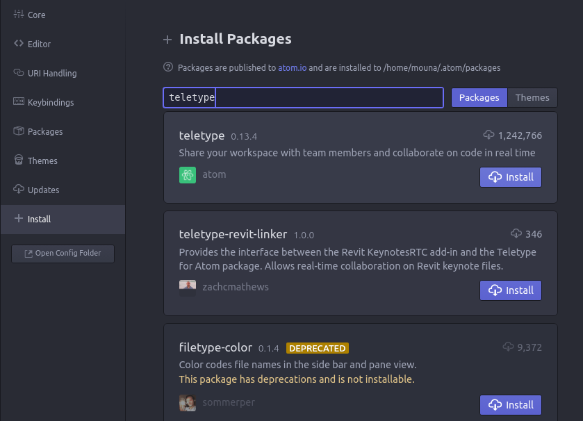

.. _editing-the-code-with-atom:

==========================
Editing the code with Atom
==========================

Atom is a free and open-source editor available for Linux, MacOS and Windows developed by GitHub.
With its minimalistic UI, Atom integrates GitHub which simplifies the work on open source projects like Ardupilot. It is a perfect complement to GitHub's primary mission of building better software by working together.

With its Teletype package, Atom supports sharing workspaces for real time collaboration.

In this wiki, we will see how to:

- install Atom
- configure GitHub
- configure Teletype package.

Install Atom for Linux/Windows/MacOS
====================================

Install Atom for Linux
----------------------

The simplest way to install Atom in your Linux computer, you can go to `https://atom.io <https://atom.io>`__ and downloading the .deb package for Debian/Ubuntu machines, or .rpm package for Red Hat/CentOS/Fedora/SUSE machines.
Then run the following command to install it:
- Debian and Ubuntu: (deb)

::

    sudo apt-get install atom

- Red Hat/CentOS: (yum)

::

    sudo yum install -y atom.x86_64.rpm

- Fedora: (dnf)

::

    sudo dnf install -y atom.x86_64.rpm

- SUSE: (zypp)

::

    sudo zypper in -y atom.x86_64.rpm

Install Atom for Windows
------------------------

Installing Atom should be fairly simple. Generally, you can go to `https://atom.io <https://atom.io>`__ and you should see a download button. After finishing download, run the .exe file.
This setup program will install Atom, add the atom and apm commands to your PATH, and create shortcuts on the desktop and in the start menu.

Install Atom for MacOS
----------------------

Atom follows the standard Mac zip installation process. You can either press the download button from the `https://atom.io <https://atom.io>`__ site or you can go to the Atom releases page to download the atom-mac.zip file explicitly. Once you have that file, you can click on it to extract the application and then drag the new Atom application into your "Applications" folder.

Configuring GitHub
==================

Press on GitHub tab then you should see a prompt like the following. Press on the link to generate a token, then enter this token in the box. Your GitHub account should now be linked with your Atom editor now.

You can visit the official GitHub manual for Atom `here <https://flight-manual.atom.io/using-atom/sections/github-package/>`__ to to start managing your GitHub repositories from Atom.

Install Teletype package for real time collaboration
====================================================

Teletype allows sharing or joining a portal for real time collaboration. To install it, go to the menu bar *Packages->Settings View->Open*.
Type in "Teletype" in the box then install. Finally, you can see Teletype in the menu *Packages* then you can *"Join Portal"* or *"Share Portal"*.

The complete Atom manual is available `here <https://flight-manual.atom.io/>`__.
