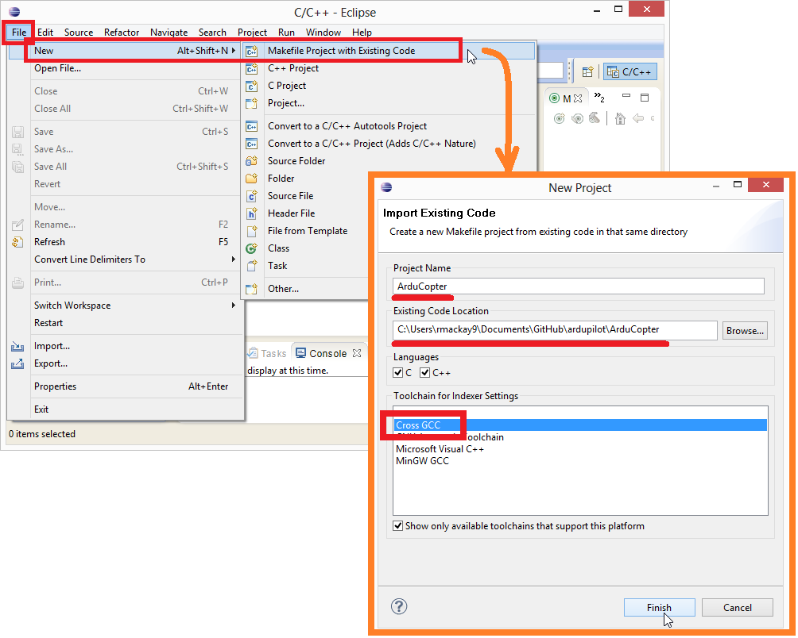
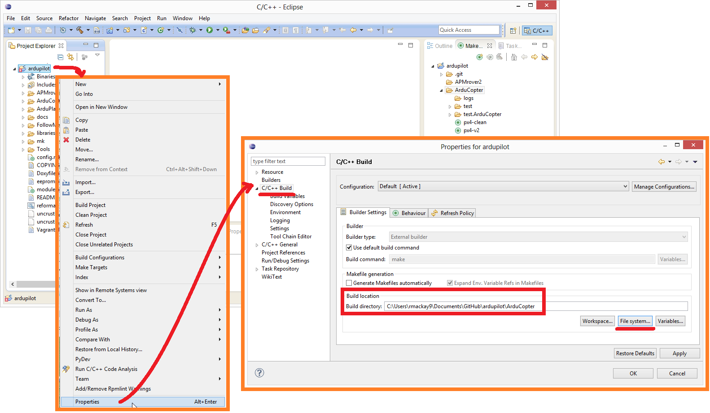
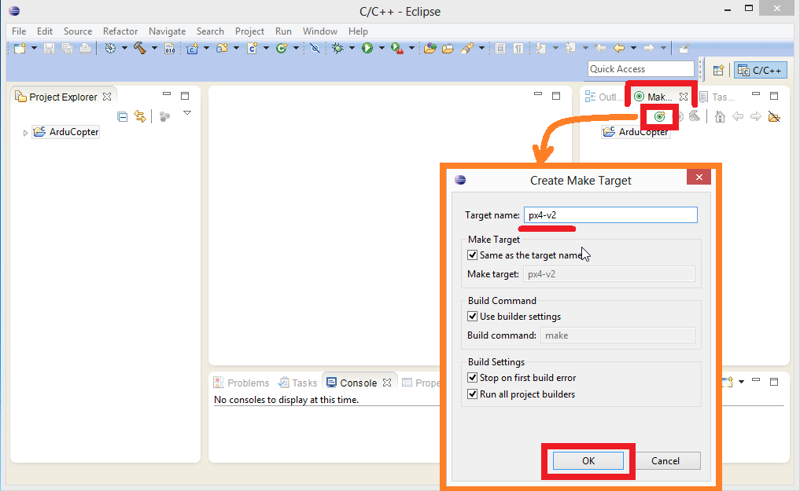
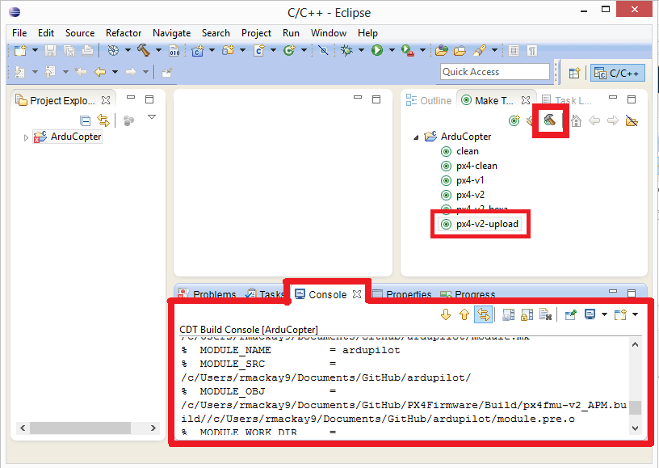

.. _editing-the-code-with-eclipse:

========================================
Editing/Building with Eclipse on Windows
========================================

This article shows how you can setup Eclipse for editing and building binaries for Pixhawk/STM32 boards.  It is not possible to build on Windows for other boards.

.. note::

   Ensure that you have Java (32-bit) installed before Eclipse can run or else you'll get Java Error Code 13 due to 32/64-bit version mismatch. Java can be installed `here <https://www.java.com/en/>`__.

Preconditions
=============

Follow the instructions in :ref:`Building for Pixhawk on Windows with Make <building-px4-with-make>` to download the required source code
(*ardupilot*, *PX4Firmware* and *PX4NuttX*) and toolchain.

The *PX4 toolchain* includes a preconfigured version of Eclipse that has
been set up for ArduPilot development.

Starting Eclipse
================

Start Eclipse using the *PX4 Eclipse* link installed with the *PX4
toolchain*. The link can be accessed from either:

-  The Windows Start menu (**Start \| All Programs \| PX4 Toolchain \|
   PX4 Eclipse**), or
-  You can directly run the file
   **C:\\Pixhawk_Toolchain\\toolchain\\msys\\1.0\\px4_eclipse.bat**

Creating the Project
====================

You can set up an Eclipse project to build ArduPilot either "from
scratch" or using pre-defined project files. Using the template files
saves you a little work as they already include the project location and
*px4-v2 make target definitions* for Copter and Plane.

Creating the Project from template files
----------------------------------------

The project can be created from predefined template files:

-  Rename **/ardupilot/eclipse.cproject** to **.cproject** and
   **/ardupilot/eclipse.project** to **.project**

   .. note::

      If using *Windows Explorer* append an additional period "." to
         the end of the files when renaming them - e.g. **.cproject.** (the
         additional period is not actually "saved".)

-  Select **File \| Import \| General \| Existing Projects into
   Workspace**
-  Check **Select root directory** and browse to the ardupilot directory
-  Select the ardupilot directory and press **Finish**

.. image:: ../images/EditingWithEclipse_ImportProject.png
    :target: ../_images/EditingWithEclipse_ImportProject.png

Creating the Project from scratch
---------------------------------

Alternative to the above steps, the project can be created by doing the
following:

-  Select **File \| New \| Make Project with Existing Code**
-  Fill in the Project Name and set the *Existing Code Location* to the
   Copter directory
-  Set the Toolchain to be *Cross GCC*" and press **Finish**

Use spaces instead of tabs
==========================

By default Copter, Plane and Rover use spaces in place of tabs. This can
be set to the default in Eclipse by changing two settings:

-  Select **Window \| Preferences \| General \| Editors \| Text Editors
   \| Insert spaces for tabs**.

   .. image:: ../images/EditingTheCode_Eclipse_spaces1.png
       :target: ../_images/EditingTheCode_Eclipse_spaces1.png
    
-  Select **Windows \| Preferences \| C/C++ \| Code Style \| Formatter**
   and creating a new Profile (i.e. "K&R Tab") which has the
   "Indentation" set to "Spaces only"

   .. image:: ../images/EditingTheCode_Eclipse_spaces2.png
       :target: ../_images/EditingTheCode_Eclipse_spaces2.png

Specify build location
======================

In the *Project Explorer* right-mouse-click on the ardupilot folder and
select **Properties**. Then under C/C++ Build set the "Build location"
to the Copter or Plane directory as shown below.

Specify make targets
====================

In the Make window on the right create any of these make targets (the
full list of possible targets can be found in
`px4_targets.mk <https://github.com/ArduPilot/ardupilot/blob/master/mk/px4_targets.mk>`__):

+--------------------------------------+--------------------------------------+
| ``make px4``                         | Build both PX4 and PixHawk firmware  |
|                                      | for a quadcopter                     |
+--------------------------------------+--------------------------------------+
| ``make px4-v2``                      | Build the Pixhawk firmware for a     |
|                                      | quad                                 |
+--------------------------------------+--------------------------------------+
| ``make px4-v2-hexa``                 | Build the Pixhawk firmware for a     |
|                                      | hexacopter.                          |
|                                      |                                      |
|                                      | # Other supported suffixes include   |
|                                      | "octa", "tri" and "heli".            |
|                                      |                                      |
|                                      | # More can be found in               |
|                                      | "mk/tagets.mk" under FRAMES          |
+--------------------------------------+--------------------------------------+
| ``make clean``                       | "clean" the ardupilot directory      |
+--------------------------------------+--------------------------------------+
| ``make px4-clean``                   | "clean" the PX4Firmware and PX4NuttX |
|                                      | directories so the next build will   |
|                                      | completely rebuild them              |
+--------------------------------------+--------------------------------------+
| ``make px4-v2-upload``               | Build and upload the Pixhawk         |
|                                      | firmware for a quad (i.e. no need to |
|                                      | do step #7 below)                    |
+--------------------------------------+--------------------------------------+

For example, the image below shows how you might define a ``px4-v2``
make target.

.. note::

   There is currently no option to upload frames other than
   quad.

Building from Eclipse
=====================

The make target can be built by pushing the green circle + hammer icon. 
The build progress will appear in the Console window.

The firmware will be created in the vehicle directory (e.g. ArduCopter)
and have the file extension **.px4**.

