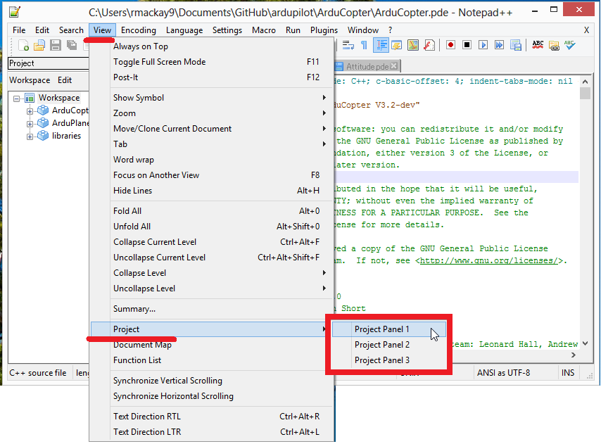
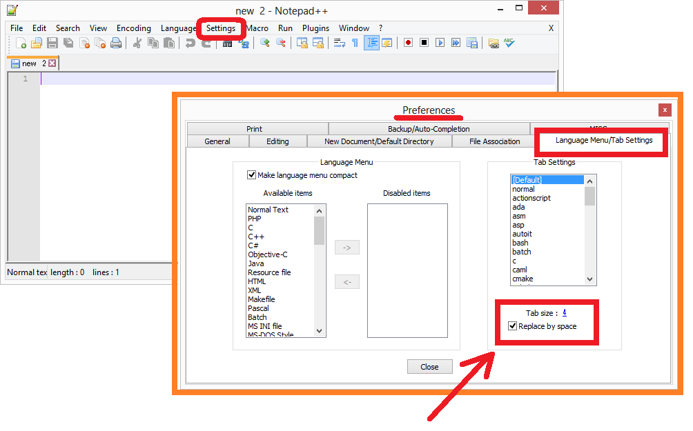

.. _editing-the-code-with-notepad:

===============================
Editing the code with NotePad++
===============================

NotePad++ can be downloaded from `here <https://notepad-plus-plus.org/>`__.

Use Project Panels to organise lots of files
============================================

Use spaces instead of tabs
==========================

Under Settings, Preference, Language Menu/Tab Settings ensure the
"Replace [tab] by space" checkbox is checked.

