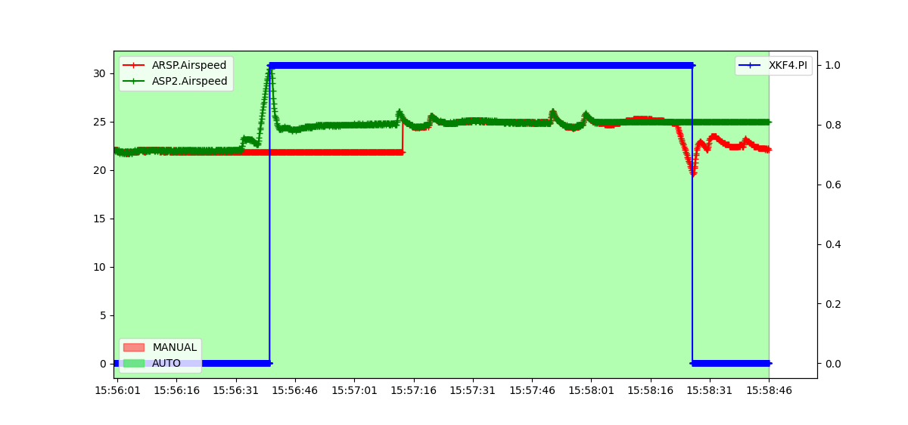
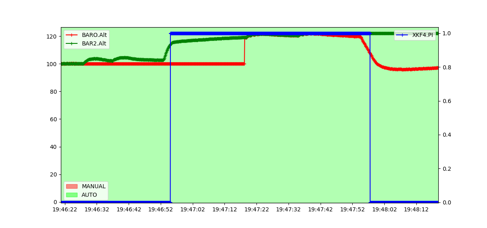
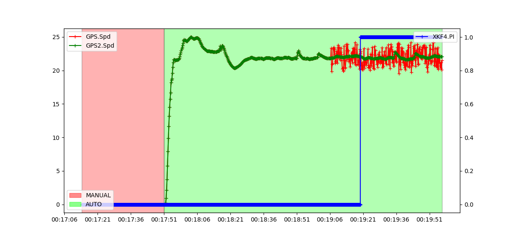
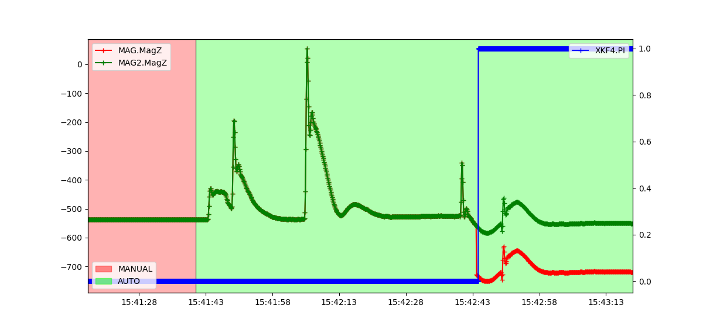

.. _ek3-affinity-lane-switching:

================================
EKF3 Affinity and Lane Switching
================================

The :ref:`EKF <dev:extended-kalman-filter>` instantiates multiple instances of the filter called 'lanes'. The primary lane is the one that provides state estimates, rest are updated in the background and available for switching to. The number of possible lanes is exactly equal to the number of IMUs enabled for use. Conventionally, each lane uses the primary instance of the Airspeed, Barometer, GPS and Magnetometer sensors. The primary sensor can be set as a user-modifiable parameter, but can be later changed by the system, even in-flight, in case of a driver-level fault. However, modern-day vehicles are known to have multiple sensors installed of good quality. Affinity is a way for the EKF lanes to use non-primary sensors within any running lane. This provides a statistically consistent way to make use of multiple high quality sensors and use lane-switching to select the lane which has best performing combination of sensors. The lane error score takes into account innovations from all sensors used by a lane. This way, the vehicle can be saved from mishaps using noisy non-IMU sensors as well.

**A simple example of an affinity configuration for a vehicle which has 1 Barometer, 2 GPS, 2 Airspeeds, 3 Magnetometers and 3 IMUs -**

.. raw:: html

   <table border="1" class="docutils">
   <tr><th>LANE</th><th>1</th><th>2</th><th>3</th></tr>
   <tr><td>AIRSPEED</td><td>1</td><td>2</td><td>1</td></tr>
   <tr><td>BAROMETER</td><td>1</td><td>1</td><td>1</td></tr>
   <tr><td>GPS</td><td>1</td><td>2</td><td>1</td></tr>
   <tr><td>MAGNETOMETER</td><td>1</td><td>2</td><td>3</td></tr>
   </table>

*Numbers are the respective sensor instances*

Configuration Parameters
------------------------

.. note::

    Affinity is only available with EKF3, so make sure you are using it by ensuring :ref:`EK3_ENABLE <EK3_ENABLE>` is set to "1" and :ref:`AHRS_EKF_TYPE <AHRS_EKF_TYPE>` is set to "3"

The :ref:`EK3_AFFINITY <EK3_AFFINITY>` parameter is a bitmask which gives you the option to choose the sensors you want to enable affinity for. Non-enabled will follow the default primary sensor allotment.

The :ref:`EK3_ERR_THRESH <EK3_ERR_THRESH>` parameter controls the sensitivity of lane switching. Lane errors are accumulated over time relative to the active primary lane. This threshold controls how much of an error difference between a non-primary and primary lane is required to consider the former performing better. Lowering this parameter makes lane switching more responsive to smaller 'relative' errors, and in practical you will see a more aggressive lane switching, and, vice-versa. 

.. warning::
    
    Misconfiguring the :ref:`EK3_ERR_THRESH <EK3_ERR_THRESH>` parameter could adversely affect the lane switching mechanism and have serious consequences which could lead to the loss of your vehicle. Please tune carefully.

Test Results
------------

Following graphs are from SITL testing that show Affinity enabled lane changing when the primary lane's sensor is subjected to noise/malfunctioning.

AIRSPEED
++++++++
An example of lane switching for a plane with 2 airspeed sensors and airspeed affinity enabled. There are 2 IMUs, hence 2 active lanes. The primary lane's airspeed sensor has failed to show changes in pressure, hence reporting a constant value. The speed of the plane is increased and a lane switch occurs. Similarly, the second airspeed sensor of the second lane (now the primary lane) is failed and the plane's speed is decreased which again triggers a lane switch.

BAROMETER
+++++++++
An example of lane switching for a plane with 2 barometers and barometer affinity enabled. There are 2 IMUs, hence 2 active lanes. The primary lane's barometer has failed to show changes in pressure, hence reporting a constant value. The altitude of the plane is increased and a lane switch occurs. Similarly, the second barometer of the second lane (now the primary lane) is failed and the plane's altitude is decreased which again triggers a lane switch.

GPS
+++
An example of lane switching for a plane with 2 GPS and GPS affinity enabled. There are 2 IMUs, hence 2 active lanes. The primary lane's GPS is simulated with a random GPS Velocity Noise of range ±2m in all 3-axis. The actual speed can be tracked with the 2nd GPS. Subsequently, the EKF primary lane starts reporting a consistently high error and a lane switch occurs when the error crosses the set threshold.

MAGNETOMETER
++++++++++++
An example of lane switching for a plane with 2 Magnetometers and magnetometer affinity enabled. There are 2 IMUs, hence 2 active lanes. An error is simulated in the primary lane's magnetometer by changing the offset of the z-axis while flying. The offset change can be tracked with the 2nd magnetometer. Subsequently, the EKF primary lane starts reporting a consistently high error and a lane switch occurs when the error crosses the set threshold.

