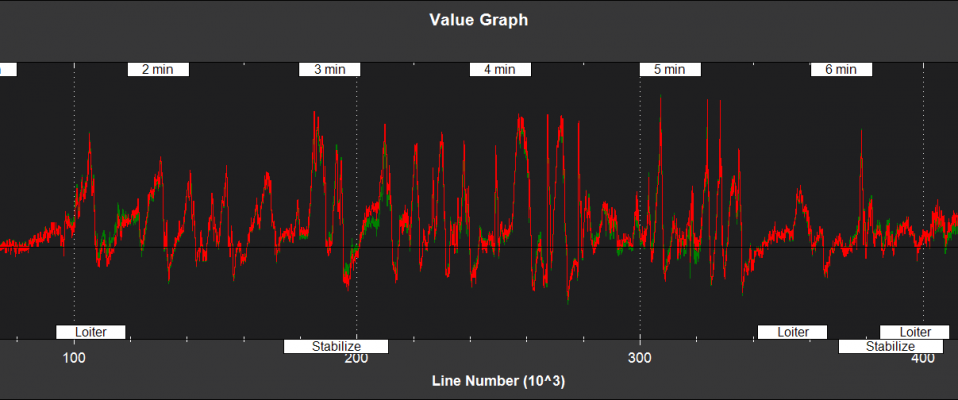

.. _ekf2-navigation-system:

======================
EKF2 Estimation System
======================

**What is the EKF2 Estimation System?**
---------------------------------------

It is a 24 state extended Kalman filter in the AP_NavEKF2 library that
estimates the following states

-  Attitude (Quaternions)
-  Velocity (North,East,Down)
-  Position (North,East,Down)
-  Gyro bias offsets (X,Y,Z)
-  Gyro scale factors (X,Y,Z)
-  Z accel bias
-  Earth magnetic field (North,East,Down)
-  Body magnetic field (X,Y,Z)
-  Wind Velocity (North,East)

It is based on the filter equations derived `here <https://github.com/priseborough/InertialNav/blob/master/derivations/RotationVectorAttitudeParameterisation/GenerateNavFilterEquations.m>`__.

EKF2 Advantages
---------------

-  It can run a separate EKF2 for each IMU making recovery from an IMU fault much more likely
-  It can switch between magnetometers if there is fault
-  It can estimate gyro scale factors which can improve accuracy during high rate manoeuvres.
-  It can simultaneously estimate both gyro offsets and orientation on startup whilst moving and doesn't rely on the DCM algorithm for its initial orientation. This makes it ideal for flying from moving platforms when the gyro has not been calibrated.
-  It can handle larger gyro bias changes in flight
-  It is able to recover faster from bad sensor data
-  It provides a slightly smoother output.
-  It is sightly more accurate
-  It uses slightly less computing power
-  It starts using GPS when checks pass rather than waiting for the
   vehicle motors to arm.

How does it achieve this?
~~~~~~~~~~~~~~~~~~~~~~~~~

#. Instead of trying to estimate the quaternion orientation directly, it
   estimates an error rotation vector and applies the correction to the
   quaternion from the inertial navigation equations. This is better
   when there are large angle errors as it avoids errors associated with
   linearising quaternions across large angle changes.

   -  See "Rotation Vector in Attitude Estimation", Mark E. Pittelkau,
      Journal of Guidance, Control, and Dynamics, 2003” for details on
      this approach.

#. The new EKF runs on a delayed time horizon so that when measurements
   are fused, they are done so using the measurement, filter states
   and covariance matrix from the same point in time. The legacy EKF
   uses a simpler method where delayed measurements are fused using
   delayed states but the covariance matrix is from the current time
   which reduces accuracy.

   -  The delayed filter states are then predicted forward into the
      current time horizon using a complementary filter that removes the
      time delay and also filters out the sudden changes in the states
      that occur when measurements are fused.
   -  This approach was inspired by the output predictor work done by
      Ali Khosravian from ANU. "Recursive Attitude Estimation in the
      Presence of Multi-rate and Multi-delay Vector Measurements,” A
      Khosravian, J Trumpf, R Mahony, T Hamel - American Control
      Conference, vol.-, 2015.
   -  This is computationally much cheaper than winding the states
      forward using buffered IMU data at each update, but slightly less
      accurate. The legacy EKF smooths the state corrections by applying
      them incrementally across the time to the next measurement which
      reduces stability of the filter.

#. Further optimisation of mathematics and code to improve
   speed have been introduced.
#. A simple compass yaw angle fusion method with fixed declination has
   been added which is used on the ground or when magnetic interference
   prevents use of the more accurate 3-axis 6-state magnetometer fusion
   technique.

Using EKF2
==========

#. Enable the new EKF by setting EK2_ENABLE = 1.  EKF2 will now be
   running in parallel and logging, etc but it will not be used by the
   control loops.
#. To use it in the control loops, set AHRS_EKF_TYPE = 2
#. The use of multiple IMU's, is controlled by the EK2_IMU_MASK
   parameter:

   -  To use only IMU1, set EK2_IMU_MASK = 1 (this is the default)
   -  To use only IMU2, set EK2_IMU_MASK = 2
   -  To run dual EKF2 using IMU1 and IMU2,  set EK2_IMU_MASK = 3 and
      turn off the legacy EKF by setting EKF_ENABLE = 0

#. After setting the parameters you will need to reboot.

EKF2 Log Data
=============

The data for EKF2 can be found in the NKF1 to NKF5 log packets.

Packets NKF1 to NKF4 contain information for each EKF instance with
the instance number given by the value of field PI.
The number of instances enabled is set by the EK2_IMU_MASK parameter. Packet NKF5
contains optical flow information for the EKF instance that is the
primary for flight control.

The available EKF2 log data is listed below.  Some plots
showing example flight data have been included. This data was
logged using a Pixhawk on a 3DR Iris+ quadcopter with the following
parameter changes followed by a reboot:

-  EK2_ENABLE = 1 (turns on EKF2)
-  EK2_IMU_MASK = 3 (Instructs EKF2 to run two instances, one for IMU1
   (MPU6000) and one for IMU2 (LDG20H + LSM303D)
-  AHRS_EKF_TYPE = 2 (tells the flight control system to use EKF2
-  LOG_BITMASK = 131071 (logs 50Hz data from startup)

***Note: Plots can be viewed in full size by left clicking them***

Filter State Estimates
----------------------

**NKF1[0]** (and **NKF1[1]** if a second IMU is being used) contain the
outputs used by the flight control system

-  TimeUS - time stamp (uSec)

-  Roll,Pitch - Euler roll and pitch angle (deg)

   |EKF2 - roll pitch|

-  Yaw - Euler yaw angle (deg)

   |EKF2 - yaw|

-  VN,VE - Velocity North,East direction (m/s)

   |EKF2 - velocity NE|

-  VD, dPD - Velocity and Position Derivative Down (m/s)

   |EKF2 - velocity D|

-  PN,PE,PD - Position North,East,Down (m)

   |EKF2 - position NED|

-  GX,GY,GZ - X,Y,Z rate gyro bias (deg/sec)

   |EKF2 - gyro rate bias|

**NKF2[0]** (and **NKF2[1]** if a second IMU is being used) contains
additional state information

-  TimeUS - time stamp (uSec)

-  AZbias - Z accelerometer bias (cm/s/s)

   |EKF2 - accel Z bias|

-  GSX,GSY,GSZ - X,Y,Z rate gyro scale factor (%)

   Eg, a log value of 0.5 would be equivalent to a scale factor of 1.005 for that sensor

   |EKF2 - gyro rate scale factor|

-  VWN,VWE - Wind velocity North,East (m/s)

-  MN,ME,MD - Earth magnetic field North,East,Down (mGauss)

   |EKF2 - earth magnetic field NED|

-  MX,MY,MZ - Body fixed magnetic field X,Y,Z (mGauss)

   |EKF2 - body magnetic field XYZ|

-  MI - Index of the magnetometer being used by EKF2

Filter Innovations
------------------

**NKF3[0]** (and **NKF3[1]** if a second IMU is being used) contain
information on the filter innovations. An innovation is the difference
between the measurement value predicted byEKF2 and the value returned by
the sensor. Smaller innovations indicate smaller sensor errors. Because
the IMU data is used to do the prediction, bad IMU data can result in
large innovations for all measurements.

-  TimeUS - time stamp (uSec)

-  IVN,IVE - GPS velocity innovations North, East (m/s)

   |EKF2 - velocity innovation NE|

-  IVD - GPS velocity innovation Down (m/s)

   |EKF2 - velocity innovation D|

-  IPN,IPE - GPS position innovations North,East (m)

   |EKF2 - position innovation NE|

-  IPD - Barometer position innovation Down (m)

   |EKF2 - position innovation D|

-  IMX,IMY,IMZ - Magnetometer innovations X,Y,Z (mGauss)

   |EKF2 - magnetometer innovation XYZ|

-  IYAW - Compass yaw innovation (deg)

   |EKF2 - compass yaw innovation|

-  IVT - True airspeed innovation (m/s)

Filter Health and Status
------------------------

**NKF4[0]** (and **NKF4[1]** if a second IMU is being used) contain
information on the innovation variance test ratios. A value of less than
1 indicates that that measurement has passed its checks and is
being used by the EKF2. A value of more than 1 indicates that the
innovations for that measurement are so high that the EKF2 will
be rejecting the data from that sensor. Values of less than 0.3 in
flight are typical for a setup with good quality sensor data.

They also contain other information relevant to filter health

-  TimeUS - time stamp (uSec)
-  SV - GPS velocity test ratio
-  SP - GPS position test ratio
-  SH - Barometer test ratio
-  SM - Magnetometer test ratio
-  SVT - Airspeed sensor Test ratio

   |EKF2 - variance test ratios|

-  errRP - Estimated attitude roll/pitch error (rad)

   |EKF2 - error roll pitch|

-  OFN - Position jump North due to the last reset of the filter states
   (m)
-  OFE - Position jump East due to the last reset of the filter states
   (m)
-  FS - Integer bitmask of filter numerical faults
-  TS - Integer bitmask of filter measurement timeout
-  SS - Integer bitmask of filer solution status
-  GPS - Integer bitmask of filter GPS quality checks
-  PI - Index showing which instance of EKF2 has been selected for
   flight control

Optical Flow and Range Finder Fusion
------------------------------------

**NKF5** contains information on the optical flow fusion for the EK2
instance bing used for flight control

-  TimeUS - time stamp (uSec)

-  normInnov - optical flow innovation variance test ratio

-  FIX,FIY - optical flow X and Y axis innovations (mrad/s)

   |EKF2 - optical flow rate innovations|

-  AFI - optical flow terrain height estimator innovation (mrad/s)

-  HAGL - estimated height above ground level (m)
-  meaRng - Range measured by the range finder (m)

   |EKF2 - hagl and range|

-  offset - estimated terrain offset relative to the pressure height
   origin

   |EKF2 - offset|

-  RI - Range finder innovation (m)

   |EKF2 - range finder innovations|

-  errHAGL - 1-Sigma uncertainty in the terrain height offset estimate
   (m)

   |EKF2 - offset uncertainty|

Tuning Parameters
-----------------

The EKF2 parameters have been tuned to provide a compromise between
accuracy and robustness to sensor errors. it is likely that further
improvements in performance are available with further tuning.

If you have a question regarding tuning of the filer, please post `on the forums <https://discuss.ardupilot.org/>`__ along with your
log file and mention the term EKF2 in your post title.

The parameters for the new EKF start with the prefix EK2\_ and are
listed below

**EK2_ENABLE**

This turns the EKF 2 on and off. Set to 1 to turn on and 0 to turn
off. Turning EKF2 on only makes the calculations run, it does not mean
it will be used for flight control. To use it for flight control set
AHRS_EKF_TYPE=2. A reboot or restart will need to be performed
after changing the value of EK2_ENABLE for it to take effect.

**EK2_GPS_TYPE**

This controls the use of GPS measurements :

-  0 = use 3D velocity & 2D position
-  1 = use 2D velocity and 2D position
-  2 = use 2D position
-  3 = use no GPS (optical flow will be used if available)

**EK2_VELNE_NOISE**

This sets a lower limit on the speed accuracy reported by the GPS
receiver that is used to set horizontal velocity observation noise. If
the model of receiver used does not provide a speed accurcy estimate,
then the parameter value will be used. Increasing it reduces the
weighting of the GPS horizontal velocity measurements. It has units of
metres/sec

**EK2_VELD_NOISE**

This sets a lower limit on the speed accuracy reported by the GPS
receiver that is used to set verical velocity observation noise in. If
the model of receiver used does not provide a speed accurcy estimate,
then the parameter value will be used. Increasing it reduces the
weighting of the GPS vertical velocity measurements. It has units of
metres/sec.

**EK2_VEL_GATE**

This sets the number of standard deviations applied to the GPS velocity
measurement innovation consistency check. Decreasing it makes it more
likely that good measurements willbe rejected. Increasing it makes it
more likely that bad measurements will be accepted.

**EK2_POSNE_NOISE**

This sets the GPS horizontal position observation noise. Increasing it
reduces the weighting of GPS horizontal position measurements. It has
units of metres

**EK2_POS_GATE**

This sets the number of standard deviations applied to the GPS position
measurement innovation consistency check. Decreasing it makes it more
likely that good measurements will be rejected. Increasing it makes it
more likely that bad measurements will be accepted.

**EK2_GLITCH_RAD**

This controls the maximum radial uncertainty in position between the
value predicted by the filter and the value measured by the GPS before
the filter position and velocity states are reset to the GPS. Making
this value larger allows the filter to ignore larger GPS glitches but
also means that non-GPS errors such as IMU and compass can create a
larger error in position before the filter is forced back to the GPS
position. It has units of metres.

**EK2_GPS_DELAY**

This is the number of msec that the GPS measurements lag behind the
inertial measurements. The maximum delay that can be compensated by
the filter is 250 msec.

**EK2_ALT_SOURCE**

This parameter controls which height sensor is used by the EKF. If the
selected optionn cannot be used, it will default to Baro as the primary
height source. Setting 0 will use the baro altitude at all times.
Setting 1 uses the range finder and is only available in combination
with optical flow navigation (EK2_GPS_TYPE = 3). Setting 2 uses GPS.
When height sources other than Baro are in use, the offset between the
Baro height and EKF height estimate is continually updated. If a
switch to Baro height needs to be made when the filter is operating,
then the  Baro height is corrected for the learned offset to prevent a
sudden step in height estimate.

**EK2_ALT_NOISE**

This is the RMS value of noise in the altitude measurement. Increasing
it reduces the weighting of the baro measurement and will make the
filter respond more slowly to baro measurement errors, but will make it
more sensitive to GPS and accelerometer errors.  It has units of metres.

**EK2_HGT_I_GATE**

This sets the number of standard deviations applied to the height
measurement innovation consistency check. Decreasing it makes it more
likely that good measurements will be rejected. Increasing it makes it
more likely that bad measurements will be accepted.

**EK2_HGT_DELAY**

This is the number of msec that the height measurements lag behind the
inertial measurements. The maximum delay that can be compensated
by the filter is 250 msec.

**EK2_MAG_NOISE**

This is the RMS value of noise in magnetometer measurements. Increasing
it reduces the weighting on these measurements. It has units of mGauss.

**EK2_MAG_CAL**

This determines when the filter will use the 3-axis magnetometer fusion
model that estimates both earth and body fixed magnetic field states.
This model is only suitable for use when the external magnetic field
environment is stable.

-  EKF_MAG_CAL = 0 enables calibration when airborne and is the
   default setting for Plane users.
-  EKF_MAG_CAL = 1 enables calibration when manoeuvreing.
-  EKF_MAG_CAL = 2 prevents magnetometer calibration regardless of
   flight condition, is recommended if the external magnetic field is
   varying and is the default for rovers.
-  EKF_MAG_CAL = 3 enables calibration when the first in-air field and
   yaw reset has completed and is the default for copters.
-  EKF_MAG_CAL = 4 enables calibration all the time.

**EK2_MAG_GATE**

This parameter sets the number of standard deviations applied to the
magnetometer measurement innovation consistency check. Decreasing it
makes it more likely that good measurements will be rejected. Increasing
it makes it more likely that bad measurements will be accepted.

**EK2_EAS_NOISE**

This is the RMS value of noise in equivalent airspeed measurements used
by planes. Increasing it reduces the weighting of airspeed measurements
and will make wind speed estimates less noisy and slower to converge.
Increasing also increases navigation errors when dead-reckoning without
GPS measurements. It has units of metres/sec.

**EK2_EAS_GATE**

This sets the number of standard deviations applied to the airspeed
measurement innovation consistency check. Decreasing it makes it more
likely that good measurements will be rejected. Increasing it makes it
more likely that bad measurements will be accepted.

**EK2_RNG_NOISE**

This is the RMS value of noise in the range finder measurement.
Increasing it reduces the weighting on this measurement. It has units of
metres.

**EK2_RNG_GATE**

This sets the number of standard deviations applied to the range finder
innovation consistency check. Decreasing it makes it more likely that
good measurements will be rejected. Increasing it makes it more likely
that bad measurements will be accepted.

**EK2_MAX_FLOW**

This parameter sets the magnitude maximum optical flow rate in that will
be accepted by the filter. It has units of rad/sec.

**EK2_FLOW_NOISE**

This is the RMS value of noise and errors in optical flow measurements.
Increasing it reduces the weighting on these measurements. It has units
of rad/sec.

**EK2_FLOW_GATE**

This sets the number of standard deviations applied to the optical flow
innovation consistency check. Decreasing it makes it more likely that
good measurements will be rejected. Increasing it makes it more likely
that bad measurements will be accepted.

**EK2_FLOW_DELAY**

This is the number of msec that the optical flow measurements lag behind
the inertial measurements. It is the time from the end of the optical
flow averaging period and does not include the time delay due to the
100msec of averaging within the flow sensor.

**EK2_GYRO_PNOISE**

This control disturbance noise controls the growth of estimated error
due to gyro measurement errors excluding bias. Increasing it makes the
flter trust the gyro measurements less and other measurements more. It
has units of rad/sec.

**EK2_ACC_PNOISE**

This control disturbance noise controls the growth of estimated error
due to accelerometer measurement errors excluding bias. Increasing it
makes the flter trust the accelerometer measurements less and other
measurements more. It has units of metres/sec/sec.

**EK2_GBIAS_PNOISE**

This state process noise controls the growth of the gyro delta angle
bias state error estimates. Increasing it makes rate gyro bias
estimation faster and noisier. It has units of rad/sec.

**EKF2_GSCL_PNOISE**

This state process noise controls the rate of gyro scale factor
learning. Increasing it makes rate gyro scale factor estimation faster
and noisier.

**EK2_ABIAS_PNOISE**

This state process noise controls the growth of the vertical
accelerometer delta velocity bias state error estimate. Increasing it
makes accelerometer bias estimation faster and noisier. It has units of
metres/sec/sec.

**EK2_MAG_PNOISE**

This state process noise controls the growth of magnetic field state
error estimates. Increasing it makes magnetic field bias estimation
faster and noisier. It has units of Gauss/sec.

**EK2_WIND_PNOISE**

This state process noise controls the growth of wind state error
estimates. Increasing it makes wind estimation faster and noisier. It
has units of metres/sec/sec

**EK2_WIND_PSCALE**

This controls how much the process noise on the wind states is increased
when gaining or losing altitude to take into account changes in wind
speed and direction with altitude. Increasing this parameter increases
how rapidly the wind states adapt when changing altitude, but does make
wind velocity estimates noisier.

**EK2_GPS_CHECK**

This is a 1 byte bitmap controlling which GPS preflight checks
are performed. Set to 0 to bypass all checks. Set to 255 perform all
checks. Set to 3 to check just the number of satellites and HDoP. Set to
31 for the most rigorous checks that will still allow checks to pass
when the copter is moving, eg launch from a boat. Setting a 1 in the
following bit locations causes the corresponding checks to be performed.

0: The receivers reported number of satellites must be >= 6

1: The receivers reported HDoP must be >=2.5

2: The receivers reported speed accuracy must be less than1.0 metres/sec
(if available)

3: The receivers reported horizontal position accuracy must be less than
5.0 metres (if available)

4: The EKF2 magnetometer or compass innovation consistency checks must
be passing. If these checks are failing, then the yaw estimate is
unreliable

5: The rate of drift in the receivers reported horizontal position must
be less than 0.3 metres/sec

6: The receivers reported vertical speed after filtering must be less
than 0.3 metres/sec

7: The receivers reported horizontal speed after filtering must be less
than 0.3 metres/sec.

Note: An unbroken pass on all selected checks for 10 seconds is required
for the EKF2 to set its origin and start using GPS.

Note: The accuracy required for checks 2, 3, 5, 6 and 7 can be adjusted
using the EK2_CHECK_SCALE parameter.

**EK2_CHECK_SCALE**

This is a percentage scaler applied to the thresholds that are used to
check GPS accuracy before it is used by the EKF. Values greater than 100
increase and values less than 100 reduce the maximum GPS error the EKF
will accept. This modifies the checks enabled by bits 2, 3, 5, 6 and 7
in the EK2_GPS_CHECK parameter.

**EK2_IMU_MASK**

This is a 1 byte bitmap controlling which IMUs will be used by EKF2. A
separate instance of EKF2 will be started for each IMU selected.

-  Set to 1 to use the first IMU only (default)
-  Set to 2 to use the second IMU only
-  Set to 3 to use the first and second IMU.

Additional IMU's up to a maximum of 6 can be used if memory and
processing resources permit. There may be insufficient memory and
processing resources to run multiple instances. If this occurs EKF2 will
fail to start and the following message will be sent to the GCS console.

::

    NavEKF2: not enough memory

If terrain data is not being used, some additional memory can be
released by setting TERRAIN_ENABLE=0 and rebooting.

.. |EKF2 - yaw| image:: ../images/EKF2-yaw.png
    :target: ../_images/EKF2-yaw.png

.. |EKF2 - offset| image:: ../images/EKF2-offset.png
    :target: ../_images/EKF2-offset.png

