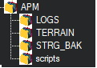

.. _filesystems:

======================
ArduPilot File Systems
======================

ArduPilot uses several files systems to store and retrieve data from non-volatile storage using either external SD cards or autopilot flash memory.

External SD Card
================

The directory structure is:

- APM: base directory
- LOGS : flight logs are stored here (See :ref:`common-downloading-and-analyzing-data-logs-in-mission-planner`)
- TERRAIN : terrain data is stored here (See :ref:`common-terrain-following`)
- STRNG_BAK: every boot the parameter data is backed up here
- scripts: LUA scripts are stored here (See :ref:`common-lua-scripts`)

 and a vehicle backup file (one for each vehicle class that the card has been used) that contains **???**

Flash based virtual file systems
================================

Several flash based file systems are setup. Most are for internal, ground station, or developer use only, but one is useful for normal users.

- @ROMFS: this contains a copy of the bootloader version created with the firmware that is loaded which is used if a bootloader update is commanded from an attached ground station or pc utility. It also contains a copy of the hardware definition file, and font files if OSD support is included.
- @PARAM: this is a packed version of the firmware's parameters which can be downloaded from the ground control station.
- @SYS: which contains several text files that keep statistics of internal operational processes for information and debugging issues (really the only one a normal user may be asked to access to send information when debugging a user issue):
    - threads.text: information on the concurrent process threads during operation
    - tasks.text:
    - dma.text:
    - memory.txt:
    - uarts.txt:
    