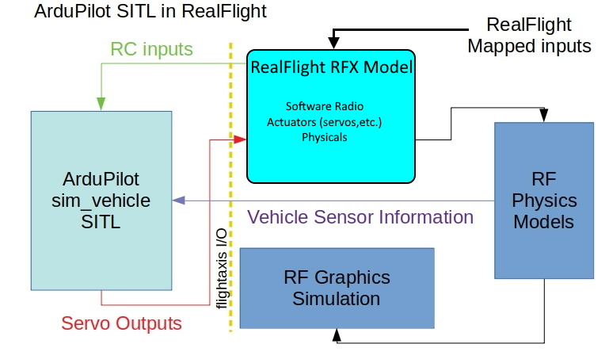

.. flightaxis:

==================================
Understanding SITL with RealFlight
==================================

This document will explain how SITL communicates with RealFlight for graphical simulations. In order to do any simulation you need several elements:

- A model of the vehicle, including its physical characterisitcs and their impacts on the physics model, control mechanisms, and a graphical data base of its appearance.

- Physics models that will predict vehicle dynamics (attitude, velocity, positions,etc.) based on control inputs into the vehicle model

- Graphics interpreter and display that takes the physics model's output and produces the graphics display of vehicle movement

- A controller mechanism to produce control inputs into the physics model to command vehicle behavior

In a normal RealFlight (RF) simulation, RF has built-in models, physics modeling, and graphic interpreter/display. Control is input via a simulation controller, such as the Interlink controller, joystick, or OpenTX transmitter in joystick mode.

This is illustrated below:

The simulation controller outputs are mapped to "TX channels" by the RF controller editor to produce mapped RC outputs. For the InterLink controller these are fixed and read-only.

They are input into the RealFlight vehicle model which is described by its .RFX file(archive actually). Most models have a "software radio" which take these "TX channels" and convert them into "RX channels", like a reciever. This "software radio" can also create dual rates, adjust trim, throw and reverses, etc. These received channels then drive motors, servos, or flight controller/mixers setup in the model files which drive the vehicle's actuators.

The Physics models takes these inputs, including the vehicles described physical characteristics from the model's files and predicts the vehicle's motion which is then graphically displayed.

The pilot provides the "autopilot" function of inputing stick/switch control via the simulator controller to direct vehicle desired behavior.

An illustration of what constitutes a RealFlight model is show below:

SITL Using the FlightAxis Interface
===================================

Using SITL to run the ArduPilot software basically is inserting an autopilot between the simulation controller and the vehicle, just like in real flight. This is done by tying a running SITL simulation  into RealFlight and using its Physics models and Graphics for the simulation. The interface between SITL and RealFlight is called FlightAxis.

When enabled in RealFlight, it exports the vehicle's predicted attitude, velocities, position to SITL, as well as the outputs of the software radio of the vehicle model its using. SITL uses these as RC and sensor inputs in its sim and outputs servo functions  to RealFlight which it now interprets as the RX channel radio outputs used by the model for its actuator inputs.

This is illustrated below:

This basically inserts ArduPilot SITL simulation of the firmware between the pilot and RealFlights inputs.

.. note:: Presently, FlightAxis can transfer the first 8 RX channels from RealFlight to SITL RC inputs, and the first 12 SERVO outputs from SITL to RealFlights RX channel inputs. This will be expanded to 12 RX channels from RealFlight in the future.
