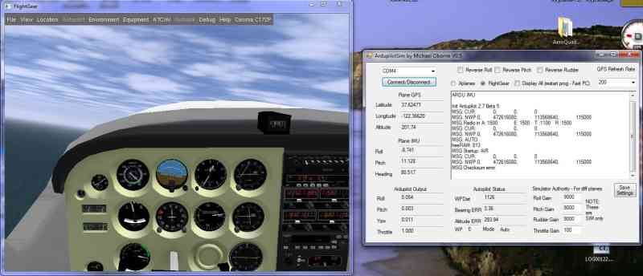

.. _flightgear-hardware-in-the-loop-simulation:

==========================================
FlightGear Hardware-in-the-Loop Simulation
==========================================

.. note:: Archived, no longer supported

`FlightGear <http://www.flightgear.org/about/>`__ is an open-source free
flight simulator. This article explains how to use this
hardware-in-the-loop simulator with Plane (only).

.. note::

   This is a community-submitted article. It should work, but has not
   been verified by the official dev team. Questions and requests for help
   should be made in the DIY Drones forums.

   Flightgear screenshot

Things you need
===============

#. `Flightgear <http://www.flightgear.org/>`__ (tested Flight Gear v2.x,
   currently at v3.4)
#. `Mission Planner <https://firmware.ardupilot.org/Tools/MissionPlanner/MissionPlanner-latest.msi>`__
   (Windows)
#. ArduPilot HIL on your APM (via APM Planner, currently (April 2013)
   only v2.68 HIL works, see below)
#. `Mavlink.xml <https://github.com/dronekit/ardupilot-releases/blob/master/Tools/FlightGear/MAVLink.xml>`__ data
   format file for flightgear
#. Recommended for Windows OS: the
   file: \ `system.fgfsrc <https://code.google.com/p/ardupilot-mega/downloads/detail?name=system.fgfsrc>`__ placed
   into the "C:\\Program Files (x86)\\FlightGear\\data" folder. This
   will load the Rascal RC plane and a few other parameters. More
   information on what is
   loaded \ `here <http://wiki.flightgear.org/Fgfsrc>`__, you can alter
   it to your own requirements.

How to make it work
===================

.. warning::

   Safety first: Disconnect the 3 wires from your brushless motor
   otherwise it will start when you advance the throttle (if in manual
   mode).

#. Download and install the FlightGear Flight Sim if you have not
   already
#. Copy Mavlink.xml to C:\\Program Files
   (x86)\\FlightGear\\data\\Protocol
#. In the Mission Planner > 'Configuration tab \| Adv Parameter List'
   save your current parameters so you can reload them after the
   simulation
#. In the Firmware tab of the MP, choose 'Pick previous firmware', from
   the drop down list pick the 4th one down, firmware should show as
   Plane v2.68, then click 'HIL Simulator \| Plane' to load the Plane
   firmware onto your APM.
#. Connect to the APM, then open the Simulation tab of the Mission
   Planner
#. Check the FlightGear radio button, then click the 'Start FG Plane'
   button.
#. After FG has finished loading click the 'Sim Link Start/Stop' button
   in the MP
#. In FG press ' v ' on the keyboard to get an outside view of the
   plane, ' x ' to zoom, move your aileron stick to see if the planes
   ailerons move, great if they do, go through this list again if not.
#. Now in the Mission Planner do your usual radio setup including
   calibration and mode switch setup, then you can fly Missions and test
   the APM just like you would on a real plane.

.. note::

   If you used the file
   "`system.fgfsrc <https://download.ardupilot.org/downloads/wiki/advanced_user_tools/windows_parameter_file_for_flightgear_HIL_simulator_system.fgfsrc.zip>`__\ "
   then you can just increase your throttle to fly the Rascal plane. If you
   didn't and are flying the default Cessna, hold down 's' on the keyboard
   to start the plane's engine, then advance your throttle to take
   off.
