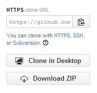
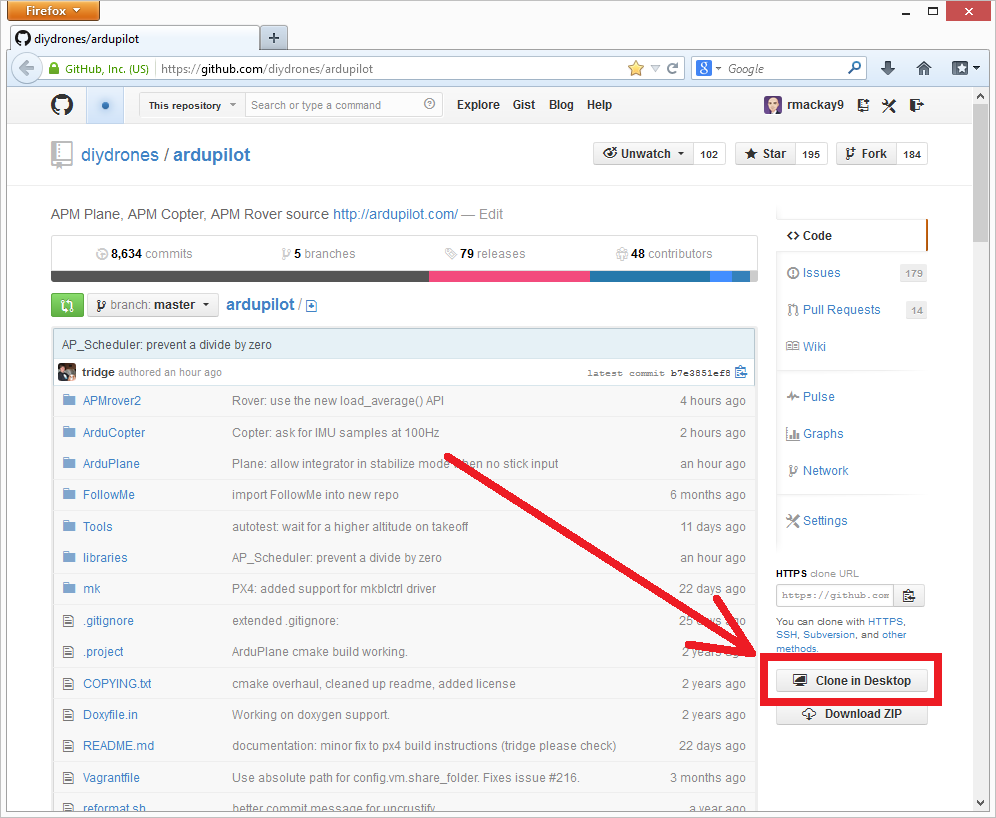

.. _git-clone:

==================
Clone a repository
==================

   .. image:: ../images/git-fork-clone.png
       :width: 70%

"Cloning" is git's term for making a local copy of a remote repository (i.e. one held on the GitHub servers).

Developers should clone the main `ArduPilot repository <https://github.com/ArduPilot/ardupilot>`__ (if they simply want to download and compile the latest code) or their own :ref:`fork <git-fork>` (if they want to make changes to the source code and potentially submit changes back).

Instructions for commonly used tools are below but whichever tool is used, the URL for the source repo will be required.  This can be found on the right side of the screen on each Github repository home page but in general the URL is:

- ``https://github.com/ArduPilot/ardupilot.git`` for the main ardupilot repo
- ``https://github.com/your-github-account/ardupilot`` for your :ref:`fork <git-fork>` of the ardupilot repo

Cloning with the command line
-----------------------------

-  open a terminal and navigate to the directory where you would like the clone to be stored
-  clone your fork:

   ::

       git clone https://github.com/your-github-userid/ardupilot
       cd ardupilot
       git submodule update --init --recursive

   or the main project repo:

   ::

       git clone https://github.com/ArduPilot/ardupilot
       cd ardupilot
       git submodule update --init --recursive

Cloning with the GitHub GUI (Windows or MAC)
--------------------------------------------

- ensure you have installed the :ref:`GitHub for Desktop <git-install>`
- open the `ArduPilot repo <https://github.com/ArduPilot/ardupilot>`__ in your favorite web browser
- click on the green "Clone or download" button and select "Open in Desktop" and follow the instructions

