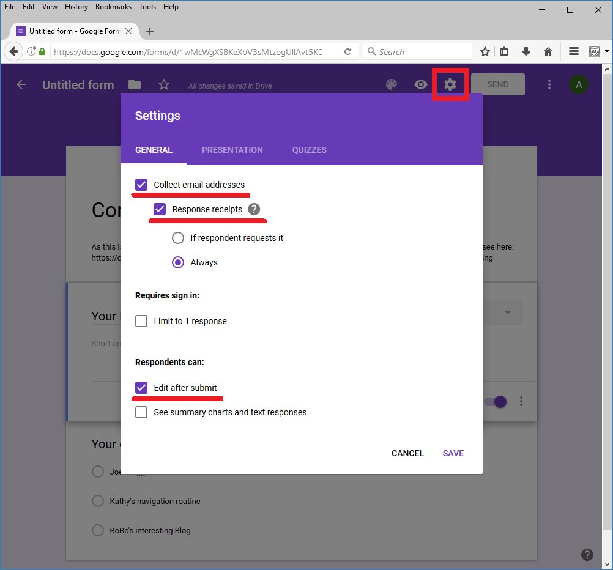

.. _how-the-team-works-voting:

======
Voting
======

The development team votes on various proposals including the "Top Contribution of the Month".  This page shows how these votes should be conducted.

Creating a voting form
======================

Description belows how to creat a form from scratch, alternatively you can use `this template <https://docs.google.com/forms/d/12blIQLXUpibOFeCqWrWsHHroRJbgh7PXUfVQHfN_1tY/copy>`__.

- open `docs.google.com/forms <https://docs.google.com/forms>`__
- under "Start a new form" select "+" (or Blank)

- fill in the form title both in the main view and on the top left of the page
- In the description we normally add the following line:

"As this is a non-technical proposal, no reason/s are required, just pick one.  For more details on how this works see here: https://docs.google.com/document/d/1Pj2ffFvwTnN2HxeTeBXyV7oAq0YONE98E6EJVVpDXCA/edit?usp=sharing"

- The first question should be titled "Your Email", of type "Short answer" and "Required"
- The 2nd question is normally a "Multiple choice" and also "Required"

- To allow users to modify their responses, select the gear icon and check "Edit after submit" and press Save

- Finally to send out the voting form:

  - push the Send button
  - set the "Email To" field to "ardupilot-dev-team@googlegroups.com"
  - fill in the Subject and Message fields
  - to allow others to see the responses (including ardupilot.devel@gmail.com), click the "Collaborators" link and add their email in the "Invite people" field.  If you are submitting the vote as yourself, include 
  - check "Include form in email" and press "Send"

Normally after a few days, you will want to check the response and inform the development team:

- open `docs.google.com/forms <https://docs.google.com/forms>`__
- find your voting form and click on it
- click the "Responses" tab to see a graph of who voted and the results
