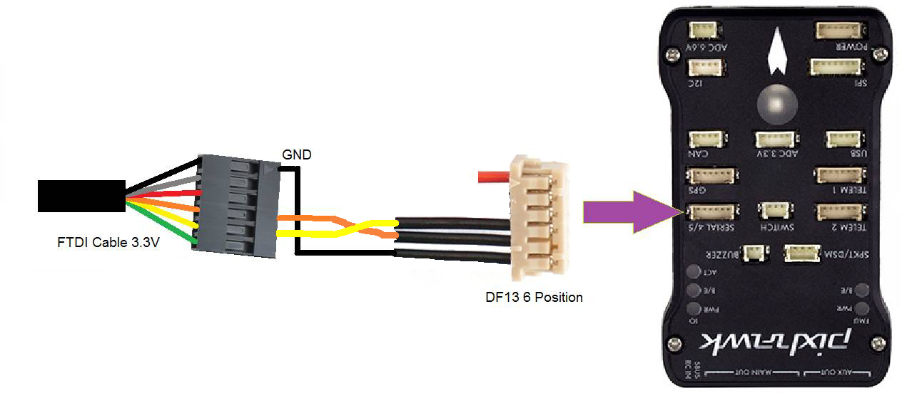
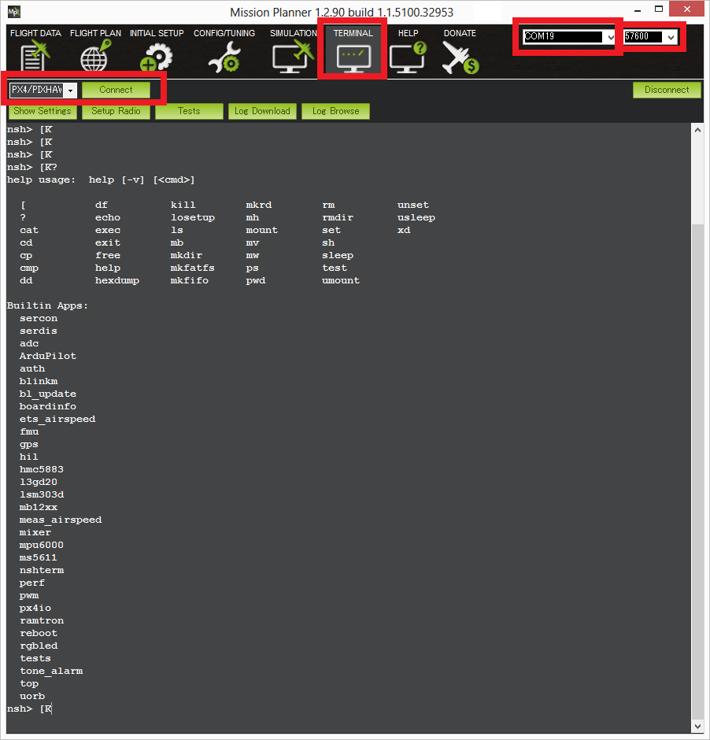
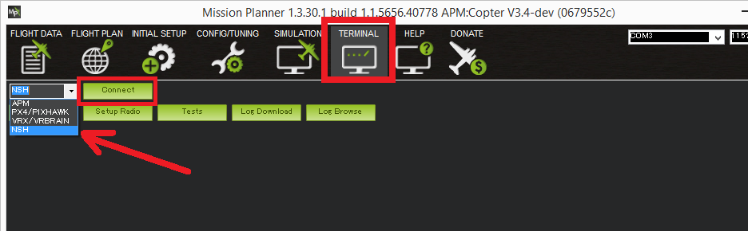

.. _interfacing-with-pixhawk-using-the-nsh:

===============================================
Archived:Interfacing with Pixhawk using the NSH
===============================================

This article explains how to communicate with a Pixhawk using the `NuttX Shell (NSH) <http://nuttx.org/Documentation/NuttShell.html>`__ using
either a serial or remote connection.

Overview
========

The Pixhawk runs the NuttX real-time operating system which includes the
NuttX Shell terminal "NSH". This allows running some Unix style commands
including "top" and "ls".

NSH is very useful for diagnosing low level issues. Some of the things
you can do with it include:

-  Display performance counters with the ``perf`` command
-  Display px4io status information
-  Diagnose microSD errors
-  Diagnose sensor failures
-  Assist in debugging new drivers

Running NSH using Debug Cable and Serial5
=========================================

To use the NSH while Copter or Plane is running you can connect using
Serial 4/5. To do this you will need an `FTDI 3.3V cable <http://store.jdrones.com/cable_ftdi_6pin_5v_p/cblftdi5v6p.htm>`__
and then modify a `DF13 6 Position cable <http://store.jdrones.com/cable_df13_6pin_15cm_p/cbldf13p6c15.htm>`__
so that it can be connected to the FTDI cable.

You should then be able to plug the FTDI cable into your computer and
connect with any Serial program including the Mission Planner's Terminal
screen. Ensure to select the FTDI cable's COM port and set the Baud rate
to 57600. You will need to press return for the "nsh>" prompt to appear.

Remote NSH over MAVLink
=======================

ArduPilot also includes support to run nsh commands remotely via MAVLink
over a USB, telemetry or WiFi link (this is an extension of the
SERIAL_CONTROL protocol used for controlling a GPS or radio UART over
MAVLink).

.. note::

   At time of writing Rover doesn't support NSH over MAVLink (because
   it doesn't support arming).

.. tip::

   This can be used for nsh
   debugging when you don't have a serial5 cable setup.

Instructions to use with Mission Planner:
-----------------------------------------

-  Connect Pixhawk to PC using a USB cable
-  Go to the Flight Data screen, select the correct COM port and baud
   (probalby 115200) and press the connect button
-  Go to the Terminal screen, set the left-most drop down to "NSH" and
   push Connect.

Setup instructions to access using MAVProxy:
--------------------------------------------

#. Load latest master onto a Pixhawk
#. Grab the latest *MAVProxy*

   -  If on Linux use:

      ::

          sudo pip install mavproxy

   -  If on Windows `grab it here <https://firmware.ardupilot.org/Tools/MAVProxy/>`__.

      .. note::

         If you are on Windows you will need to delete any old
               version of MAVProxy in **c:\\Program Files (x86)\\MAVProxy**
               first, as the installer does not properly cleanup old
               versions.

#. Start *MAVProxy* as usual
#. Load the nsh module in *MAVProxy* with

   ::

       module load nsh

#. start the nsh shell with

   ::

       nsh start

#. Now run nsh commands as usual. Note that MAVLink is still running,
   so the map, *MAPVproxy console*, graphs etc all keep updating while
   in the nsh shell.

   .. tip::

      A blank response to an NSH command may indicate low RAM memory
      on the autopilot board. Free up memory if possible. For example, on
      master you can save about 20Kb by disabling terrain following (set
      ``TERRAIN_ENABLE=0``).

#. To drop back to the normal *MAVProxy* prompt type a single "." on a
   line by itself

You can only start a shell when the system is disarmed. Once the shell
is started you can arm if you like.

.. warning::

   In theory you could fly while doing nsh commands, but we don't
   recommend it. 

This also works over a 3DR Radio link, although it is of course slower
in output than when on a USB connection.
