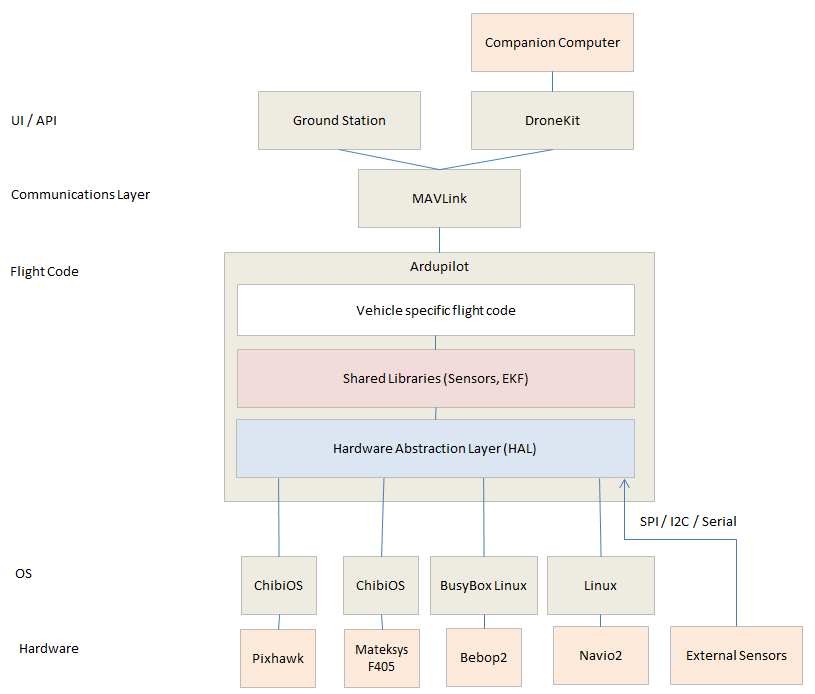

.. _learning-ardupilot-introduction:

=================================
Learning ArduPilot — Introduction
=================================

This page introduces the basic structure of ArduPilot. Before you get
started you should work out what code exploring system you will use. You
could just use a web browser and look at https://github.com/ArduPilot/ardupilot/ but you will probably get a lot
more out of it if you have :ref:`cloned all of the git repositories <where-to-get-the-code>` and use a good programmer's IDE like the ones recommended :ref:`here <code-editing-tools-and-ides>`.

Basic structure
===============

The basic structure of ArduPilot is broken up into 5 main parts:

-  vehicle code
-  shared libraries
-  hardware abstraction layer (AP_HAL)
-  tools directories
-  external support code (i.e. mavlink, dronekit)

Vehicle Code
------------

The vehicle directories are the top level directories that define the
firmware for each vehicle type.  Currently there are 5 vehicle types: Plane, Copter, Rover, Sub and AntennaTracker.
Although There are a lot of common elements between different vehicle types, they are each different. For now we only have a :ref:`detailed description of the code structure for the Copter code <apmcopter-code-overview>`.

Along with the \*.cpp files, each vehicle directory contains a make.inc
file which lists library dependencies. The Makefiles read this to create
the -I and -L flags for the build.

Libraries
---------

The `libraries <https://github.com/ArduPilot/ardupilot/tree/master/libraries>`__ are
shared amongst the four vehicle types Copter, Plane, Rover and AntennaTracker.  These libraries include sensor drivers, attitude and position estimation (aka :ref:`EKF <ekf>`) and control code (i.e. PID controllers).
See the :ref:`Library Description <apmcopter-programming-libraries>`, :ref:`Library Example Sketches <learning-ardupilot-the-example-sketches>` and :ref:`Sensor Drivers <code-overview-sensor-drivers>` pages for more details.

AP_HAL
-------

The AP_HAL layer (Hardware Abstraction Layer) is how we make ArduPilot
portable to lots of different platforms. There is a top level AP_HAL in
libraries/AP_HAL that defines the interface that the rest of the code
has to specific board features, then there is a AP_HAL_XXX
subdirectory for each board type, for example AP_HAL_AVR for AVR based
boards, AP_HAL_PX4 for Pixhawk boards and AP_HAL_Linux for Linux based
boards.

Tools directories
~~~~~~~~~~~~~~~~~

The tools directories are miscellaneous support directories. For
examples, tools/autotest provides the autotest infrastructure behind the
`autotest.ardupilot.org <https://autotest.ardupilot.org/>`__ site and
tools/Replay provides our log replay utility.

External support code
~~~~~~~~~~~~~~~~~~~~~

On some platforms we need external support code to provide additional
features or board support. Currently the external trees are:

-  `PX4NuttX <https://github.com/ArduPilot/PX4NuttX>`__ - the core NuttX
   RTOS used on Pixhawk boards
-  `PX4Firmware <https://github.com/ArduPilot/PX4Firmware>`__ - the base
   PX4 middleware and drivers used on Pixhawk boards
-  `uavcan <https://github.com/ArduPilot/uavcan>`__ - the uavcan CANBUS
   implementation used in ArduPilot
-  `mavlink <https://github.com/mavlink/mavlink>`__ - the mavlink
   protocol and code generator

.. note::

   Most of these are imported as :ref:`Git Submodules <git-submodules>` when you :ref:`build ArduPilot <building-the-code>`.

