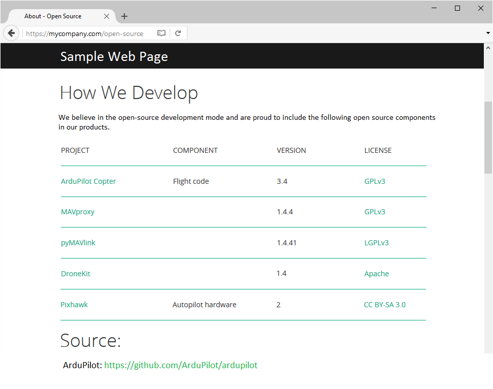
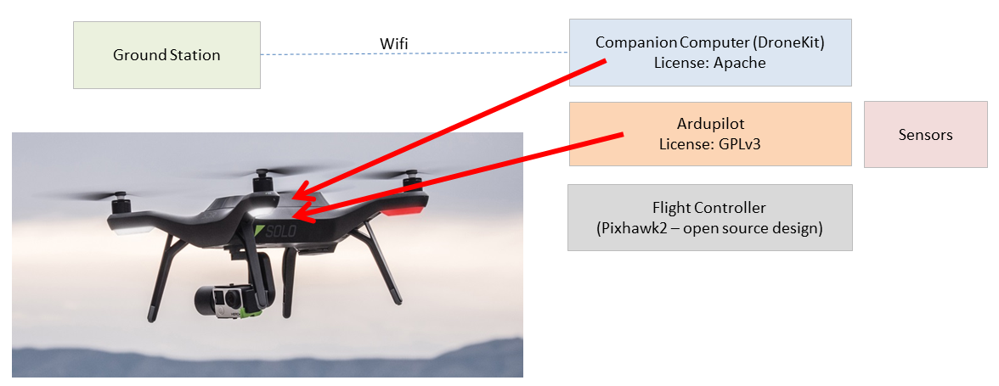

.. _license-gplv3:

===============
License (GPLv3)
===============

ArduPilot (including Copter, Plane, Rover, Sub and AntennaTracker) and the ground control software (including Mission Planner, APM Planner2 and MAVProxy) are free software: you can redistribute it and/or modify it under the terms of the GNU General Public License version 3 as published by the `Free Software Foundation <http://www.fsf.org/>`__.

This program is distributed in the hope that it will be useful, but
WITHOUT ANY WARRANTY; without even the implied warranty of
MERCHANTABILITY or FITNESS FOR A PARTICULAR PURPOSE. See the GNU General
Public License for more details.

For more specific details see
`http://www.gnu.org/licenses, <http://www.gnu.org/licenses/>`__ the
`Quick Guide to GPLv3. <http://www.gnu.org/licenses/quick-guide-gplv3.html>`__ and the
`copying.txt <https://github.com/ArduPilot/ardupilot/blob/master/COPYING.txt>`__
in the codebase.

The GNU operating system has an informative GPL `FAQ here <http://www.gnu.org/licenses/gpl-faq.html>`__.

Note to developers
==================

We very much appreciate you using our code to do fun and interesting
things. We hope that while doing this you may find and fix bugs or
make enhancements that could be useful for the greater community and
will make the developers aware of them by creating an issue in the `issues list <https://github.com/ArduPilot/ardupilot/issues>`__ and/or :ref:`contribute a fix using a pull request <submitting-patches-back-to-master>`
so they can be considered to be added to the original code base.

Note to  businesses or individuals including this software in products
======================================================================

Firstly, by the very nature of the ArduPilot Project you are free to use all of the code and tools provided in our Github repository under the terms of the licenses without any authorization or involvement from our team.
We greatly appreciate those companies and individuals who incorporate this software into their products for sale.  A significant number have already done this.  There are some things that the license requires however that we need to point out:

-  Inform your customers that the software is open source and provide the actual source code in the product or provide a link to where the source code can be found (see sample below).

-  As with the contributions of individual developers, we would like it
   if you could keep us informed of the products that incorporate the
   software by emailing partners@ardupilot.org.  Also for those
   changes that could be useful to the wider community we would
   appreciate it if you could :ref:`contribute them back using a pull request <submitting-patches-back-to-master>`
   for consideration to be added to the original code base.

To both individual developers and companies we also ask that when making
derivative works, the original credits listing all the individuals that
contributed to getting the software to its current form are left in
place.

Why did we pick this license over others?
=========================================

- the requirement to contribute back bug fixes and enhancements to the project (or at least provide those fixes to the end customer) increases cooperation amongst the contributors.  Without this requirement participants are tempted to keep even small improvements to themselves in order to gain an advantage over other contributors.  There is evidence that this quickly leads to many incompatible forks of the project to the detriment of all.

  Linus Torvalds (inventor of Linux) agrees.

  .. image:: ../images/license-linus-quote.png
      :target: http://www.cio.com/article/3112582/linux/linus-torvalds-says-gpl-was-defining-factor-in-linuxs-success.html
      :width: 400px

- the "v3" portion of the license ensures that the customer who purchased the vehicle has the right to upgrade or replace the version of ArduPilot on the flight controller.  The license doesn't require that it actually work but just that the upgrade is possible.  This ensures that even if a manufacturer stops supporting the product (which can happen for very valid reasons) the product can continue to be useful if the owner or a community of developers decides to pick up support.  Examples of this have already happened with ArduPilot.  Note that this requirement only applies to `"User Products" <https://github.com/ArduPilot/ardupilot/blob/master/COPYING.txt#L297>`__ and products where it is technically possible for the manufacturer to upgrade the firmware on the device.

Can I integrate Closed source (i.e. Proprietary) and Open Source?
=================================================================

ArduPilot is open source (GPLv3) but you can use a companion computer to run closed source code to ease integrating ArduPilot into your corporate systems or to add higher level features to differentiate yourself from your rivals.  You build on the reliability of the free low-level flight code so you can instead invest in the higher level features.  We believe ArduPilot is as reliable as the leading closed system and you are not beholden to a particular manufacturer.  Below is an image of how one manufacturer accomplished this.

