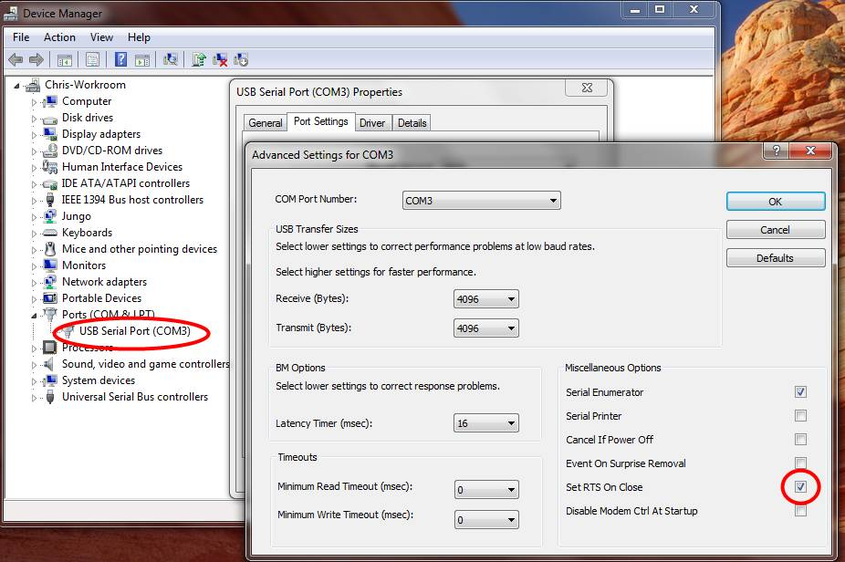
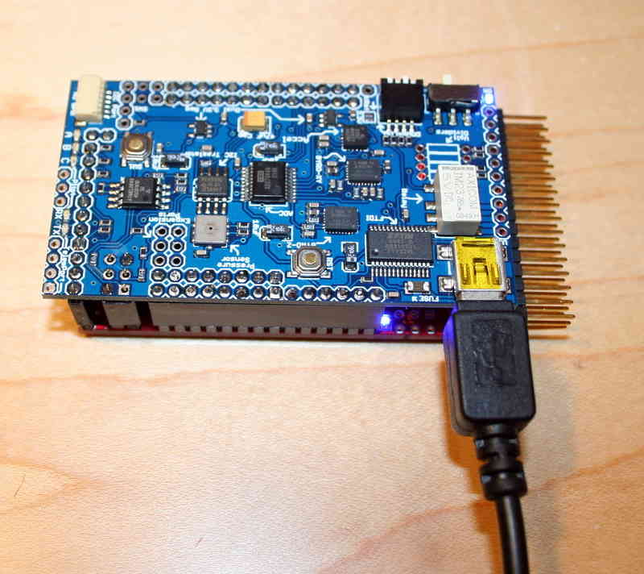
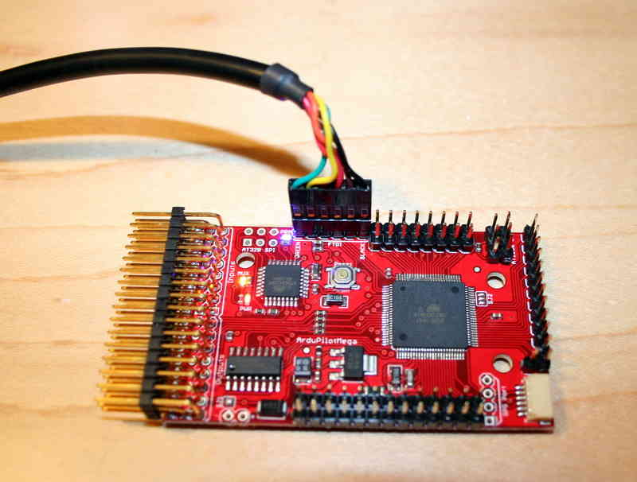
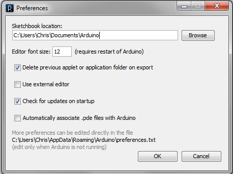
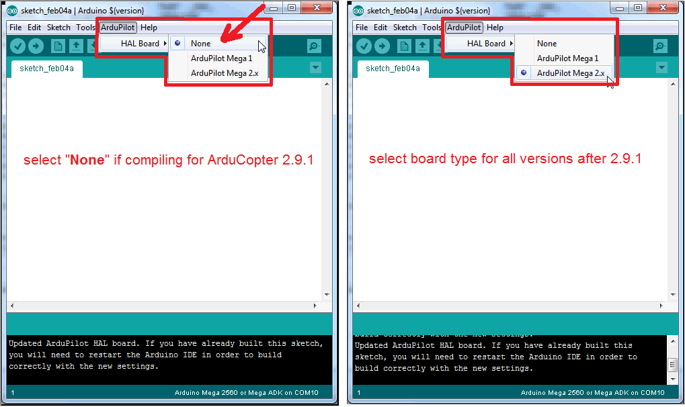
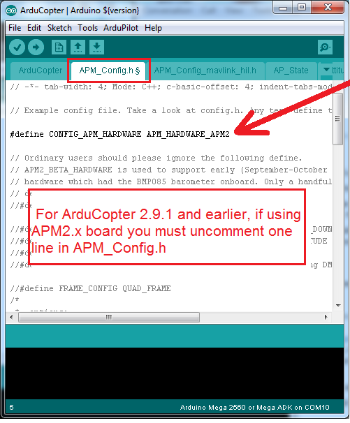

.. _load-the-code-onto-apm2x:

======================================
Archived: Loading the code onto APM2.x
======================================

What you'll need:
=================

-  mini USB cable (for APM1) or micro USB cable (for APM2)
-  modified version of the Arduino IDE
   for \ `windows <https://firmware.ardupilot.org/Tools/Arduino/>`__ or `macintosh <https://firmware.ardupilot.org/Tools/Arduino/>`__

Setting up the software drivers
===============================

First, download and install Arduino (see links above). If you've never
used Arduino before, please use \ `these setup instructions <http://arduino.cc/en/Guide/HomePage>`__ to become familiar
with Arduino basics.

Next, set up the drivers for the USB interface to APM. Most people will
use a regular USB-A to miniB cable (regular USB on one side, mini USB on
the other) to connect to APM via the IMU shield, but if you're not using
that shield you can use a FTDI cable. Pictures showing how to plug in
these cables are below.

When you plug APM or the FTDI cable the first time to your PC, Windows 7
should recognize the FTDI USB-to-serial chip and install the right
drivers, but if it doesn't or if you're using an earlier version of
Windows, you should download and install the appropriate driver for your
Operating System
from \ `here <http://www.ftdichip.com/Drivers/VCP.htm>`__. Once you've
done so, reboot your PC and plug in the cable again. It should be
recognized and show up in your Windows Device Manger (which you can find
in the Windows Control Panel) as shown below (your COM port will
probably be a different number; it's assigned by Windows based on how
many other devices you've connected). That's the COM port you'll use in
Arduino and all other USB interactions with APM.

*Note: if you're using the FTDI cable, you must go to the Control
Panel/Device Manager and make a change to the COM port assigned to the
FTDI/USB cable. Find the USB Serial Port entry as shown here (your FTDI
may have been assigned to a different port than the 3 shown below; it
doesn't matter what number it's given) and under Properties/Port
Settings/Advanced, ensure that the "Set RTS On Close" box is checked, as
shown below. Once you've made this change once, you won't have to do it
again.*

Connecting the cable
====================

The FTDI or USB cable will provide sufficient power for desktop use, but
will probably not drive more than two regular servos. If you want to
drive more servos than that or if you're using digital servos, you'll
need to have an additional power supply (usually an ESC connected to one
of the APM servo outputs).

If you're using a USB cable, connect it here:

If you're using an FTDI cable, connect it here, noting the marking for
the black and green sides of the cable:

Setting the Sketchbook folder
=============================

Next you must define the folder Arduino will use for its "sketches"
(Arduino-talk for the set of files that compose a program) and libraries

Create a folder someplace where you can find it, perhaps in your
Documents folder or even on your desktop. (If you've been using Arduino,
you probably have this set up somewhere already). Launch the Arduino IDE
and open the \ **Preferences** dialog. Set the sketchbook location to
the\ ``Sketchbook`` folder you created or are using. Here's where I have
mine:

Once you've changed that directory, you must close Arduino and restart
it for it to be recognized.

Setting the board type
======================

In our modified version of the Arduino IDE there is a new "ArduPilot"
menu which allows you to select the board type.

-  For Copter version 2.9.1 and earlier you should select the "None"
   from this menu and then ensure that under Tools, Board is
   "ArduinoMega 2560 or Mega ADK". If you are using an APM2 you will
   also need to uncomment line 5 from APM_Config.h (see bottom
   screenshot)
-  For versions later than 2.9.1 you should set the "ArduPilot", "HAL
   Board" to either "ArduPilot Mega 1" or "ArduPilot Mega 2.x" depending
   on which board you are programming.

.. note::

   You will need to restart your Arduino IDE after changing the
   above.

