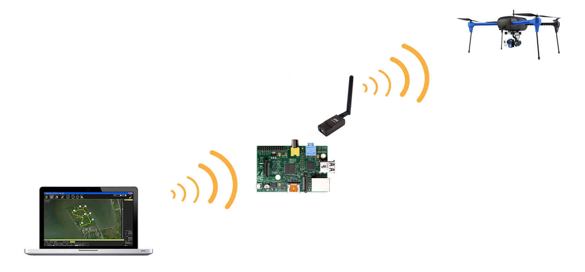
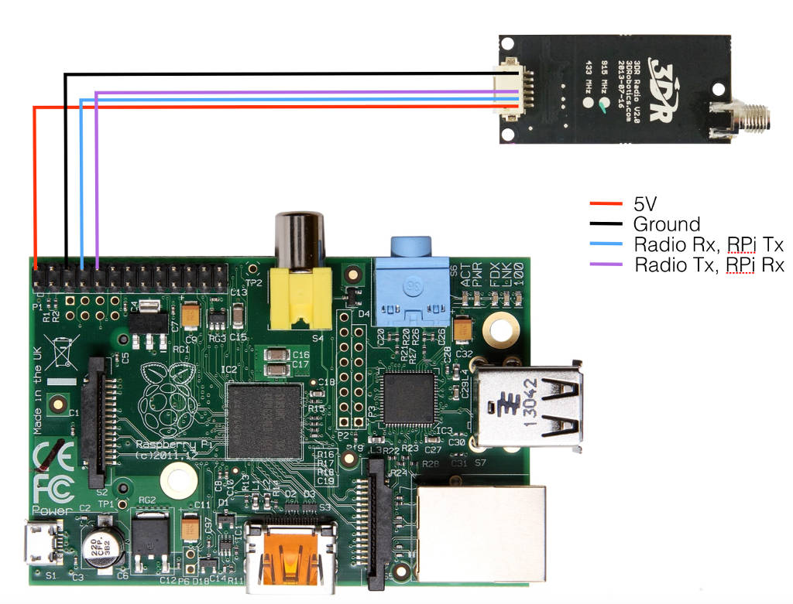
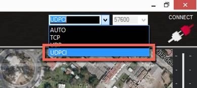
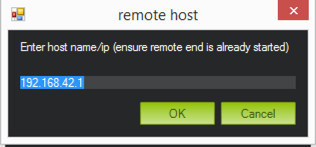
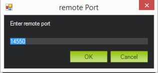

.. _making-a-mavlink-wifi-bridge-using-the-raspberry-pi:

===================================================
Making a Mavlink WiFi bridge using the Raspberry Pi
===================================================

.. note::

   This document is still a work in progress

Overview
========

This page will show you how to setup a Raspberry Pi (RPi) as a gateway
to a 3DR Telemetry Radio. This will allow you to connect a computer or
tablet via WiFi to the Raspberry Pi, and the Raspberry Pi will in turn
forward the communication to a drone through a telemetry link.

To accomplish this tutorial you will need the following items:

-  Raspberry Pi with SD Card
-  A compatible Wifi dongle (not all dongles support AP mode)
-  3DR Telemetry Radio
-  A vehicle to connect to

If you don't want to mess around all the configuration steps described
here you can also just go to the bottom of the page and download an SD
Card image that you can load as described in the section :ref:`Getting the Raspberry Pi up and running with Raspbian <making-a-mavlink-wifi-bridge-using-the-raspberry-pi_getting_the_raspberry_pi_up_and_running_with_raspbian>`.
Just use the image provided at the bottom instead of the image from the
Raspberri Pi Website.

.. _making-a-mavlink-wifi-bridge-using-the-raspberry-pi_getting_the_raspberry_pi_up_and_running_with_raspbian:

Getting the Raspberry Pi up and running with Raspbian
=====================================================

First we need to get the Raspberry Pi up and running with Debian. This
is accomplished by downloading the SD Card image from the Raspberry Pi
website, and loading it into an SD Card.

#. Go to the `Raspberry Pi downloads page <http://www.raspberrypi.org/downloads/>`__ and download the
   latest raspbian image (as of this writing:
   `2014-12-24-wheezy-raspbian.zip <http://downloads.raspberrypi.org/raspbian_latest>`__)
#. Follow the guide specific to your operating system to prepare the SD
   Card with the image you downloaded:

   -  `Linux <http://www.raspberrypi.org/documentation/installation/installing-images/linux.md>`__
   -  `Windows <http://www.raspberrypi.org/documentation/installation/installing-images/windows.md>`__
   -  `OS X <http://www.raspberrypi.org/documentation/installation/installing-images/mac.md>`__

#. Once you have the SD Card ready insert it into the RPi and boot it up
#. The first time you boot the RPi it will load the Raspberry Pi
   Configuration Utility, setup the following:

   -  Expand the file system (This allows you to use all of the free
      space on the SD Card)
   -  Set your timezone
   -  Make sure the boot option is set to boot to console
   -  Enable SSH under "Advanced Options"
   -  Finish the setup and reboot

You now have the Raspberry Pi ready to setup MavProxy and to set it up
as an access point so you can use it to create a local WiFi network. To
avoid having to continue using a keyboard and monitor it is convenient
to connect to the RPi using an SSH client. You can follow the steps on
the page :ref:`Connecting to RPi with an SSH/Telnet client <raspberry-pi-via-mavlink_connecting_to_rpi_with_an_sshtelnet_client>`
in order to achieve this.

Setting up the Raspberry Pi as an access point
==============================================

Now we need to setup the the software that will allow the RPi to act as
an access point. For the following steps make sure you have access to
the internet from Raspberry Pi, this is needed in order to download the
software packages. The easiest way to achieve this is to connect the RPi
to an Ethernet connection.

Installing hostapd and a dhcp server
------------------------------------

Now connect to the RPi through an SSH connection and type the following
commands:

::

    sudo apt-get update
    sudo apt-get install hostapd isc-dhcp-server

These commands install the software needed to setup the RPi as an access
point, and to allow it to assign IP addresses to the computers that
connect to it (DHCP Server). After you run these commands you may see
the following lines in the output:

::

    [FAIL] Starting ISC DHCP server: dhcpd[....] check syslog for diagnostics. ... failed!
     failed!

Don't worry, this does not affect the functionality.

Now we need to configure these two packages, first we will configure the
DHCP Server

Configure the DHCP Server
-------------------------

The following steps will guide you through the configuration of the DHCP
server. Next we need to edit the file **/etc/dhcp/dhcpd.conf**, this
files allows the computers connected through WiFi to automatically get
IP Addresses, DNS, and other information to allow them to connect
through the RPi.

::

     sudo nano /etc/dhcp/dhcpd.conf

Find the following lines and comment them out by adding a # in the
beginning of the line:

::

    option domain-name "example.org";
    option domain-name-servers ns1.example.org, ns2.example.org;

Make them so they look like this:

::

    #option domain-name "example.org";
    #option domain-name-servers ns1.example.org, ns2.example.org;

In the same file, find the following lines and uncomment the
"authoritative" line by removing the # at the beginning of the line:

::

    # If this DHCP server is the official DHCP server for the local
    # network, the authoritative directive should be uncommented.
    #authoritative;

Make the line so it looks like this:

::

    # If this DHCP server is the official DHCP server for the local
    # network, the authoritative directive should be uncommented.
    authoritative;

At the bottom of this same file, add the following lines:

::

    subnet 192.168.42.0 netmask 255.255.255.0 {
        range 192.168.42.10 192.168.42.50;
        option broadcast-address 192.168.42.255;
        option routers 192.168.42.1;
        default-lease-time 600;
        max-lease-time 7200;
        option domain-name "local";
        option domain-name-servers 8.8.8.8, 8.8.4.4;
    }

These lines configure the network address DNS servers and gateway
information that the RPi will assign to the clients connecting to it. If
you will use the RPi to bridge to another network through the ethernet
connection, it is important that this address range does not conflict
with the network the RPi is connected to through the ethernet
connection. In other words, if your local network uses the address range
192.168.42.xx you need to select a different address range. Also the
router address 192.168.42.1 will be the ip address of the RPi (we will
set that up later on).

Save the file by typing in **Control-X** then **Y** then **return**

Now we will edit the file **/etc/default/isc-dhcp-server** in order to
tell the server on what network interface it will be active. Type the
following command:

::

    sudo nano /etc/default/isc-dhcp-server

Find the line that says

::

    INTERFACESv4=""

and change it to:

::

    INTERFACESv4="wlan0"

Save the file by typing in **Control-X** then **Y** then **return**

Setup the wlan0 interface as a static ip address
------------------------------------------------

We now have to setup the wireless interface on the RPi to have its own
fixed IP address and set it up to take incoming connections, type the
following commands:

::

    sudo ifdown wlan0
    sudo nano /etc/network/interfaces

change the file so it matches the following:

::

    auto lo

    iface lo inet loopback
    iface eth0 inet dhcp

    allow-hotplug wlan0

    iface wlan0 inet static
      address 192.168.42.1
      netmask 255.255.255.0

    #wpa-roam /etc/wpa_supplicant/wpa_supplicant.conf
    #iface default inet dhcp

Save the file by typing in **Control-X** then **Y** then **return**

This sets up a static IP address (192.168.42.1) to the wireless lan
interface (wlan0). This configuration however will not take effect until
the next reboot, so if you want to immediately assign this address you
need to type the following:

::

    sudo ifconfig wlan0 192.168.42.1

Configure the Access Point Details
----------------------------------

The next steps will set up our wireless network with a name and
password, and will configure the hardware adapter to be used in access
point (AP) mode. It is important to note that not all WiFi dongles
support AP mode, please make sure that the dongle you are using supports
this mode. *This has only been tested using the WiFi dongle sold by
Adafruit. Check this with Craig*

The configuration file we need to change is
**/etc/hostapd/hostapd.conf**

Type the following command:

::

    sudo nano /etc/hostapd/hostapd.conf

This will create a new file. If there is already a file with that name
already, change the contents to the lines below, otherwise add the
following lines to the file:

::

    interface=wlan0
    driver=rtl871xdrv
    ssid=MavStation
    hw_mode=g
    channel=6
    macaddr_acl=0
    auth_algs=1
    ignore_broadcast_ssid=0
    wpa=2
    wpa_passphrase=MavLink_1 
    wpa_key_mgmt=WPA-PSK
    wpa_pairwise=TKIP
    rsn_pairwise=CCMP

Save the file by typing in **Control-X** then **Y** then **return**

This is telling the access point software to use the **wlan0**
interface, and to setup a network called **MavStation** with the pass
phrase **MavLink1**. Another important part of this file is the line:

::

    driver=rtl871xdrv

If you are using a different dongle than the one we are using you may
need to change this line to use a driver suitable for your dongle, you
may want to try:

::

    driver=nl80211
    
If you are using the built in WiFi on a Raspberry Pi 3 as wlan0, comment out the driver line:
    
::
    
    #driver=rt1871xdrv
 
Make sure the file has no extra spaces or tabs at the beginning and ends
of the lines, this file is very sensitive to this.

Now we must tell the software to use the configuration file we just
created. To do this we need to modify the file **/etc/default/hostapd**

Type the following command:

::

    sudo nano /etc/default/hostapd

Find the line that contains **#DAEMON_CONF=""** and change it to the
following:

::

    DAEMON_CONF="/etc/hostapd/hostapd.conf"

Save the file by typing in **Control-X** then **Y** then **return**

Configure Network Address Translation (NAT)
-------------------------------------------

Setting up NAT allows the WiFi clients of the RPi to have their data
tunneled through the ethernet connection on the RPi. To do this type the
following command:

::

    sudo nano /etc/sysctl.conf

Find the lines:

::

    # Uncomment the next line to enable packet forwarding for IPv4
    #net.ipv4.ip_forward=1

and uncomment it like this:

::

    # Uncomment the next line to enable packet forwarding for IPv4
    net.ipv4.ip_forward=1

This change will not be applied until the next boot, so to apply it
immediately run the following command:

::

    sudo sh -c "echo 1 > /proc/sys/net/ipv4/ip_forward"

Now run the following commands to setup the routing tables between the
wireless lan interface and the ethernet port:

::

    sudo iptables -t nat -A POSTROUTING -o eth0 -j MASQUERADE
    sudo iptables -A FORWARD -i eth0 -o wlan0 -m state --state RELATED,ESTABLISHED -j ACCEPT
    sudo iptables -A FORWARD -i wlan0 -o eth0 -j ACCEPT

To check your changes to the tables you can use the following commands:

::

    sudo iptables -t nat -S
    sudo iptables -S

In order to restore this changes after boot we need to save the
configuration to a file so that we can use that later to restore the
configuration. Type the following:

::

    sudo sh -c "iptables-save > /etc/iptables.ipv4.nat"

We now need to update the interface file again, type the following
command:

::

    sudo nano /etc/network/interfaces

And add the following line to the end of the file:

::

    up iptables-restore < /etc/iptables.ipv4.nat

The complete file should now look like this:

::

    auto lo

    iface lo inet loopback
    iface eth0 inet dhcp

    allow-hotplug wlan0

    iface wlan0 inet static
      address 192.168.42.1
      netmask 255.255.255.0

    #wpa-roam /etc/wpa_supplicant/wpa_supplicant.conf
    #iface default inet dhcp

    up iptables-restore < /etc/iptables.ipv4.nat

Save the file by typing in **Control-X** then **Y** then **return**

We are now almost ready to run the access point software. Before we do
that though we need to update it to a version that supports our network
adapter.

Update hostapd
--------------

If you are not using the built in WiFi on a Raspberry Pi 3 then the hostapd
version installed by apt-get does not fully support the WiFi dongle we are using
so we need to update it to a later version. Lets get the new version of hostapd 
by typing the follwing command: (only if NOT using the built in Wifi)

::

    wget http://adafruit-download.s3.amazonaws.com/adafruit_hostapd_14128.zip

Now lets unzip the files, swap them with the old version, and fix the
permissions so we are able to run the software:

::

    unzip adafruit_hostapd_14128.zip
    sudo mv /usr/sbin/hostapd /usr/sbin/hostapd.ORIG
    sudo mv hostapd /usr/sbin
    sudo chmod 755 /usr/sbin/hostapd

Setting up a daemon
-------------------

With everything installed and ready to go, we now have to set the system
up as a program that will start when the system boots up. This is called
a **daemon**. Type the following commands:

::

    sudo service hostapd start 
    sudo service isc-dhcp-server start

You should now see the following output if everything runs well:

::

    pi@MavStation ~ $ sudo service hostapd start
    [ ok ] Starting advanced IEEE 802.11 management: hostapd.
    pi@MavStation ~ $ sudo service isc-dhcp-server start
    [ ok ] Starting ISC DHCP server: dhcpd.

Now in order to set the services up so they run everytime the RPi boots,
type the following:

::

    sudo update-rc.d hostapd enable 
    sudo update-rc.d isc-dhcp-server enable

One last step is to remove WPASupplicant so it does not interfere with
the Access Point, type the following commands:

::

    sudo mv /usr/share/dbus-1/system-services/fi.epitest.hostap.WPASupplicant.service ~/

And finally reboot your RPi by typing the following:

::

    sudo reboot

Your system is now setup as an access point. You should now see a WiFi
Network called **MavStation** and you should be able to connect by using
the pass phrase **MavLink_1** (if you chose to keep the same name and
pass phrase)

Important Considerations!
-------------------------

You must make sure that the RPi is receiving enough power to handle both
the WiFi Dongle and the Ethernet connection in case you want to use it
as an router to another network. I had success powering it up with a 2A
power supply.

If you do not have enough power you may be able to connect to it, but
when you try to browse a web page it may drop the connection and kill
the network interfaces. Check /var/log/syslog for this type of entries:

::

    Dec 27 12:37:17 MavStation kernel: [  261.984400] ERROR::dwc_otg_hcd_urb_enqueue:505: Not connected
    Dec 27 12:37:18 MavStation dhclient: receive_packet failed on eth0: Network is down
    Dec 27 12:37:22 MavStation ntpd[2081]: Deleting interface #2 eth0, 10.0.1.21#123, interface stats: received=11, sent=16, dropped=0, active_time=237 secs

Also if you are able to see the Wireless network but can't connect to
it, that may also mean that the WiFi channel may be conflicting with
another network. Try changing the channel on the file
**/etc/hostapd/hostapd.conf**.

::

    channel=x

Finally make sure that your WiFi dongle supports Access Point mode.

Installing and configuring MavProxy
===================================

With the RPi now working as an access point, we now need to configure it
to connect to a drone. To accomplish this we will install
`MavProxy <http://ardupilot.github.io/MAVProxy/html/index.html>`__, a
minimalist but full featured ground control station.

.. tip::

   The official instructions to `install MAVProxy on Linux are here <http://ardupilot.github.io/MAVProxy/html/getting_started/download_and_installation.html#linux>`__.

First install some other modules that are needed. Type the following
commands:

::

    sudo apt-get update
    sudo apt-get install python-opencv python-wxgtk python-pip python-dev

Then use *pip* to install MavProxy and all its dependencies

::

    sudo pip install MAVProxy

In order to allow serial connections to the RPi we need to disable the
console and login prompt on the serial port. To do this we have to edit
the file **/etc/inittab**. Type the following:

::

    sudo nano /etc/inittab

Now go to the bottom of the file and look for the following lines:

::

    #Spawn a getty on Raspberry Pi serial line
    T0:23:respawn:/sbin/getty -L ttyAMA0 115200 vt100

and comment out the line like this:

::

    #Spawn a getty on Raspberry Pi serial line
    #T0:23:respawn:/sbin/getty -L ttyAMA0 115200 vt100

Save the file by typing in **Control-X** then **Y** then **return**

Now we should be ready to test the connection to the drone.

Connecting a 3DR Telemetry Radio to a Raspberry Pi
==================================================

.. tip::

   The instructions here show how to connect the RPi using the 3DR
   Radio via a serial port. It is far simpler to connect to the radio via
   its USB port. The
   :ref:`configuration <making-a-mavlink-wifi-bridge-using-the-raspberry-pi_configuring_mavproxy_to_always_run_and_listen_to_incoming_connections>`
   is the same except that you need to specify ``/dev/ttyUSB0`` (USB
   connection) rather than ``/dev/ttyAMA0`` (UART).

In order to communicate with a vehicle we will use the serial connection
on the RPi. The serial port UART goes to pins 8 (TXD) and 10 (RXD) on
the P1 header. We also need to provide power to the 3DR Radio by wiring
pins 1 (+5V) and pin 6 (GND).

The 3DR Radio V2 pins 1 (+5V), 2 (RXD), 3 (TXD) and 6 (GND) are the
corresponding pins to wire. Remember that the TXD on the Raspberry Pi
needs to be wired to the RXD on the 3DR Radio.

You can find more information on the pin out for the Raspberry Pi
`HERE <http://www.raspberrypi.org/pinout-for-gpio-connectors/>`__

    
    Connecting Telemetry Radio to RaPi

Testing the MavProxy Connection
===============================

Now we are ready to test the communication. To do this follow the
instructions on the section `"Testing the
Connection" <raspberry-pi-via-mavlink/#Testing_the_connection>`__ in the
Raspberry Pi via Mavlink page.

.. _making-a-mavlink-wifi-bridge-using-the-raspberry-pi_configuring_mavproxy_to_always_run_and_listen_to_incoming_connections:

Configuring MavProxy to always run and listen to incoming connections
=====================================================================

The next step to get this working is to setup MavProxy to run
automatically with the RPi boots up. To do this MavProxy has a daemon
mode that works similarly to the above configuration for the DHCP
server. In order to set it up we will use a script and modify it to work
with the RPi.

#. Download the `mavgateway file <https://raw.githubusercontent.com/dronekit/dronekit-python/3222b2cdb71b8b4c5b924ee28fc5d3529be00e67/scripts/mavgateway>`__
   (from Github) and then copy it over to to the RPi.
#. We now have to edit the file and change some aspects of it to make it
   compatible. Lets edit the file:

   ::

       nano mavgateway

#. To setup the correct parameters to start MavProxy find the following
   line:

   ::

       DAEMON_ARGS="--master=/dev/ttyMFD1,115200 --out=udpin:0.0.0.0:14550 --daemon"

   -  If you're using a serial connection change it to this:

      ::

          DAEMON_ARGS="--master=/dev/ttyAMA0,57600 --out=udpin:0.0.0.0:14550 --daemon"

   -  If you're using a USB connection change it to this:

      ::

          DAEMON_ARGS="--master=/dev/ttyUSB0,57600 --out=udpin:0.0.0.0:14550 --daemon"

#. Next we need to change the user that starts MavProxy, find this line:

   ::

       start-stop-daemon --start --background --make-pidfile --chuid edison --chdir /tmp --quiet --pidfile $PIDFILE --exec $DAEMON -- \

   And change it to:

   ::

       start-stop-daemon --start --background --make-pidfile --chuid pi --chdir /tmp --quiet --pidfile $PIDFILE --exec $DAEMON -- \

   Save the file by typing in **Control-X** then **Y** then **return**

#. Now we need to move the file and set the correct permissions. Type
   the following commands:

   ::

       sudo mv mavgateway /etc/init.d/mavgateway
       cd /etc/init.d/
       sudo chown root:root mavgateway
       sudo chmod 755 mavgateway

#. We are now ready to setup the daemon to run every time the RPi boots
   type this command:

   ::

       sudo update-rc.d mavgateway defaults

#. Reboot the RPi:

   ::

       sudo reboot

Connecting to the MavGateway
============================

MavProxy
--------

Using MavProxy (replace **xxx.xxx.xxx.xxx** with the IP Address of the
RPi):

::

    mavproxy.py –master=udpout:xxx.xxx.xxx.xxx:14550

Using Mission Planner
---------------------

Using the latest beta version (1.3.17.1 build 1.1.5478.13250) you can
now initiate a UDP connection. To do this select **UDPCI** from the
connection type menu:

After that click connect, you will be presented with a screen to enter
the IP Address of the RPi:

And enter the UDP Port on the next screen:

Using APM Planner -- TBD
------------------------

Using a Tablet -- TBD
---------------------

SD Card Image file
==================

If you don't want to configure your own RPi, you can download this image
file and restore it to an SD Card to use it on your own RPi from this
`link <http://firmware.ardupilot.org/Tools/MavStation/>`__.

To restore **this image** to an SD Card you will need an SD Card with at
least 16GB of space, just follow the same steps described in the section
`"Getting_the_Raspberry_Pi_up_and_running_with_Raspbian" <#Getting_the_Raspberry_Pi_up_and_running_with_Raspbian>`__,
but use this image instead of the OS image.

References
==========

https://learn.adafruit.com/setting-up-a-raspberry-pi-as-a-wifi-access-point/install-software

http://sirlagz.net/2013/02/10/how-to-use-the-raspberry-pi-as-a-wireless-access-pointrouter-part-3b/
