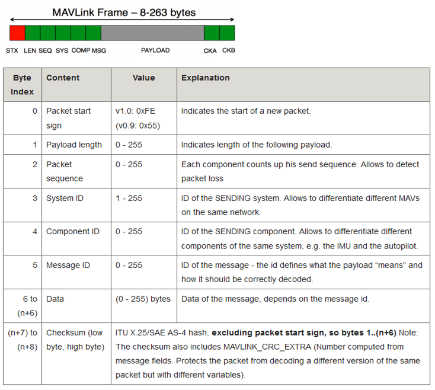
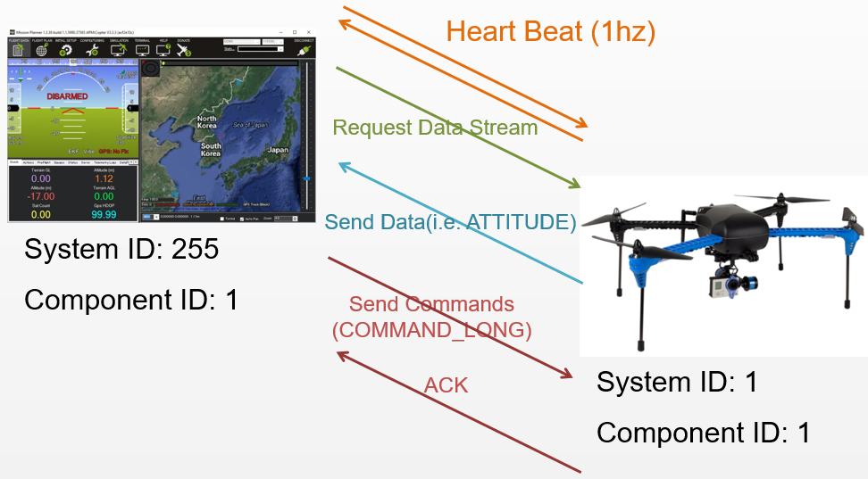

.. _mavlink-basics:

==============
MAVLink Basics
==============

`MAVLink <https://mavlink.io/en/>`__ is a serial protocol most commonly used to send data and commands between vehicles and ground stations

- The protocol defines a large set of messages which can be found in `common.xml <https://mavlink.io/en/messages/common.html>`__ and `ardupilot.xml <https://mavlink.io/en/messages/ardupilotmega.html>`__
- MAVLink messages can be sent over almost any serial connection and does not depend upon the underlying technology (wifi, 900mhz radio, etc)
- The messages are not guaranteed to be delivered which means ground stations or companion computers must often check the state of the vehicle to determine if a command has been executed

Message Format
--------------

- Messages are no more than 263 bytes (Mavlink version1.0) or 280 bytes (Mavlink version 2.0).
- The sender always fills in the ``System ID`` and ``Component ID`` fields so that the receiver knows where the packet came from.  The ``System ID`` is a unique ID for each vehicle or ground station.  Ground stations normally use a high system id like "255" and vehicles default to use "1" (this can be changed by setting the :ref:`MAV_SYSID <MAV_SYSID>` parameter).  The ``Component ID`` for the ground station or flight controller is normally "1".  Other MAVLink capable device on the vehicle (i.e. companion computer, gimbal) should use the same ``System ID`` as the flight controller but use a different ``Component ID``
- The ``Message ID`` field can be seen in the `common.xml <https://mavlink.io/en/messages/common.html>`__ and `ardupilot.xml <https://mavlink.io/en/messages/ardupilotmega.html>`__ next to the message name.  For example the `HEARTBEAT <https://mavlink.io/en/messages/common.html#HEARTBEAT>`__ message Id is "0"
- The ``Data`` portion of the message holds the individual field values being sent
- See this page for advice on how to :ref:`add support for a new MAVLink message <code-overview-adding-a-new-mavlink-message>`

High Level Message Flow
-----------------------

- Once a connection is opened each device (aka "System") sends the `HEARTBEAT <https://mavlink.io/en/messages/common.html#HEARTBEAT>`__ message at 1hz
- The ground station or companion computer :ref:`requests the data <mavlink-requesting-data>` it wants (and the rate) by sending messages of the following types

   - `REQUEST_DATA_STREAM <https://mavlink.io/en/messages/common.html#REQUEST_DATA_STREAM>`__ supports setting the rate of groups of messages
   - `COMMAND_LONG <https://mavlink.io/en/messages/common.html#COMMAND_LONG>`__ containing a `SET_MESSAGE_INTERVAL <https://mavlink.io/en/messages/common.html#MAV_CMD_SET_MESSAGE_INTERVAL>`__ command provides precise control of which messages are sent (and their rate) but is only supported on ArduPilot 4.0 and higher

- Ground station or companion computer send commands to the vehicle.  Details of the supported commands are :ref:`here for copter <copter-commands-in-guided-mode>` and :ref:`plane <plane-commands-in-guided-mode>`

MAVLink1 vs MAVLink2
--------------------
- MAVLink2 messages have a maximum of 280 bytes of length, as they implement compatibility flags and support for signature.
- MAVLink2 extends MAVLink1 by allowing new fields to be added to existing MAVLink1 messages, supports new messages with ``Message ID`` over "255" and adds support for signing messages
- MAVLink2 is backwards compatible with MAVLink1 meaning that if a device understands MAVlink2 messages it certainly understands MAVLink1 messages
- If a device only capable of understanding MAVLink1 receives a message that includes additional fields (added under MAVLink2) the device will only see the original fields.  I.e. the device will be able to read the message but will not "see" the additional fields
- A flight controller's serial port (presumably connected to a telemetry radio) can be set to use MAVLink2 by setting the ``SERIALx_PROTOCOL`` parameter to "2" (where "x" is the serial port number on the flight controller)
-  See `Mavlink2 Documentation <https://mavlink.io/en/guide/mavlink_2.html>`__ for more information (especially on message extensions)
