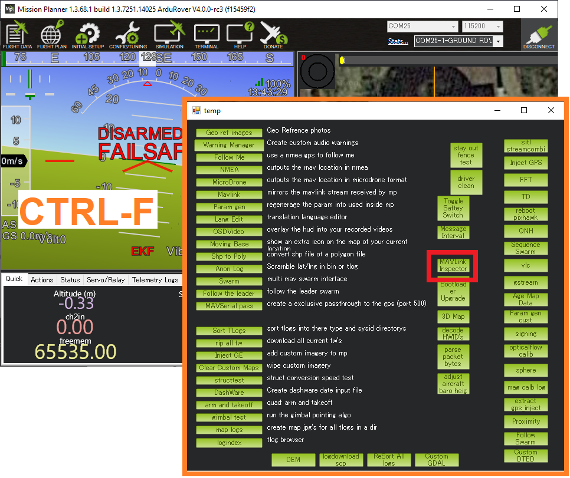

.. _mavlink-requesting-data:

==================================
Requesting Data From The Autopilot
==================================

The ground station or companion computer can request the data it wants (and the rate) using one of the following methods:

   - Set the ``SRx_`` parameters to cause the autopilot to pro-actively send groups of messages on start-up.  This method is easy to set-up for a small number of drones but is not recommended for most applications
   - Send `REQUEST_DATA_STREAM <https://mavlink.io/en/messages/common.html#REQUEST_DATA_STREAM>`__ messages to set the rate for groups of messages
   - Send a `SET_MESSAGE_INTERVAL <https://mavlink.io/en/messages/common.html#MAV_CMD_SET_MESSAGE_INTERVAL>`__ command (within a `COMMAND_LONG <https://mavlink.io/en/messages/common.html#COMMAND_LONG>`__ message) to precisely control the rate of an individual message.  Note this is only supported on ArduPilot 4.0 and higher
   - Send a `REQUEST_MESSAGE <https://mavlink.io/en/messages/common.html#MAV_CMD_REQUEST_MESSAGE>`__ command (within a `COMMAND_LONG <https://mavlink.io/en/messages/common.html#COMMAND_LONG>`__ message) to request a single instance of a message.  Note this is only supported on ArduPilot 4.0 and higher

More details of these methods can be found below.

Using SRx Parameters
--------------------

Setting the ``SRx_`` parameters (and then rebooting the autopilot) will cause the autopilot to pro-actively send groups of messages to the ground station.  This is not the recommended method because the ground station has no way to determine what "x" should be.

- Connect to the autopilot with a ground station
- Determine which telemetry connection is being used.  For example if the ground station is connected to the autopilot's "Telem1" port (perhaps using a wifi or telemetry radio) then the ``SR1_`` parameters should be modified
- Set the ``SRx_`` parameter to the rate (in Hz) you wish the group of messages to be sent.  The exact messages contained in each group can be determined by inspecting the STREAM_xxx arrays in each vehicle's GCS_Mavlink.cpp file (see here for `Copter <https://github.com/ArduPilot/ardupilot/blob/master/ArduCopter/GCS_Mavlink.cpp#L393>`__, `Plane <https://github.com/ArduPilot/ardupilot/blob/master/ArduPlane/GCS_Mavlink.cpp#L547>`__, `Rover <https://github.com/ArduPilot/ardupilot/blob/master/Rover/GCS_Mavlink.cpp#L457>`__, `Sub <https://github.com/ArduPilot/ardupilot/blob/master/ArduSub/GCS_Mavlink.cpp#L318>`__ and `AntennaTracker <https://github.com/ArduPilot/ardupilot/blob/master/AntennaTracker/GCS_Mavlink.cpp#L232>`__).  Below is the list of messages by group for Copter-4.0:

    - SRx_ADSB

      - `ADSB_VEHICLE <https://mavlink.io/en/messages/common.html#ADSB_VEHICLE>`__

    - SRx_EXT_STAT

      - `SYS_STATUS <https://mavlink.io/en/messages/common.html#SYS_STATUS>`__
      - `POWER_STATUS <https://mavlink.io/en/messages/common.html#POWER_STATUS>`__
      - `MEMINFO <https://mavlink.io/en/messages/ardupilotmega.html#MEMINFO>`__
      - `MISSION_CURRENT <https://mavlink.io/en/messages/common.html#MISSION_CURRENT>`__
      - `GPS_RAW_INT <https://mavlink.io/en/messages/common.html#GPS_RAW_INT>`__
      - `GPS_RTK <https://mavlink.io/en/messages/common.html#GPS_RTK>`__
      - `GPS2_RAW <https://mavlink.io/en/messages/common.html#GPS2_RAW>`__
      - `GPS2_RTK <https://mavlink.io/en/messages/common.html#GPS2_RTK>`__
      - `NAV_CONTROLLER_OUTPUT <https://mavlink.io/en/messages/common.html#NAV_CONTROLLER_OUTPUT>`__
      - `FENCE_STATUS <https://mavlink.io/en/messages/common.html#FENCE_STATUS>`__
      - `POSITION_TARGET_GLOBAL_INT <https://mavlink.io/en/messages/common.html#POSITION_TARGET_GLOBAL_INT>`__

    - SRx_EXTRA1

      - `ATTITUDE <https://mavlink.io/en/messages/common.html#ATTITUDE>`__
      - `SIMSTATE <https://mavlink.io/en/messages/common.html#SIMSTATE>`__
      - `AHRS2 <https://mavlink.io/en/messages/common.html#AHRS2>`__
      - `AHRS3 <https://mavlink.io/en/messages/common.html#AHRS3>`__
      - `PID_TUNING <https://mavlink.io/en/messages/common.html#PID_TUNING>`__

    - SRx_EXTRA2

      - `VFR_HUD <https://mavlink.io/en/messages/common.html#VFR_HUD>`__

    - SRx_EXTRA3

      - `AHRS <https://mavlink.io/en/messages/common.html#AHRS>`__
      - `HWSTATUS <https://mavlink.io/en/messages/ardupilotmega.html#HWSTATUS>`__
      - `SYSTEM_TIME <https://mavlink.io/en/messages/common.html#SYSTEM_TIME>`__
      - `RANGEFINDER <https://mavlink.io/en/messages/ardupilotmega.html#RANGEFINDER>`__
      - `DISTANCE_SENSOR <https://mavlink.io/en/messages/common.html#DISTANCE_SENSOR>`__
      - `TERRAIN_REQUEST <https://mavlink.io/en/messages/common.html#TERRAIN>`__
      - `BATTERY2 <https://mavlink.io/en/messages/ardupilotmega.html#BATTERY2>`__ (deprecated, use BATTERY_STATUS)
      - `BATTERY_STATUS <https://mavlink.io/en/messages/common.html#BATTERY_STATUS>`__
      - `MOUNT_STATUS <https://mavlink.io/en/messages/ardupilotmega.html#MOUNT_STATUS>`__
      - `OPTICAL_FLOW <https://mavlink.io/en/messages/common.html#OPTICAL_FLOW>`__
      - `GIMBAL_REPORT <https://mavlink.io/en/messages/ardupilotmega.html#GIMBAL_REPORT>`__
      - `MAG_CAL_REPORT <https://mavlink.io/en/messages/ardupilotmega.html#MAG_CAL_REPORT>`__
      - `MAG_CAL_PROGRESS <https://mavlink.io/en/messages/ardupilotmega.html#MAG_CAL_PROGRESS>`__
      - `EKF_STATUS_REPORT <https://mavlink.io/en/messages/ardupilotmega.html#EKF_STATUS_REPORT>`__
      - `VIBRATION <https://mavlink.io/en/messages/ardupilotmega.html#VIBRATION>`__
      - `RPM <https://mavlink.io/en/messages/ardupilotmega.html#RPM>`__
      - `ESC_TELEMETRY_1_TO_4 <https://mavlink.io/en/messages/ardupilotmega.html#ESC_TELEMETRY_1_TO_4>`__
      - `ESC_TELEMETRY_5_TO_8 <https://mavlink.io/en/messages/ardupilotmega.html#ESC_TELEMETRY_5_TO_8>`__
      - `ESC_TELEMETRY_9_TO_12 <https://mavlink.io/en/messages/ardupilotmega.html#ESC_TELEMETRY_9_TO_12>`__

    - SRx_PARAMS - should not be changed

    - SRx_POSITION

      - `GLOBAL_POSITION_INT <https://mavlink.io/en/messages/common.html#GLOBAL_POSITION_INT>`__
      - `LOCAL_POSITION_NED <https://mavlink.io/en/messages/common.html#LOCAL_POSITION_NED>`__

    - SRx_RAW_CTRL (Not Used)

    - SRx_RAW_SENS

      - `RAW_IMU <https://mavlink.io/en/messages/common.html#RAW_IMU>`__
      - `SCALED_IMU2 <https://mavlink.io/en/messages/common.html#SCALED_IMU2>`__
      - `SCALED_IMU3 <https://mavlink.io/en/messages/common.html#SCALED_IMU3>`__
      - `SCALED_PRESSURE <https://mavlink.io/en/messages/common.html#SCALED_PRESSURE>`__
      - `SCALED_PRESSURE2 <https://mavlink.io/en/messages/common.html#SCALED_PRESSURE2>`__
      - `SCALED_PRESSURE3 <https://mavlink.io/en/messages/common.html#SCALED_PRESSURE3>`__
      - `SENSOR_OFFSETS <https://mavlink.io/en/messages/ardupilotmega.html#SENSOR_OFFSETS>`__

    - SRx_RC_CHAN

      - `SERVO_OUTPUT_RAW <https://mavlink.io/en/messages/common.html#SERVO_OUTPUT_RAW>`__
      - `RC_CHANNELS <https://mavlink.io/en/messages/common.html#RC_CHANNELS>`__
      - `RC_CHANNELS_RAW  <https://mavlink.io/en/messages/common.html#RC_CHANNELS_RAW>`__ (only sent on mavlink1 links)

Using REQUEST_DATA_STREAM
-------------------------

Most ground stations including the Mission Planner use this method.  See "Setting the datarate" section of the `Telemetry Logs wiki page <https://ardupilot.org/copter/docs/common-mission-planner-telemetry-logs.html#setting-the-datarate>`__.

Send a `REQUEST_DATA_STREAM <https://mavlink.io/en/messages/common.html#REQUEST_DATA_STREAM>`__ message with the following fields

- target_system : the MAVLink system id of the vehicle (normally "1")
- target_components : normally "0"
- req_stream_id : 0 to 12 corresponding to the group of messages (see `MAV_DATA_STREAM <https://mavlink.io/en/messages/common.html#MAV_DATA_STREAM>`__).  See the "Using SRx Parameters" section above to determine exactly which messages are in each group
- req_message_rate : the rate (in hz) of the message
- start_stop : "1" to start sending, "0" to stop

Using SET_MESSAGE_INTERVAL
--------------------------

This method provides the most precise control and reduces bandwidth requirements (because unnecessary messages are not sent) but requires knowing exactly which messages you require

Send a `COMMAND_LONG <https://mavlink.io/en/messages/common.html#COMMAND_LONG>`__ with the following fields

- target_system : the MAVLink system id of the vehicle (normally "1")
- target_components : normally "0"
- command: 511 (for `MAV_CMD_SET_MESSAGE_INTERVAL <https://mavlink.io/en/messages/common.html#MAV_CMD_SET_MESSAGE_INTERVAL>`__)
- confirmation: 0
- param1: desired MAVLink message's id (i.e. 33 for `GLOBAL_POSITION_INT <https://mavlink.io/en/messages/common.html#GLOBAL_POSITION_INT>`__)
- param2: time interval between messages in microseconds (i.e. 100000 for 10hz, 1000000 for 1hz)
- param3 to param7: 0 (not used)

.. warning::

   If the telemetry link is shared (i.e. multiple GCSs or a GCS and a companion computer) there can be conflicting requests.  The most common example is the Mission Planner using the REQUEST_DATA_STREAM method while a companion copmuter uses SET_MESSAGE_INTERVAL method.  Mission Planner at least allows turning off the REQUEST_DATA_STREAM requests by setting the rates to "-1" (see `Setting the datarate here <https://ardupilot.org/copter/docs/common-mission-planner-telemetry-logs.html#setting-the-datarate>`__).  MAVProxy users can ``set messagerate -1``.

Using REQUEST_MESSAGE
---------------------

A GCS can poll for a single instance of a message from the autopilot.

Send a `COMMAND_LONG <https://mavlink.io/en/messages/common.html#COMMAND_LONG>`__ with the following fields

- target_system : the MAVLink system id of the vehicle (normally "1")
- target_components : normally "0"
- command: 512 (for `MAV_CMD_REQUEST_MESSAGE <https://mavlink.io/en/messages/common.html#MAV_CMD_REQUEST_MESSAGE>`__)
- confirmation: 0
- param1: desired MAVLink message's id (i.e. 33 for `GLOBAL_POSITION_INT <https://mavlink.io/en/messages/common.html#GLOBAL_POSITION_INT>`__)
- param2: depends on message requested; see that message's definition for details.
- param3 to param7: 0 (not used)

Checking The Message Rates
--------------------------

Some ground stations including Mission Planner and QGC include a "MAVLink Inspector" which is useful when checking the update rate of specific messages.

If using Mission Planner:

- Press Ctrl-F
- Push the "MAVLink Inspector" button
- Expand the vehicle and component IDs to see individual messages and their update rate

If using MAVProxy:

 - module load messagerate
 - messagerate status
