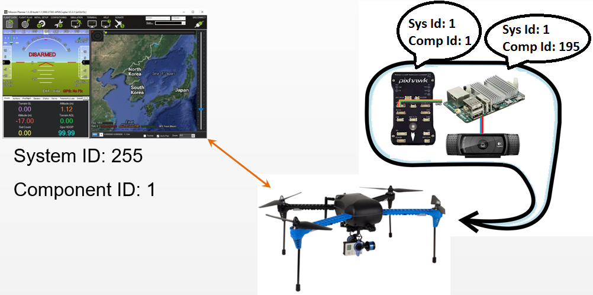

.. _mavlink-routing-in-ardupilot:

============================
MAVLink Routing in ArduPilot
============================

ArduPilot (which runs on the flight controller) can route MAVLink messages received on one telemetry port to all other telemetry ports.  This is important in cases where there are multiple MAVLink enabled components on the vehicle (i.e. a flight controller and a companion computer) but only a single telemetry connection between the vehicle and the ground station.  This page describes how ArduPilot decides which messages should be routed and to which telemetry ports.

As described on the :ref:`MAVLink Basics <mavlink-basics>` page a MAVLink network is made up of *systems* (vehicles, GCS, antenna trackers, etc) which are themselves made up of *components* (flight controller, camera system, etc).

Each message contains a ``System ID`` and ``Component ID`` field to specify where the message came from.  In addition *some messages* (including `SET_POSITION_TARGET_GLOBAL_INT <https://mavlink.io/en/messages/common.html#SET_POSITION_TARGET_GLOBAL_INT>`__) include ``target_system`` and ``target_component`` fields to allow specifying which system/component should execute the command.

A value of 0 for the ``target_system`` or ``target_component`` is
considered a broadcast ID, and will be sent to all systems in the
network/components on the target system.

The routing on ArduPilot systems works in the following way:

-  All received MAVLink messages are checked by the `MAVLink_routing <https://github.com/ArduPilot/ardupilot/blob/master/libraries/GCS_MAVLink/MAVLink_routing.h>`__ class.
-  The class extracts the source system id (aka *sysid*) and component id (aka *compid*) and builds up a routing array which maps the channel (i.e. USB port, Telem1, Telem2) to the *<sysid,compid>* pair.
-  The class also extracts the target system id (``target_system``) and component id (``target_component``) and if these don’t match the vehicle’s *<sysid,compid>* the messages are forwarded to the appropriate channel using the array above.
-  Messages that don’t have a target *<sysid,compid>* are processed by the vehicle and then forwarded to each known system/component.

Detailed theory of MAVLink routing
==================================

This information below is reproduced from the routing code in-source
comments
(`/libraries/GCS_MAVLink/MAVLink_routing.cpp <https://github.com/ArduPilot/ardupilot/blob/master/libraries/GCS_MAVLink/MAVLink_routing.cpp>`__)

#. When a flight controller receives a message it should process it
   locally if any of these conditions hold:

   #. It has no ``target_system`` field
   #. It has a ``target_system`` of zero
   #. It has the flight controllers target system and has no
      ``target_component`` field
   #. It has the flight controllers target system and has the flight
      controllers ``target_component``
   #. It has the flight controllers target system and the flight
      controller has not seen any messages on any of its links from a
      system that has the messages
      ``target_system``/``target_component`` combination

#. When a flight controller receives a message it should forward it onto
   another different link if any of these conditions hold for that link:

   #. It has no ``target_system`` field
   #. It has a ``target_system`` of zero
   #. It does not have the flight controllers ``target_system`` and the
      flight controller has seen a message from the messages
      ``target_system`` on the link
   #. It has the flight controllers ``target_system`` and has a
      ``target_component`` field and the flight controllers has seen a
      message from the ``target_system``/``target_component``
      combination on the link

.. note::

   This proposal assumes that ground stations will not send command
   packets to a non-broadcast destination (sysid/compid combination) until
   they have received at least one package from that destination over the
   link. This is essential to prevent a flight controller from acting on a
   message that is not meant for it. For example, a ``PARAM_SET`` cannot be
   sent to a specific *<sysid/compid>* combination until the GCS has seen a
   packet from that *<sysid/compid>* combination on the link.

   The GCS must also reset what\ *<sysid/compid>* combinations it has seen
   on a link when it sees a SYSTEM_TIME message with a decrease in
   time_boot_ms from a particular *<sysid/compid>*. That is essential to
   detect a reset of the flight controller, which implies a reset of its
   routing table.
