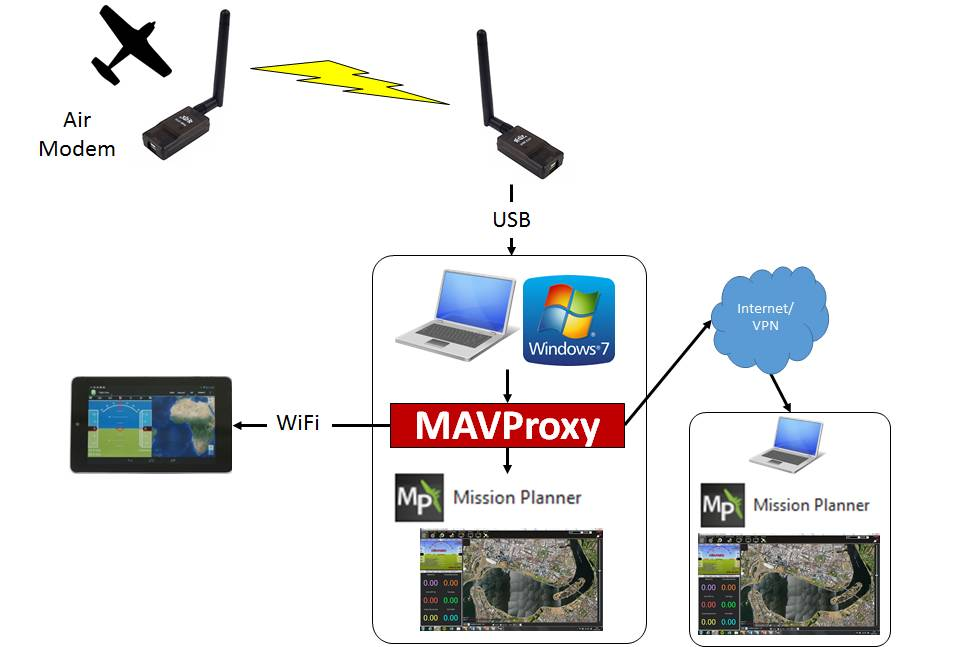

.. _mavproxy-on-windows-7:

===================
MAVProxy on Windows
===================

This guide shows how to set up MAVProxy to allow forwarding of messages
via network interfaces.

Overview
========

:ref:`MAVProxy<mavproxy:home>` is a powerful
command-line based "developer" ground station software that complements
your favorite GUI ground station, such as Mission Planner, APM Planner
etc.

A key feature of MAVProxy is its ability to forward the messages from
your UAV over the network via UDP to multiple other ground station
software on other devices. For example: you can run a ground station on
a laptop next to your antenna and forward via wifi to a
smartphone/tablet which lets you easily relocate to launch into wind
before heading back to your fixed antenna. I have also used it to send
telemetry data to a friend acting as spotter several kilometers away
(via 4G vpn) during a longer flight so that he could monitor the entire
flight and determine where to look to find the aircraft in flight.

This guide shows how to set up MAVProxy to allow forwarding via network
interfaces and usage via command line. There may be other ways to get
this running and you may need other packages as per the :ref:`MAVProxy Documentation<mavproxy:home>` in order
to use more advanced functions. No warranty responsibility for damage
etc.

.. note::

   Full credit to Andrew Tridgell and all other contributors to
   MAVProxy and the other software used here.

Step 1: Check you can connect to your UAV
=========================================

Before starting anything make sure you can make a direct connection to
your aircraft with your normal Ground Station software on the PC in
question. Check that you know the correct COM port and baudrate for the
modem attached to your laptop as we will need that info later.

Step 2: Install MAVProxy
========================

Install MAVProxy from https://firmware.ardupilot.org/Tools/MAVProxy

Step 3: Ready to run
====================

Check your radio modem is connected via USB, the aircraft modem and APM
are powered and ensure any other ground station software is closed.

Open a command prompt window (Click start, type cmd and then press
enter) and then run:

::

    "C:\Program Files (x86)\MAVProxy\mavproxy.exe"

If everything has worked you should see MAVProxy start up and some basic
flight data such as mode and current waypoint appear. Occasionally some
data does seem to result in glitching and odd characters appearing
onscreen but this does not seem to affect reliability or performance.

.. image:: ../images/mavproxy_running.png
    :target: ../_images/mavproxy_running.png

Enter a command such as mode FBWA and press enter. You should see
MAVLink report the mode change and notice your aircraft change behaviour
into that mode.

The full list of MAVLink commands can be found in the
:ref:`MAVProxy Documentation<mavproxy:home>` if you want to experiment further
with the command line.

To exit MAVLink press Control+C together.

Step 4: Forwarding over network
===============================

To forward the MAV data over the network including to a local program on
your PC we simply need to add some extra parameters when starting
MAVProxy via the command line.

To connect with a local ground station software such as Mission Planner
start MAVProxy as above with the command mavproxy.exe --master="com14"
--baudrate 57600 --out 127.0.0.1:14550 and press enter.

Then open Mission Planner and select UDP and click connect. Clink OK on
the default prompt for port number (14550) and you should see mission
planner start downloading parameters and connecting to your UAV.

Finally you can add the IP address of any computer to forward the
telemetry stream onwards to other ground stations.

#. On the local network/wifi you will need to ensure there is no
   firewall on the client PC stopping the incoming stream to your ground
   station software.
#. Add --out IP_ADDRESS:14550 to the end of the mavproxy.exe command.
   You can add as many separate --out parameters as you want depending
   on how many extra ground stations you are running.
#. Set each ground station to listen for UDP packets on port 14550
