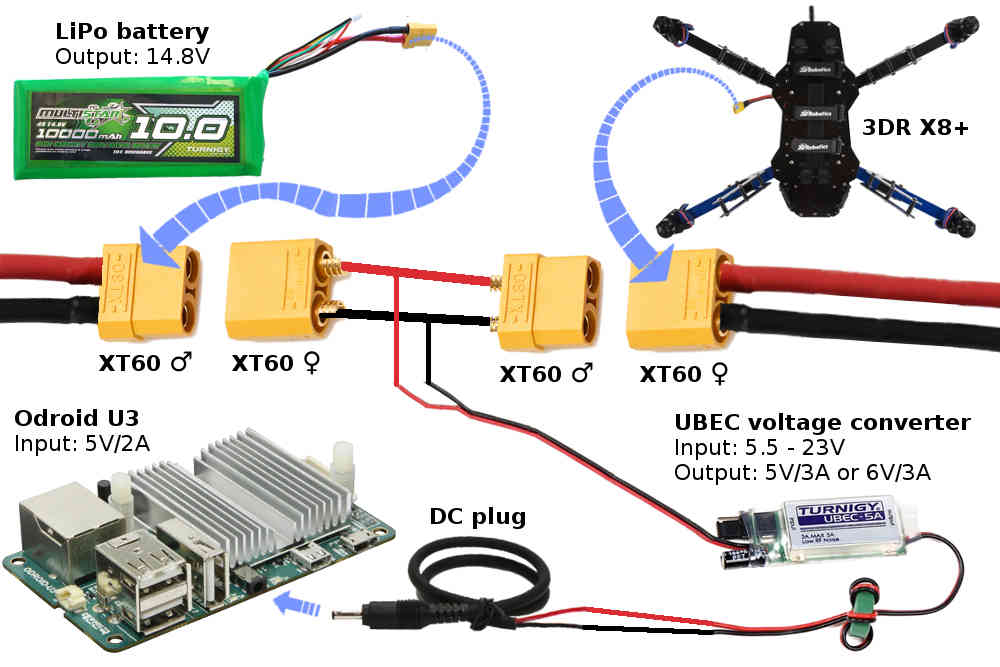

.. _odroid-via-mavlink:

=====================================
Communicating with ODroid via MAVLink
=====================================

Overview
========

This page introduces how to connect and configure an `ODROID U3 <https://www.hardkernel.com/shop/odroid-u3/>`__ (*Discontinued*) , \ `ODROID-C1+ <https://www.hardkernel.com/shop/odroid-c1/>`__ or `ORDOID-XU4 <https://www.hardkernel.com/shop/odroid-xu4-special-price/>`__ so
that it is able to communicate with a Pixhawk flight controller using
the MAVLink protocol over a serial connection. The capabilities are very
similar to the :ref:`Raspberry Pi <raspberry-pi-via-mavlink>` except
that the ODroid has a much faster CPU (performance is roughly 10x faster
than the RPi).

Recommended parts
=================

These parts are required:

-  ODROID board
   (`ODROID-C1+ <https://www.hardkernel.com/shop/odroid-c1/>`__, \ `ORDOID-XU4 <https://www.hardkernel.com/shop/odroid-xu4-special-price/>`__ or `ODROID U3 <https://www.hardkernel.com/shop/odroid-u3/>`__ (*Discontinued*))
-  `5V Power supply <https://www.hardkernel.com/shop/5v-2a-power-supply-asia-korea-round-plug/>`__
-  `DC Plug and Cable Assembly <https://www.hardkernel.com/shop/dc-plug-cable-assembly-2-5mm/>`__
-  `8GB MicroSD Card <https://www.hardkernel.com/shop/16gb-microsd-uhs-1-xu4-linux/>`__
   OR `8GB eMMC Module <https://www.hardkernel.com/shop/8gb-emmc-module-c1-c0-linux/>`__
   preloaded with Linux (the EMMC module is about 4x faster which may be
   useful for image processing)
-  `FTDI Cable <http://store.jdrones.com/cable_ftdi_6pin_5v_p/cblftdi5v6p.htm>`__ or USB
   to Serial interface like `this <https://www.amazon.com/Prolific-PL2303-USB-TTL-Module/dp/B008958S7A>`__. This `link <https://www.sjoerdlangkemper.nl/2019/03/20/usb-to-serial-uart/>`__ provides an overview of USB-TTL modules.

These optional items may also be useful:

-  `Logitech HD Pro Webcam C920 <http://www.logitech.com/en-us/product/hd-pro-webcam-c920>`__ is
   the recommended camera for image processing applications because it
   natively encodes images using the h264 format.

   .. note::

      The usable resolution of this webcam is limited to 640 x 480
      (or perhaps 1280 x 720) because no official Linux driver has been
      written for this camera yet.

-  Protective Case for `XU4 <https://www.hardkernel.com/shop/odroid-xu4-case-black/>`__ or `C1+ <https://www.hardkernel.com/shop/odroid-c2-c1-case-black/>`__
-  `HDMI Type-A cable <https://www.hardkernel.com/shop/hdmi-1-4-cable-type-a-a/>`__
   in case you wish to connect the ODroid to a computer monitor
-  `Wifi module <https://www.hardkernel.com/shop/wifi-module-3/>`__
   if you wish to connect to the ODroid from your desktop computer using
   WiFi
-  `Serial Debug cable <https://www.hardkernel.com/shop/usb-uart-module-kit/>`__
   *if you wish to connect to the ODroid console with a direct
   connection to your desktop computer*
-  Cat6 cable for connection while on the ground

Initial ODROID Setup
====================

It is easier to manage the odroid after it has a connection to your
network.  We've used the following steps to complete the initial setup
of the board:

Discovering IP Address
----------------------

Using Keyboard/Mouse/Monitor
~~~~~~~~~~~~~~~~~~~~~~~~~~~~

-  Plug the preloaded eMMC or MicroSD card into the board
-  (Temporarily) attach a mouse and keyboard to the USB ports
-  Plug power into the board (at this point the boot LED should light up
   blue)
-  Attach micro-HDMI cable to the board (this must be done \ *after* the
   board starts to boot, or the monitor may backpower the board /
   keeping it from booting)
-  A text menu will appear

   -  Choose advanced settings and enable the SSH server
   -  Choose the option to expand the root filesystem to fill the card
   -  Select save and reboot

-  The board will reboot into a fairly standard looking Ubuntu
-  Go to the network setup icon in the upper right and join your wifi
   network
-  Type "ifconfig" to see the IP address your board was assigned

Using command line
~~~~~~~~~~~~~~~~~~

You can discover the ip address of devices on your network using a
utility called nmap

::

    $ sudo nmap -sn 10.0.1.0/24

This will return a list of discovered devices on your network for and
you will see an entry like

\*(this example is RPi - will update to ODROID)

::

    Nmap scan report for 10.0.1.17
    Host is up (0.00056s latency).
    MAC Address: B8:27:EB:0A:26:9D (Raspberry Pi Foundation)

Common Setup with known IP Address
----------------------------------

-  From some other computer type "ssh -Y odroid@IPADDRESS" with password
   odroid.  Confirm you can login and get a ssh shell
-  At an odroid shell type "sudo adduser odroid dialout" - this gives
   the odroid account access to the serial (pixhawk) port.
-  At an odroid shell type "sudo adduser odroid plugdev" - this gives
   the odroid account access to the USB camera.
-  Now you can unplug the keyboard/mouse/hdmi cables and just use ssh if
   you want.  As long as you use the -Y option with SSH you can even run
   graphical applications on the odroid and they will appear on your
   desktop computer (assuming you are running something that understands
   X-Windows)

Connecting the Pixhawk and ODroid
=================================

.. image:: ../images/Odroid-wiring.jpg
    :target: ../_images/Odroid-wiring.jpg

If using an FTDI cable, connect as shown in the picture below, DO NOT
connect the power wire.

   Odroid FTDI/USB cable (detailview)

If using a USB to Serial interface, connect as shown below.

Power connections are shown below:

   Odroid Power Connections

Connecting to ODroid with an SSH/Telnet client
==============================================

`Please refer to the instructions for the Raspberry Pi <https://www.raspberrypi.org/documentation/remote-access/ssh/>`__.

Installing the required packages
================================

This assumes you have a SSH connection to the Pi.

See the :ref:`MAVProxy Documentation<mavproxy:mavproxy-downloadinstalllinux>` for install instructions

Testing the connection
======================

Before attempting this, you will need to connect to your Pixhawk via
mission planner with the USB cable.

Set SERIAL2_BAUD (telemetry 2 baud rate) to 1500 (1.5Mbit)

To test the ODroid and Pixhawk are able to communicate with each other
first ensure both are powered, then in a console on the Odroid type:

``mavproxy.py --master=/dev/ttyUSB0 --baudrate 1500000 --aircraft MyCopter``

once mavproxy has started you should be able to type in the following
commands to arm and then disarm the copter.

``arm throttle``

disarm

Configure mavproxy to always run
================================

This is accomplished by adding the following to the end of your
"/home/odroid/.bashrc" file. The Pixhawk is connected via "ttyUSB0". The
last section of the file should look like below.  **Change the IP
address to that of your ground station** (this also starts the balloon
finder, comment that line out if you don't want it to run)

::

    export PATH=$PATH:$HOME/GitHub/ardupilot-balloon-finder
    export PATH=$PATH:$HOME/GitHub/ardupilot-balloon-finder/scripts
    export PYTHONPATH=$PYTHONPATH:$HOME/GitHub/ardupilot-balloon-finder/scripts
    if screen -list | grep -q "MavProxy"; then
     echo "MavProxy is already running"
    else
     cd /home/odroid
     screen -S MavProxy -d -m -s /bin/bash mavproxy.py --master=/dev/ttyUSB0 --baudrate 1500000 --out 192.168.1.11:14550 --aircraft MyCopter
     python /home/odroid/GitHub/ardupilot-balloon-finder/scripts/colour_finder_web.py
     echo "started MavProxy type screen -x to view"
    fi

Connecting with the Mission Planner
===================================

:ref:`Please refer to the instructions for the Raspberry Pi <raspberry-pi-via-mavlink_connecting_with_the_mission_planner>`.

Example Projects
================

Red Balloon Finder
------------------

..  youtube:: yRmXwRqPesY
    :width: 100%

The Red Balloon Finder project was written to enable an Odroid to
control an Copter based quadcopter to hunt down and pop 1m red balloon
for the `Sparkfun 2014 AVC <https://avc.sparkfun.com/>`__.  The python
code that runs on the odroid can be found
`here <https://github.com/rmackay9/ardupilot-balloon-finder>`__.  The
slightly modified Copter-3.2 code can be found
`here <https://github.com/rmackay9/rmackay9-ardupilot/tree/avc4>`__.
Installation instructions are below.

Set the following parameters on the Pixhawk:

SERIAL2_BAUD to 921 (921600 bits per sec)

SR2_EXTRA1 to 20 (20hz update rate for attitude from Pixhawk to Odroid)

Create a home/odroid/GitHub directory where we will install the required
source code:

::

    cd /home/odroid/
    mkdir GitHub
    cd GitHub

Type the following commands to download the ardupilot-balloon-finder
source code:

::

    git clone https://github.com/rmackay9/ardupilot-balloon-finder.git

Add the ardupilot-balloon-finder to the PATH and PYTHONPATH by doing the
following:

::

    cd /home/odroid/
    nano .bashrc     #Note that "nano" can be replaced by your favourite editor such as "vi"

scroll to the bottom of the file and add the following as the very last
items

::

    export PATH=$PATH:$HOME/GitHub/ardupilot-balloon-finder
    export PATH=$PATH:$HOME/GitHub/ardupilot-balloon-finder/scripts
    export PYTHONPATH=$PYTHONPATH:$HOME/GitHub/ardupilot-balloon-finder/scripts

Drone API
~~~~~~~~~

To install the latest :ref:`Drone API <droneapi-tutorial>` , run the
following:

::

    sudo pip install --upgrade droneapi

next setup mavproxy to start the DroneAPI each time it is started:

::

    nano /home/odroid/MyCopter/.mavinit.scr

then add the following to the file (correct the path of the
balloon_strategy.py to your path)

::

    module load droneapi.module.api
    api start /home/odroid/GitHub/ardupilot-balloon-finder/scripts/balloon_strategy.py

Cherrypy
~~~~~~~~

Cherrypy is a simply python webserver used by ardupilot-balloon-finder
to show what the camera is currently seeing on a web page.  Install
cherrypy by entering the following in an Odroid terminal:

::

    sudo pip install cherrypy

Can't get it to work? 
Try posting your question in the `Companion Computer discussion board <https://discuss.ardupilot.org/c/apsync-companion-computers>`__.

.. toctree::
    :maxdepth: 1

    ODroid Wifi Access Point for sharing files via Samba <odroid-wifi-access-point-for-sharing-files-via-samba>
