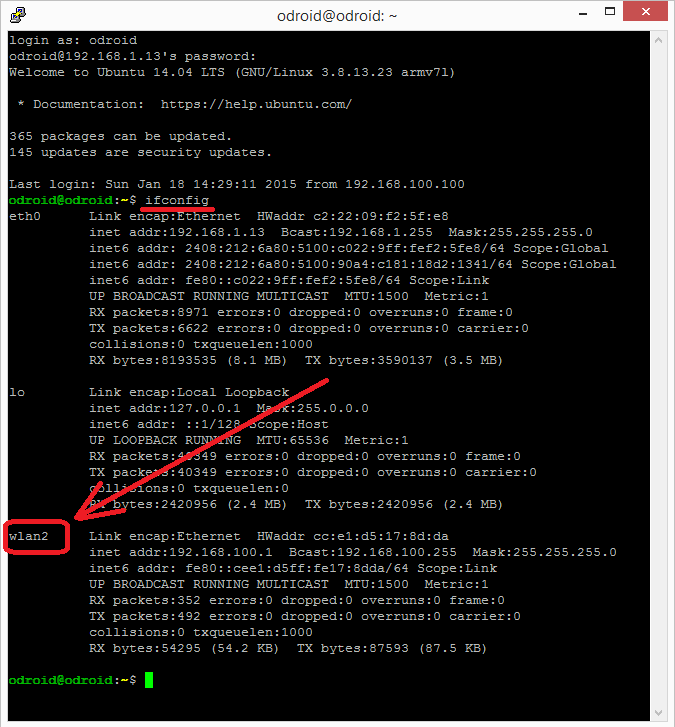
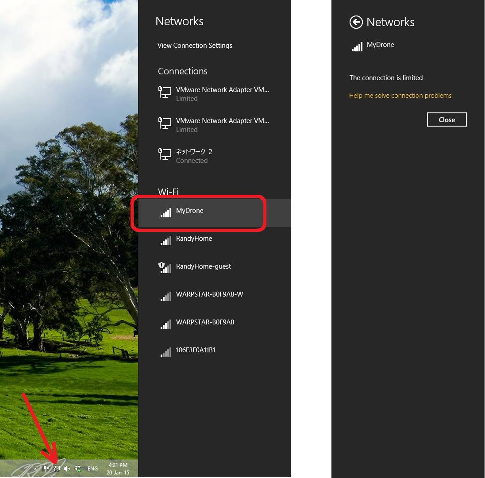
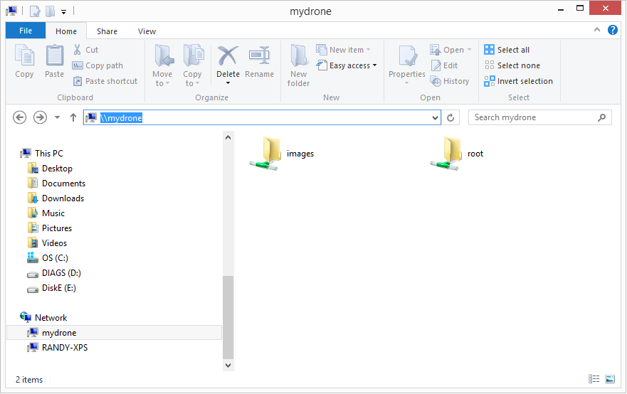

.. _odroid-wifi-access-point-for-sharing-files-via-samba:

====================================================
ODroid Wifi Access Point for sharing files via Samba
====================================================

Overview
========

This page will show you how to setup an Odroid with a Wifi AccessPoint
so that the Odroid's hard drive can be accessed and modified from
another computer.  This is primarily aimed at allowing access to images,
videos and log files on the Odroid.  The procedure makes use of
`hostapd <http://wireless.kernel.org/en/users/Documentation/hostapd>`__,
`Samba <https://www.samba.org/>`__ and
`dhcp <https://en.wikipedia.org/wiki/Dynamic_Host_Configuration_Protocol>`__.

To accomplish this you will need:

-  Odroid U3 running Ubuntu 14.04 as described on :ref:`this page <odroid-via-mavlink>`.
-  A Wifi dongle capable of "master" mode (aka "AP" or access point). 
   These exact instructions were performed with an $8 `Buffalo Airstation 11n 11g/b USB2 wireless LAN terminal purchased in Japan <http://www.yamada-denkiweb.com/1265136015>`__.

All the instructions below can be implemented by connecting a keyboard,
mouse and screen to the Odroid or using ssh (via Putty).

Install all the required packages
=================================

Becomes super user:

::

    sudo -s

Install hostapd, samba and all the other required packages:

::

    apt-get install hostapd samba samba-common python-glade2 system-config-samba isc-dhcp-server

Setting up the Access Point
===========================

After first ensuring the wifi dongle is plugged into the Odroid,

Find the name of your wifi dongle by typing ``ifconfig`` (normally it
will be "**wlan0**\ " or "**wlan2**\ ")

Check the wifi dongle supports "AP" mode:

::

    iw list

A huge list of information will be displayed, you are looking for a
section called "Supported interface modes:" followed by "\* AP".  If you
cannot find this then these instructions will not work and you should
try with another dongle.

::

    Supported interface modes:
    * IBSS
    * managed
    * AP 

Use your favourite editor (nano or vi perhaps) to edit the
``/etc/network/interfaces`` fileand add an entry for your wifi dongle. 
Note you should replace "wlan2" if your dongle has a different name:

``auto wlan2``

iface **wlan2** inet static

address 192.168.100.1

netmask 255.255.255.0

Edit the ``/etc/hostapd/hostapd.conf`` file and ensure it looks like
below

::

    vi /etc/hostapd/hostapd.conf

::

    interface=wlan2   <-- change "wlan2" to name of wifi dongle found above
    driver=nl80211
    ssid=MyDrone
    hw_mode=g
    channel=11
    macaddr_acl=0
    auth_algs=1
    ignore_broadcast_ssid=0
    wpa=2
    wpa_passphrase=MyDrone12   <-- password for clients to access the wifi access point
    wpa_key_mgmt=WPA-PSK
    wpa_pairwise=TKIP
    rsn_pairwise=CCMP

Try starting hostapd:

::

    hostapd /etc/hostapd/hostapd.conf

If this fails try replacing the /usr/sbin/hostapd and hostapd_cli files
with the version found in `the downloads area <https://download.ardupilot.org/downloads/wiki/developer_tools/hostapd_OdroidU3_Ubuntu1404.zip>`__.

You will also need to install the libnl-dev package:

::

    apt-get install libnl-dev

To make the hostapd service run whenever the odroid is started edit the
/etc/init.d/hostapd file and ensure the line below appears:

::

    DAEMON_CONF=/etc/hostapd/hostapd.conf

Setting up Samba
================

Create directories you wish to share:

::

    mkdir -p /mydrone
    mkdir -p /mydrone/images

Edit the samba config file (if not present create a new file):

::

    vi /etc/samba/smb.conf

::

    [global]
    workgroup = MyDroneGroup
    server string = Drone Server
    netbios name = mydrone
    security = user
    map to guest = bad user
    dns proxy = no
    #===== Share Definitions =====
    [images]
    path = /mydrone/images
    browsable = yes
    writable = yes
    guest ok = yes
    read only = no

The this config will create a "images" share with no restriction on
clients adding or deleting files.

Setting up DHCP
===============

Edit the /etc/dhcp/dhcpd.conf file and ensure it has all the lines
listed below added/uncommented:

::

    vi /etc/dhcp/dhcpd.conf

::

    # option definitions common to all supported networks...
    option domain-name "mydrone.local";
    option domain-name-servers dns.mydrone.local
    default-lease-time 600;
    max-lease-time 7200;
    authoritative;
    log-facility local7;
    subnet 192.168.100.0 netmask 255.255.255.0 {
    range 192.168.100.100 192.168.100.200;    <-- clients will get IP addresses in this range
    }

Add all possible client IP addresses to the ``/etc/hosts`` file:

::

    vi /etc/hosts

::

    127.0.0.1 localhost
    192.168.100.1 odroid-pc odroid
    192.168.100.100 client100
    192.168.100.101 client101
    192.168.100.102 client102
    ....
    192.168.100.200 client200

Adding all the client IP address can be accomplished more quickly with
the following command:

::

    (for i in $(seq 100 200); do echo 192.168.100.$i client$i; done) >> /etc/hosts

Restart the Odroid and with any luck an AP will be created and you will
be able to connect as shown below.

Connecting from a Windows PC
============================

To connect from a Windows 8.1 machine click on the network icon near the
clock and then click on "MyDrone", "Connect" and after 30seconds or so
it should connect with a message "The connection is limited" because the
Odroid likely does not have access to the internet (this is ok).

Open a File Explorer and type \\\\mydrone into the address bar and the
contents of the Odroid images directory should appear.

References
==========

These pages were referenced during the creation of this document.

`wireless.kernel.org's hostapd documentation <http://wireless.kernel.org/en/users/Documentation/hostapd>`__.
