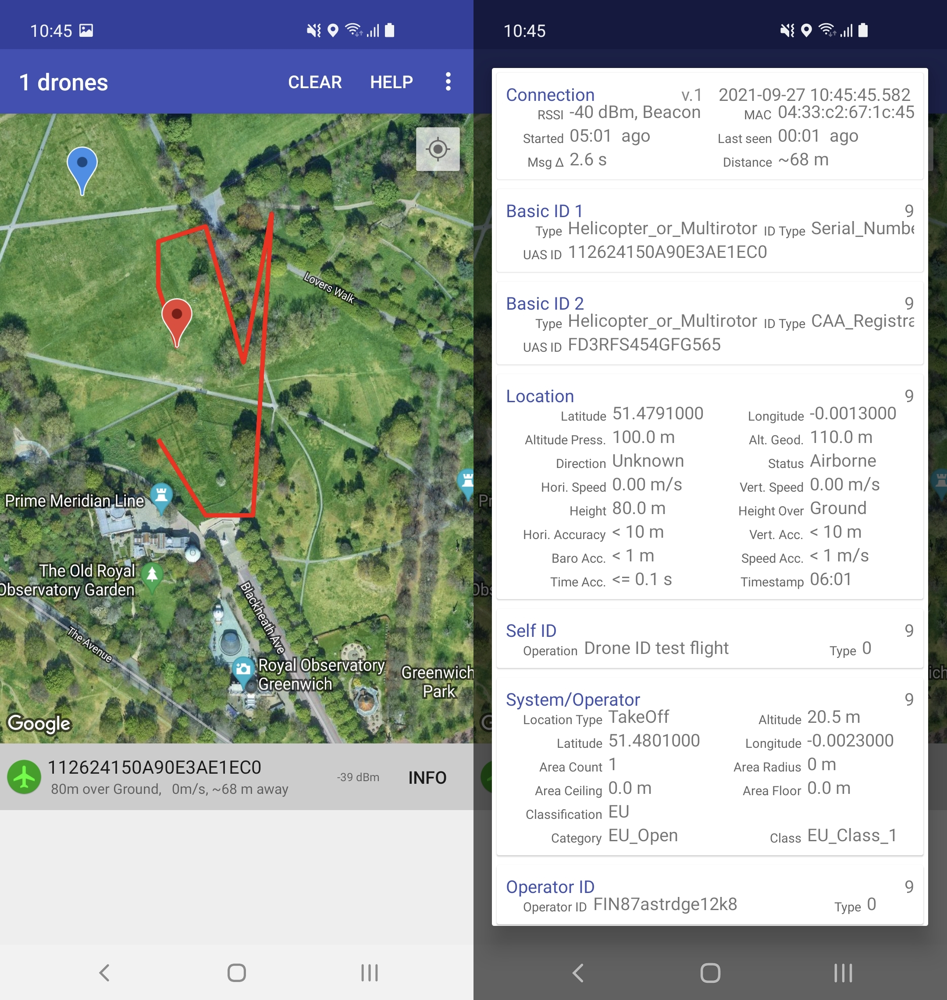

.. _opendroneid:

===========
OpenDroneID
===========

Building Firmware for Production
================================

ArduPilot provides methods for making firmware for autopilot systems integrating OpenDroneID Remote ID transmitter modules tamper-resistant as well as compliant with various countries initiatives.

ArduPilot's tamper resistance currently consists of:

- Using a special board ID for ODID (OpenDroneID) firmware that will reject normal attempts of loading firmware without the necessary functions and parameters required for compliance
- Special READONLY parameters which can be set in the firmware during the compilation

Future enhancements are planned.

For an example see the hwdef and param files for an `ODID version of CubeOrange <https://github.com/ArduPilot/ardupilot/tree/master/libraries/AP_HAL_ChibiOS/hwdef/CubeOrange-ODID>`__ with a CAN OpenDroneID module integrated on the carrier board.

Building Firmware for Bench Testing and Experimentation
=======================================================

An experimental firmware version can be built for any autopilot by:

- Adding the line "define AP_OPENDRONEID_ENABLED 1" to its hwdef.dat file

Testing
=======

- Update MAVProxy/pymavlink to at least 1.8.54 (https://ardupilot.org/mavproxy/docs/getting_started/download_and_installation.html#updating)
- In the directory you will be running MAVProxy from, create a remoteid.scr file with this content:

.. code-block::

    module load OpenDroneID

    opendroneid set UAS_ID_type 1
    opendroneid set UA_type 1
    opendroneid set area_ceiling 700
    opendroneid set area_count 1
    opendroneid set area_floor -200
    opendroneid set area_radius 1000
    opendroneid set category_eu 1
    opendroneid set class_eu 1
    opendroneid set classification_type 1
    opendroneid set description "TestDrone1"
    opendroneid set description_type 1
    opendroneid set operator_id "TestPilot1"
    opendroneid set operator_id_type 1
    opendroneid set operator_location_type 0      #note that a value of 1 is usually required in actual operation. This allows using a GCS with its own GPS for testing.
    opendroneid set rate_hz 1

This sets up the required parameters a user would normally have to enter into the RemoteID system from a GCS.

- Attach autopilot with an OpenDroneID compatible Remote ID module , `like this <https://github.com/ArduPilot/ArduRemoteID>`__ , attached to one of its serial ports to PC and start MAVProxy with the console and map with the option to set the operator location to the vehicle arming location:

.. code::

  MAVProxy.py --console --map

.. note:: this may not be legal in some jurisdictions in actual use, but the OpenDroneID module firmware will reject this assignment with a suitable build option set in its firmware for those jurisdictions. This allows testing on PCs without a GPS attached to determine operator location.

- Make sure the autopilot serial port that the module is attached is setup for 57.6K and MAVLink2 
- Run the 'script remoteid.scr' command to load the script...you should see it announce that it has loaded the OpenDroneID module and other commands in the console
- Set the following params:

  - :ref:`DID_ENABLE<DID_ENABLE>` 1 
  - :ref:`DID_OPTIONS<DID_OPTIONS>` 1 
  - :ref:`DID_MAVPORT<DID_MAVPORT>` X  where x is the serial port attached to OpenDroneID module
  - :ref:`DID_CANDRIVER<DID_CANDRIVER>` 0
  - :ref:`AHRS_EKF_TYPE<AHRS_EKF_TYPE>` 3 
  - :ref:`GPS_TYPE<GPS_TYPE>` 1
  - :ref:`GPS_TYPE2<GPS_TYPE2>` 0

- If its a CAN module these parameters should be substituted:

  - :ref:`DID_MAVPORT<DID_MAVPORT>` -1 
  - :ref:`DID_CANDRIVER<DID_CANDRIVER>` 1

- Any OpenDroneID pre-arms should disappear and the vehicle appear on your android phone with this app: https://play.google.com/store/apps/details?id=org.opendroneid.android_osm

Using SITL for testing
======================

SITL can also be used to run simulated missions and observe on the above OpenDroneID phone app by attaching the ODID Remote ID module to the PC via an USB FTDI connector.

If the module is attached to the PC  via USB or a serial FTDI adapter, then you can discover the Linux path to its port using:

.. code::

  ls /dev/serial/by-id/*

this will return a rather lengthy path in a similar form to:

**/dev/serial/by-id/usb-Silicon_Labs_CP2102N_USB_to_UART_Bridge_Controller_4e7564343210ec11a33426947a109228-if00-port0**

Start SITL using the following,  and if you will be using the SERIAL1 interface in the code (ie ::ref:`DID_MAVPORT<DID_MAVPORT>` = 1) and the <path> discovered above:

.. code-block::

   sim_vehicle.py --console --map -A --serial1=uart:<path>

Follow the rest of the instructions above for loading the remoteid.scr script and setup once MAVProxy starts. You should see the plane on your phone app. You can now create and fly missions and monitor them on the phone app.

