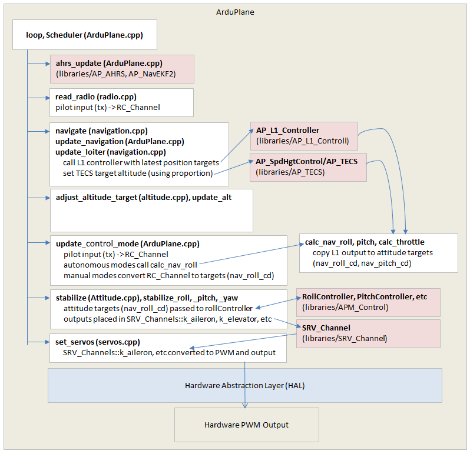
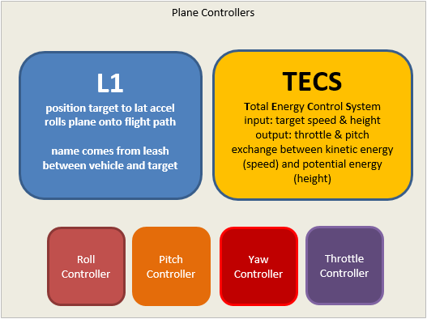

.. _plane-architecture:

============================
Plane Architecture Overview
============================

This page attempts to roughly show the ArduPlane architecture.  Please note it was not written by Plane experts so there may be some inaccuraies.

Above is a high level diagram of ArduPlane's architecture.  One large difference between Plane vs Copter and Rover is flight modes are not organised into a single file (:ref:`like they are in Copter <apmcopter-adding-a-new-flight-mode>`) or class (:ref:`like they are in Rover <rover-adding-a-new-drive-mode>`).  Instead the code path goes through stages.  Each stage then decides what it should do based on the flight mode.

These stages can be seen in the diagram above and include:

- ``ahrs_update`` calls the EKF to consume the latest sensor data and produce a attitude and position estimate.
- ``read_radio`` reads in the pilot's input and calculates the appropriate attitude or position targets
- ``navigate`` calls the L1 and TECS controllers (see below) to convert position targets for the roll, pitch and throttle controllers
- ``update_flight_mode`` copies the L1 controller's roll and pitch targets to nav_roll_cd and nav_pitch_cd global variables
- ``stabilize`` executes the lower level roll, pitch and throttle controllers
- ``set_servos`` sends the output from the roll, pitch and throttle controllers to the appropriate servo outputs

Plane Controllers
-----------------

Plane has 2 high level controllers and at least 3 lower level controllers shown below.

- the L1 controller converts a origin and destination (each expressed as a latitude, longitude) into a lateral acceleration to make the vehicle travel horizontally along the path from the origin to the destination.
- the TECS (Total Energy Conservation System) controls the exchange between the vehicle's kinetic energy (i.e. speed) and its potential energy (i.e. altitude).  Its inputs are a target speed and height and it attempts to reach these targets by calculating target throttle and pitch values which are then passed to the lower level pitch and throttle controllers.
